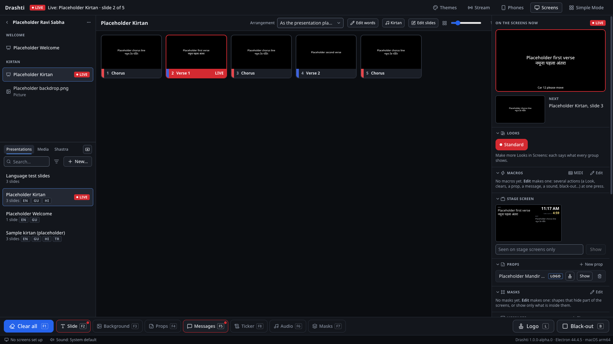

# Drashti

> Drashti is built independently for use at a BAPS mandir. It is not an official BAPS product.

Drashti (v1.0, package `drashti`) is a presentation app for BAPS mandirs. It replaces ProPresenter 6 on the mandir's Mac and ProPresenter 7 on its Windows PC, on the same machines and the same screens. The plan is in `PLAN.md` at the workspace root.

Stack: Electron 44, React 19, TypeScript 6 (strict), Zustand, Tailwind 4, SQLite (better-sqlite3), Vitest, Playwright, electron-builder and pnpm 12.

## Status

Phase 0 (foundations) is in place:

- the read-only **audit kit** for the two ProPresenter machines (`tools/audit/`);
- the **show engine** in the main process: versioned, serializable state sent as snapshots and patches through a transport interface;
- the **SQLite library** with the full core model, migrations and two placeholder presentations;
- **screens**: displays as the OS reports them, screen groups, a canvas size and scaling per screen, and one output window per assigned display, restored on restart;
- one **shared renderer** with bundled Noto fonts, used by the operator preview, the thumbnails and every output;
- a minimal **operator UI** with a single keymap, and an **output watchdog**.

Phase 1 has started:

- text boxes hold **styled runs** (font, size, colour, weight and language per run);
- the **import pipeline** runs in a background worker process: plain-text lyrics, ProPresenter 6 and 7 presentations, templates and themes, playlists and bundles, and media files, with re-import rules, a media folder that stores each file once, and a report kept for every import;
- **importing from the operator window**: drag files or folders onto the presentation list, or use **Import…**; progress, then a migration report with a fix for each item; removing presentations with Delete, and Undo;
- **arrangements** set the order a presentation plays in (a repeated chorus shows and plays each time), chosen per presentation or per playlist item;
- **playlists** in the operator window: imported ones with their folders, headers, media and placeholders, and the operator's own, built by dragging from the library;
- **search** as you type, by title and slide text in English, Gujarati, Hindi and transliteration, ignoring Latin accents, with v and w alike and a doubled vowel as its single one ("dvitiyah" finds "dwitiyah", "Shri" finds "Shree"; Session 13), x as ksh, f as ph, and ru as ri after a consonant ("Axar" finds "Akshar", "Fal" finds "Phal", "Krushna" finds "Krishna", but "guru" never finds "giri"; Session 14) (about 4 to 5 ms a query at 5,000 presentations); text in legacy fonts is left out, and the results say so;
- **editing words as plain text**: any presentation's words in the lyrics format, saved back with each slide's look, backgrounds and cues kept, the live slide updated and Undo; "New…" makes a presentation from pasted words;
- **a setup wizard**: on the first start (and from View > Set Up Screens…), each output's number on it, what it shows (audience, stage or nothing) and its languages, the sound output with a test tone, and the default theme, applied together at Finish with a test slide on every screen; skipping changes nothing, and Simple Mode never shows it;
- **sabha templates**: running orders with headers, fixed items and named slots, kept apart from the week's playlists so they are never run; Save as template on any playlist, New playlist from a template, slots filled through search starting at their category (or asking for a Shastra passage), renamed and given another category; items that start, reset or show timers as they go up (Session 12), kept by templates; two example templates to edit;
- **kirtan details and the library**: category (Drashti's list, which can be added to), kavi, raag, occasions and a recording from the media library; the library filters by them, and search finds kirtans by kavi and raag;
- **auto-transliteration**: Gujarati and Devanagari to Roman letters by rule, as words are said ("ghar", not "ghara"), plain or with accent marks (ISO 15919); "Make transliteration" fills a kirtan's track, keeps lines changed by hand unless told to replace them, and is undone with Undo;
- **each screen's own languages**: every screen group chooses which of a kirtan's languages it shows and in what order (Audience Gujarati and transliteration, the stage Gujarati only, a stream transliteration and English), and the words close up with no gap;
- **the Shastra module** (Session 12): texts an admin loads from authorised sources in a documented file format (`docs/shastra-format.md`), found by reference ("SD 14", "SD 14-16", "Vach G.Pr. 1", with each text's own abbreviations), by their words in any language, or by browsing; a passage shows as slides with its reference line, in its text's theme, cut to fit, in each group's languages (Sanskrit in Devanagari or Gujarati script among them) or as a lower third; passages in playlists and template slots, and put up from a phone or the API;
- **the idle rotation** (Session 12): darshan pictures from the media library and the admin's quotes (in Gujarati, Hindi and English, with an attribution), each up for a set time and dissolving into the next, in step on every screen; each group's Look says whether its screens show it once the operator starts it (it stops by itself when the first slide or picture goes up, so Clear all does not bring it back) or always when nothing is up (a lobby); a quote of the day, one per date, after the pictures and in a stage box; started and stopped from its panel or a macro;
- **Samvat and tithi** (Session 12): calendars an admin loads from authorised sources in a documented file format (`docs/calendar-format.md`; Drashti computes no tithi), giving each date's Vikram Samvat year, month, paksha, tithi and festivals in Gujarati and English; today's shows along the bottom of the operator window (Simple Mode too), on stage screens (a Samvat box, or a clock box with the date) and in messages with a Samvat field on the audience screens, changing at midnight; a date no calendar gives shows nothing;
- **the arti at its time** (Session 12): an admin's schedules (days of the week and a time, or one date) for the arti presentation; minutes before, the operator window (and Simple Mode, as a big button) prompts with a countdown; at the time the arti is what Next shows; **Put up Arti now** or **Not now**; never up by itself unless its schedule says, and then after a ten-second countdown with Cancel; a time that passed while Drashti was closed is not run late;
- **macros** (Session 11): actions run in order as one change, from a panel, a slide's cue, phones, the API or a **MIDI** controller (Learn maps a pad to a macro, or to Next, Back, Clear all, Black-out or Logo);
- **key and fill outputs** (Session 11): a group's fill and key on two displays, for a video switcher to key the words over a camera;
- **masks** (Session 11): a library of shapes that hide part of a screen or show only what is inside them, as a group's own shape in a Look (never cleared) or on the Masks layer (F7);
- **stage layouts** (Session 11): boxes placed on the stage screen (the current and next slide, notes, the clock, timers, the stage message, the playlist's next items, the time left on a video or sound, the screens' state, fixed text), each stage group's chosen in its Look; Standard is the stage screen as it was;
- **Looks** (Session 11): for each screen group, which layers its screens show, a kirtan's languages, and whether slides are drawn as designed or as a lower third; one Look is live, and switching it (from the main window, a phone or the API) changes every group at once; Standard, made from the groups as they were, keeps every screen as it was;
- **kirtans with language tracks**: a kirtan's Gujarati, Hindi, English and transliteration lines are its slides' own words by language (one copy, so nothing drifts); Edit words has a **By language** view (one language, or all of them, slide by slide, with missing lines marked); a presentation becomes a kirtan, or stops being one, without its words moving; imports with lines in two scripts, or an author or artist field, come in as kirtans;
- **themes**: a look per language (font, size, weight, colour, shadow), the text box's place and alignment, and a background, applied to any number of presentations with one Undo; presentations made in Drashti start with the default theme;
- **props**: a logo or a line of words that stays up whatever slide is live, made from a picture or words, and imported from both older formats' props files;
- **messages**: templates with fields ("Car {plate} please move", or a live timer), filled in and shown on the audience screens, several at once;
- **timers**: countdowns, count-ups, countdowns to a time of day and clocks, started, paused, reset and edited by the operator, shown on the audience screens and the stage; only start, pause and reset are sent, and each window works out the time;
- a **stage screen** for the performers: current and next text, notes, the clock and a stage-only message, in large text;
- **running a sabha from a playlist**: Next and Previous carry on across items (stepping over headers and placeholders), pictures and videos go up as the background and sounds on the audio layer, the next slide shows beside the live one, outputs load the next slide's images and videos ahead, and restart recovery keeps the place in the playlist;
- **media playback**: library media reaches the windows by id only (`drashti-media://`); slide backgrounds play on the background layer and audio cues on the audio layer; images and videos on slides draw everywhere, with still frames for video thumbnails; every screen shows the same frame of a video, and one audio player makes all the sound, on the output chosen in settings;
- **media Drashti cannot play** (ProRes, AVI, HEIC and the like) is found at import, marked, and listed in the report; **Convert** (in the report or the media list, a file or all of them) makes a copy that plays with the bundled FFmpeg, one file at a time in the background, and everything that used the original uses the copy, with Undo (the original is never changed);
- a rotating **log file** in the data folder, and **Help > Save Diagnostics…** for one file to send after a problem, with no library content;
- **backing up and restoring the library** (File menu): a consistent copy of the library, with the media if wanted, in a folder the operator picks; a restore checks the backup, asks once, keeps the current library under `Backups/` and restarts with nothing live; **scheduled backups** (Session 14) on chosen days at a time into a folder an admin picks, the media copied once into a folder they share, the newest kept, waiting while on air, a missing drive skipped with a warning;
- the **slide editor**: text boxes, shapes (rectangles, rounded rectangles, ellipses, lines), pictures and videos on slides, moved, resized, turned and snapped with guides; several elements (Shift-click, a box dragged round them, or Select all) moved, resized and turned together from one box round them, lined up and spaced out; elements copied, cut and pasted between slides and presentations with their styles, languages and media (Paste puts them where they were, a step down when that place is taken; Paste in place, Cmd/Ctrl+Shift+V, exactly there; Cmd/Ctrl+D duplicates); text styles for a box or its selected words, with full shadows, outlines and shrink-to-fit; typing in place in any language; its own Undo and Redo, each gesture one step; one change for the operator's Undo when saved;
- **Simple Mode**: one screen with big buttons for a volunteer (the playlist, Next and Back, Black out, Logo, Clear all and Put it back), which cannot change anything, with its own way back to Pro Mode (the word **pro**, or a PIN); Drashti comes back in it after an unexpected stop within 3 hours, and starts in Pro Mode after a quit on purpose (or a stop longer ago) unless PINs are set (Sessions 20 and 21);
- **audio playlists** (Session 14): music on the audio layer, one track after another, independent of the slides (before the sabha), with play, pause, next and previous, going round again and shuffle, short fades, in step with the engine's clock; Simple Mode, the remote and the API play and pause it;
- **playback markers** (Session 14): a video's or sound's start and end points and named markers, kept with the media item; a background loops between its points; a jump to a marker from under the live picture, the remote or the API lands in step on every screen and the audio player; read from the older formats' imports, to be looked over;
- **PDF, PowerPoint and Keynote as pictures** (Session 15): a `.pdf`, `.pptx`, `.ppt` or `.key` dropped on the library (or chosen with Import…) becomes a presentation whose slides each hold one page as a picture over the whole slide, at the first audience group's canvas size (a page of another shape is fitted with black either side), with the speaker notes as the slide's notes; PowerPoint and Keynote files are first saved as PDF by PowerPoint (where it is installed) or Keynote (on a Mac), out of sight and closed again afterwards, and animations show as each slide's finished picture; otherwise the report says to save it as PDF. Session 16 tried them for real on the dev Mac (Keynote 14.4, PowerPoint 16.97) and made them safe: see "Keynote and PowerPoint, for real" below;
- **accessibility** (Session 15, WCAG 2.2 AA): a whole sabha runs by keyboard alone in Pro Mode and in Simple Mode; Tab goes through the operator window region by region as it is laid out (the header, playlists, library, slides, live, show controls, status), every stop with its focus ring; keys a control uses itself (the arrows between tabs, through a menu, on a splitter) never also move the slide on the screens; a row's menu opens from the keyboard (Shift+F10) on the Mac too; every control can be reached with the text at 200%; reducing motion stops the interface's own movement; the phone pages' controls are at least 24 × 24; see `docs/design.md`, section 8;
- **guides** (Session 15): `docs/operator-guide.md` (a sabha in Pro Mode, start to end), `docs/admin-guide.md` (setting Drashti up and looking after it) and `docs/setup-day.md` (the setup day's checklist, and what to write down), in the volunteers' guide's plain words;
- **a three-hour soak test** and **speed on modest hardware** (Session 15): a never-ending sabha on CI's Mac and Windows machines, its memory and processor curves reported (see "Soak test"); and the performance check's heavy cases (video backgrounds up to 4K, masks, dissolves, three outputs with the stream), with and without a handicap (see "Speed on modest hardware");
- **updates** (Session 14): Help > Check for Updates… looks at the releases on GitHub; an admin downloads one (at a gentle speed, waiting while the stream is on air or recording) and says to install it when Drashti quits; Drashti never installs or restarts by itself, and Simple Mode never sees it; a node refused for its version offers to update to Main's; signed and notarised installers when certificates are given to the Release workflow;
- **roles and PINs** (Session 14): off until an admin sets an admin PIN and an operator PIN; then Drashti starts in Simple Mode, leaving it takes a PIN, and setting up (the library, screens, schedules, the stream's settings, phones and nodes, backups and updates) takes the admin PIN, checked in the main process; wrong PINs are limited;
- a **design system** and a redesigned operator window (see "The design system");
- **Drashti's own logo** (Session 19), the lamp's flame, in place of Electron's icon: on the Mac app and its disk image, the Windows installer, Start menu entry, uninstaller and windows, and as the Home Screen and browser icon of the pages phones open (see "The design system");
- **restart recovery** of the whole show: after an unexpected stop (within 3 hours; since Session 20 never after a clean quit) the slide, background, black-out and place in the playlist come back by themselves, with the sound, props, messages, the stage message and running or paused timers (the sound and timers carry on from where they would be), and a slide moving on by itself carries on with the time it had left;
- **transitions** (a cut, or a dissolve on every screen at once, with the background a slide brings) and **auto-advance** (slides moving on by themselves, looping or not, with the time left shown);
- **built-in streaming and recording** (Session 9): the stream's **Program** drawn off screen with the same renderer as the outputs, in two layouts switchable on air (**Camera and words**: the camera or a capture card with the live slide's words as a lower third in the stream group's languages; **Slides**: the hall's picture); one sound input (the mixer's line in) with a level meter and a delay, and Drashti's own sound mixed in on request; **Go live** to YouTube over RTMPS through the bundled FFmpeg (hardware H.264 where the computer has it, x264 otherwise; AAC), with both Go Live and End confirmed; health on screen (time on air, bitrate, frames, dropped frames, connection), reconnecting by itself, and a **recording** to a folder at the same time (or on its own) that a dropped connection never stops; after a crash it goes live again by itself within 5 minutes; keys kept in the system's secure storage and never shown again; ON AIR and REC in the header and in Simple Mode, which cannot start, end or change the stream;
- **the local network** (Session 10, off until the operator turns it on in Pro Mode): phones and tablets on the mandir's Wi-Fi, paired with a QR code or a code that works once, as a **remote** (Next and Back, slides, clears, black-out, the logo, timers and messages, drawn with the outputs' renderer), a **stage display** in a browser (exactly what a stage screen shows), or for **announcements** sent from phones, which reach the screens only once the operator approves them (as a message, or in a ticker scrolling in step on every audience screen); a versioned **API** (`docs/api.md`) for scripts and Companion; every request checked as the windows' are, Simple Mode included;
- **output nodes** (Session 13): the same Drashti, started as a **Node** on another computer (the mandir's second machine, or a small PC by a lobby screen), follows one Main over the local network and shows its screen groups on that computer's displays, drawn by the same renderer on Main's clock (in step to within a frame on the tests' computer), holding its picture when the network drops and catching up by itself; paired with a code Main shows, over TLS with Main's own certificate, which the node pins; copies of the pictures and videos it needs, made ahead and checked by their hash (anything put up before its copy arrived is fetched first, a copy for later giving way, and shows the moment it lands, Main gone and back included); never any sound, and nothing it can change on Main. The **screens dashboard** (the screens line in the status bar, both modes) shows every display on Main and its nodes with a live picture of what it shows, and how each node stands (online, latency, clock, media, late frames, version); the status bar warns when a node goes offline, falls behind on media or drifts out of step; since Session 17 a node saves its own diagnostics (**Help**, **Save Diagnostics…**) and has the watchdog self-test with diagnostics on;
- a **library list** that stays cheap at any size (about 4 ms at 5,000 presentations, kirtan details included), and a **performance check** to run by hand on the real machines.
- **screens and the stream made safe against failures** (Session 23): going live from a Mac (FFmpeg now checks YouTube's certificate against the system's authorities), quitting while on air (one ordered stop list; the stream never resumes after a clean quit), render errors (a screen draws black, the error is logged and the screen reloads once), files that cannot be read (kept aside, never written over), hung and given-up outputs (noticed, restarted, retried, shown as Stopped), and dissolves cut short (never dim, never from black).

Next (PLAN.md section 5.2): the mandir setup (`docs/setup-day.md`), where the importers meet the mandir's own files and the keys become the operators' own, then the parallel run.

## The repository is public

`Priyansh9121/drashti` is public: everything pushed, and every CI log, can be read by anyone. So:

- **No secrets, no real content.** No keys, stream keys or passwords; no real kirtan or scripture text; nothing from the mandir's library or a computer's ProPresenter libraries. Tests and screenshots use placeholder text and generated media, and test output about real libraries is counts only. `.gitignore` blocks `.env`, `.mcp.json` and `migration-samples/` as a safety net.
- **Commits use the GitHub noreply address.**
- **Three checks catch a secret:** GitHub secret scanning with push protection (turned on 1 Oct 2026), a gitleaks scan of the whole history before each push (`.githooks/pre-push`; run `pnpm hooks` once in a new clone), and the same scan in CI. gitleaks has no allowlist: nothing in the history needs one.

## Download Drashti

Drashti is free. Each computer has one link, and it always gives the newest release (Session 18):

| Computer                               | Download                                                                                       |
| -------------------------------------- | ---------------------------------------------------------------------------------------------- |
| A Mac with Apple silicon (M1 or later) | https://github.com/Priyansh9121/drashti/releases/latest/download/Drashti-mac-apple-silicon.dmg |
| A Mac with an Intel processor          | https://github.com/Priyansh9121/drashti/releases/latest/download/Drashti-mac-intel.dmg         |
| A Windows 10 or 11 PC (64-bit)         | https://github.com/Priyansh9121/drashti/releases/latest/download/Drashti-windows-setup.exe     |

**Which Mac?** Apple menu, **About This Mac**: a **Chip** line (Apple M1, M2, M3 or later) means Apple silicon; a **Processor** line naming Intel means an Intel Mac. Drashti needs macOS 13 or later.

**The first time, once on each computer** (the installers are not signed yet): on a Mac, open the `.dmg`, drag Drashti into Applications and open it; macOS says it could not verify Drashti: press **Done**, then in **System Settings**, **Privacy & Security**, press **Open Anyway** by the message about Drashti, and confirm. On Windows, open the installer (if the browser says it is not commonly downloaded, keep it); at "Windows protected your PC" press **More info**, then **Run anyway**. The steps for the volunteers are in `docs/parallel-run.md` (section 2), for the admins in `docs/admin-guide.md` (section 2).

The links work once a release has been published (by hand, from the Release workflow: "Releases, signing and updates"), and keep working for every release after it, which carries the same names; until then they answer Not Found. A release's files, with `SHA256SUMS.txt` to check a download by hand, are at https://github.com/Priyansh9121/drashti/releases/latest. Its two Mac `.zip` files are what Drashti's own update installs: nobody needs to download them.

## Setup

You need **Node.js 22.12 or later** and **pnpm 12**. Nothing else: better-sqlite3 ships prebuilt Node-API binaries, so no compiler is needed on either OS.

macOS (Terminal):

```bash
cd app
corepack enable pnpm        # or: npm install -g pnpm@12
pnpm install
```

Windows (PowerShell):

```powershell
cd app
corepack enable pnpm        # or: npm install -g pnpm@12
pnpm install
```

The Electron binary downloads the first time something needs it (for example `pnpm dev` or `pnpm test`).

Streaming and recording need the bundled **FFmpeg**, which is never in git. Fetch it once (it is checked against a pinned SHA-256, kept in `~/.cache/drashti/`, and put in `vendor/ffmpeg/`):

```bash
node scripts/fetch-ffmpeg.mjs            # this computer's (add --target darwin-x64 to package Intel Macs too)
node scripts/check-ffmpeg.mjs            # Drashti finds it, it speaks RTMPS, and which encoders work here
```

## Commands

| Command            | What it does                                                                                                                                                |
| ------------------ | ----------------------------------------------------------------------------------------------------------------------------------------------------------- |
| `pnpm dev`         | Run the app with hot reload.                                                                                                                                |
| `pnpm build`       | Build main, preload and renderer into `out/`.                                                                                                               |
| `pnpm test`        | Unit tests (Vitest), run inside Electron's own Node so they use the exact Node, V8 and native-module ABI the app ships with.                                |
| `pnpm test:e2e`    | Build, then run every Playwright test against the real app.                                                                                                 |
| `pnpm test:perf`   | Build, then run the performance check (by hand only; see "Performance check").                                                                              |
| `pnpm test:smoke`  | Build, then run only the smoke test: launch, go live on slide 1, check the output window shows it.                                                          |
| `pnpm lint`        | ESLint (type-aware) and a Prettier check.                                                                                                                   |
| `pnpm typecheck`   | TypeScript for the Node side, the web side and the end-to-end tests.                                                                                        |
| `pnpm format`      | Format everything with Prettier.                                                                                                                            |
| `pnpm test:audit`  | Tests for the audit kit in `tools/audit/`.                                                                                                                  |
| `pnpm secret-scan` | Scan the whole git history for secrets (gitleaks, findings redacted). Runs before every push and in CI.                                                     |
| `pnpm hooks`       | Turn on the git hooks in `.githooks/` for this clone (the secret scan before each push). Run once after cloning.                                            |
| `pnpm package`     | Build installers into `release/`: `.dmg` and `.zip` on macOS (Apple silicon and Intel), `.exe` on Windows, each with its FFmpeg. They are unsigned for now. |
| `pnpm icons`       | Make every icon file from Drashti's logo, `build/icon.svg` (on a Mac: Apple's `iconutil` makes the `.icns`). Commit what it makes.                          |

CI runs on GitHub Actions in the public `drashti` repository, where standard runners are free. `.github/workflows/ci.yml` runs typecheck, lint and unit tests on Ubuntu for every push. Every push to `phase1` or `main`, pull requests and manual runs also get unit tests, the end-to-end tests (including the smoke test) and packaging on `macos-latest` and `windows-latest`, and keep the installers for 7 days. A push cancels the run still going on the same branch, so the last push's run is the one that counts. A manual run can pick one OS:

```bash
gh workflow run CI --ref <branch> -f os=windows   # or os=macos, os=both
```

A manual run can also be a quick check: only the specs it names, with no unit tests on the Mac or Windows runner and no packaging. Each manual run has its own concurrency group, so pushes and manual runs never cancel each other.

```bash
gh workflow run CI --ref <branch> -f os=windows -f specs="tests/e2e/operator-safety.spec.ts"
gh workflow run CI --ref <branch> -f os=macos -f specs="tests/e2e/remote.spec.ts" -f repeat=5   # each test 5 times
gh workflow run CI --ref <branch> -f os=macos -f specs="tests/e2e/network.spec.ts" -f quiet=true
gh workflow run CI --ref <branch> -f os=macos -f screenshots=true   # kept as the screenshots-macOS artifact
gh workflow run CI --ref <branch> -f os=windows -f unit="src/main/stream/worker/pipeline.test.ts" -f repeat=40   # unit tests, 40 times (Session 16)
```

- `unit` (Session 16) runs only the unit test files it names, `repeat` times each, and says how many runs failed; with no specs it runs no end-to-end tests.
- **The two checks that failed now and then** (Session 16). The slow end of the output paint check (`tests/e2e/operator.spec.ts`: the 12th of 15 slide changes painted within 34 ms) failed about 1 attempt in 25 on CI Macs. 26 attempts on CI Macs showed why: its first three measured changes were the output's first paints of those slides, 11 of 78 over 34 ms against 8 of 312 for the rest. The test now puts every slide up once, unmeasured, before it measures; the budgets are as they were. 26 attempts after: the first three changes 0 of 78 over 34 ms, all of them 3 of 390, the 12th of 15 at worst 28 ms. One attempt in each set of 26 failed the median instead (24 ms, then 18 ms, against 17): each time 8 of its 15 changes took over 17 ms (up to 39 and 67 ms) among fast ones (2 to 13 ms), a run of late frames on the virtual machine, which the test cannot tell from a slow Drashti. That part is left for Priyansh to decide (the session report has the numbers). The FFmpeg stream test (`src/main/stream/worker/pipeline.test.ts`), which failed once on Windows before `9561baa`, passed 40 runs of 40 on Windows after it (160 tests).
- `quiet=true` runs the specs in the quiet test mode on a macOS runner while `scripts/quiet-check.mjs` watches the front app. It then runs them once more as an operator would, where Drashti must be seen in front (see "End-to-end tests on a computer someone is using").

A **secret scan** job runs on every push and pull request: `scripts/secret-scan.mjs` downloads one pinned gitleaks release (its sha256 is written in the script and checked before use), proves on a throwaway repository that a planted token is found and printed redacted, then scans every commit of every branch with `--redact` and fails the run on any finding. The end-to-end jobs wait for it.

Each unit or end-to-end run keeps its temporary files in one folder, `drashti-run-<process id>-…` in the system's temporary folder (`scripts/temp-root.mjs`; TMPDIR, TEMP and TMP point into it for the tests and the apps they start), and removes it at the end. A run that crashed leaves its folder behind; the next run clears it, and any loose `drashti-*` folders over an hour old.

`.github/workflows/release.yml` builds a release (Session 14; see "Releases, signing and updates"): started by hand, it publishes only from `main` with **publish** ticked; otherwise, and on a push to `release-dry-run`, it is a dry run that keeps the files as an artifact.

`.github/workflows/audit-kit.yml` tests the audit scripts on both OSes, including under Windows PowerShell 5.1, when they change on `main` or in a pull request, or when started by hand.

### End-to-end tests on a computer someone is using

Each end-to-end test starts Drashti, and Drashti running as an operator would takes the keyboard and puts outputs over the whole screen. So the full suite runs on CI. On a computer someone is using, run one spec at a time (never with `--repeat-each`). Runs outside CI are quiet: the test helpers set `DRASHTI_TEST_QUIET=1` (`src/main/windows/quiet.ts`), and a packaged Drashti ignores it.

- **Drashti never becomes the active app.** On macOS it runs as an accessory app, with no Dock icon and no menu bar. Every window is shown without activating it, and nothing focuses, raises or full-screens a window.
- **Nothing covers the screen.** Outputs open as ordinary windows, and every window is see-through and lets clicks through to whatever is under it. The pages still draw as on a real screen, and Playwright stands in for keyboard focus.
- **It makes no sound.** A system dialog that no test answered is answered with its cancel button instead of appearing.

Some tests need real focus, a real full-screen output or a whole display. They skip themselves in quiet runs and run on CI:

- covering and uncovering the operator's display;
- the screens test's full-screen output;
- the setup wizard's cover step;
- the watchdog self-test;
- the screenshots;
- the performance check.

`DRASHTI_E2E_LOUD=1` runs them locally as CI does, but only when whoever is at the computer agrees.

To check quiet runs on macOS, run `node scripts/quiet-check.mjs <spec>` after `pnpm build`. It runs the spec while asking `lsappinfo front` every half second which app is in front, and fails if Drashti or Electron ever is.

- `--expect-front` with `DRASHTI_E2E_LOUD=1` is the control run: Drashti must be seen in front there, or the check can't see it.
- `DRASHTI_E2E_QUIET=1` makes a CI run quiet as well.

**When Drashti crashes in a test**, the test's output says so with the exit code (on Windows, `0xffff7003` is a crash with no crash handler to write a dump). To see where, run that spec again with `DRASHTI_TEST_CRASH_DUMPS` pointing at a folder: the dumps land there. Read them with `minidump_stackwalk` and Electron's symbols for that version and platform, which `npx electron-minidump` fetches from symbols.electronjs.org. A dump holds the test app's memory, so keep it out of public places once read. This is how the Windows Uncover crash in Session 10 was found (see `src/main/outputs/electron-outputs.ts`).

### Switches

| Environment variable                 | Effect                                                                                                                                                                                                                                                 |
| ------------------------------------ | ------------------------------------------------------------------------------------------------------------------------------------------------------------------------------------------------------------------------------------------------------ |
| `DRASHTI_USER_DATA_DIR=<dir>`        | Use this folder for the library and settings (tests use a fresh one each run).                                                                                                                                                                         |
| `DRASHTI_WINDOWED_OUTPUTS=1`         | Development only: outputs open as normal windows, to try them on a computer with one screen.                                                                                                                                                           |
| `DRASHTI_EXTRA_DISPLAYS=<n>`         | With windowed outputs: up to 4 pretend displays (copies of the main one), to try several outputs on one screen.                                                                                                                                        |
| `DRASHTI_DIAGNOSTICS=1`              | Adds a Diagnostics menu with the watchdog self-test and crash buttons (on a node too, since Session 17).                                                                                                                                               |
| `DRASHTI_SELFTEST=watchdog`          | Runs the watchdog self-test headless, prints the result and exits (used by the tests).                                                                                                                                                                 |
| `DRASHTI_SELFTEST=node-watchdog`     | A node's own watchdog self-test, headless, with the node's data folder (its pairing): prints the result and exits (Session 17; used by the tests).                                                                                                     |
| `DRASHTI_SELFTEST=performance`       | Runs the performance check headless in a throwaway library, prints the result and exits (see "Performance check").                                                                                                                                     |
| `DRASHTI_PRIORITY=normal`            | Windows: this run at normal priority (or `above-normal`), whatever File > Run Ahead of Other Programs says (Session 16); the performance check compares the two with it.                                                                               |
| `DRASHTI_SELFTEST=restore-relaunch`  | Backs up, asks for a restore and restarts for real, then the new copy checks the library and writes `result.json` into `DRASHTI_SELFTEST_DIR` (used by `scripts/check-relaunch.mjs`).                                                                  |
| `DRASHTI_NO_QUIT_CONFIRM=1`          | Skips the "Quit Drashti?" question (used by the tests).                                                                                                                                                                                                |
| `DRASHTI_LOG_PERMISSIONS=1`          | Logs every permission a page checks or asks for (to see why a sound output cannot be chosen).                                                                                                                                                          |
| `DRASHTI_TEST_MEDIA_DELAY_MS=<ms>`   | Tests only: media answers this late (up to 5 s), as from a slow disk.                                                                                                                                                                                  |
| `DRASHTI_TEST_NO_RELAUNCH=1`         | Tests only: after Restore Library…, quit instead of restarting (the test starts Drashti again itself).                                                                                                                                                 |
| `DRASHTI_SELFTEST=ffmpeg`            | Checks the bundled FFmpeg (found, version, RTMPS, which H.264 encoders work), prints the result and exits (used by `scripts/check-ffmpeg.mjs`).                                                                                                        |
| `DRASHTI_FFMPEG=<path>`              | Use this FFmpeg instead of the bundled one.                                                                                                                                                                                                            |
| `DRASHTI_TEST_FAKE_DEVICES=1`        | Tests only: Chromium's fake camera (a moving test pattern) and fake microphone (a beep) stand in for real ones, and the system is not asked for camera or microphone access.                                                                           |
| `DRASHTI_TEST_NO_SAFE_STORAGE=1`     | Tests only: behave as if the system's secure storage were missing, so no stream key can be saved.                                                                                                                                                      |
| `DRASHTI_TEST_CRASH_DUMPS=<dir>`     | Tests only: keep crash dumps (minidumps) in this folder, never sent anywhere (see "End-to-end tests on a computer someone is using").                                                                                                                  |
| `DRASHTI_TEST_QUIET=1`               | Tests only, ignored by a packaged Drashti: the quiet test mode (see "End-to-end tests on a computer someone is using").                                                                                                                                |
| `DRASHTI_ROLE=main` or `node`        | Start as Main or as a node (kept in the data folder for later starts). With a `DRASHTI_USER_DATA_DIR` of its own, a node can run beside Main on one computer.                                                                                          |
| `DRASHTI_NODE_PORT=<port>`           | The port Main listens for nodes on (8741 unless given).                                                                                                                                                                                                |
| `DRASHTI_TEST_VERSION=<version>`     | Tests only, ignored by a packaged Drashti: the version this copy says it runs, to see Main and a node on different versions refuse each other.                                                                                                         |
| `DRASHTI_TEST_CLOCK_SKEW_MS=<ms>`    | Tests only, ignored by a packaged Drashti: a node's clock as if it were this far off, to see it measure Main's clock and correct for it.                                                                                                               |
| `DRASHTI_TEST_COMPUTER_NAME=<name>`  | Tests only, ignored by a packaged Drashti: the computer's name as Main and its nodes show it (screenshots never show a test computer's own).                                                                                                           |
| `DRASHTI_TEST_COPY_RATE=<bytes>`     | Tests only, ignored by a packaged Drashti: Main copies media to nodes at this rate (bytes a second, 1024 at least), so a test can watch a copy under way.                                                                                              |
| `DRASHTI_TEST_ARTI_CLOCK=1`          | Tests only, ignored by a packaged Drashti: the schedules' clock (the arti, scheduled backups and macros) can be moved by a test (`globalThis.drashtiArtiClock(wallMs)`), starting `DRASHTI_TEST_ARTI_OFFSET_MS` ahead. The engine's clock never moves. |
| `DRASHTI_TEST_BACKUP_RATE=<bytes>`   | Tests only, ignored by a packaged Drashti: scheduled backups copy at this rate (bytes a second).                                                                                                                                                       |
| `DRASHTI_UPDATE_URL=<url>`           | Tests only, ignored by a packaged Drashti: look for updates at this server (GitHub Releases' paths) instead of GitHub.                                                                                                                                 |
| `DRASHTI_TEST_UPDATE_INSTALL=<file>` | Tests only, ignored by a packaged Drashti: installing an update at quit writes what it would run into this file, and runs nothing.                                                                                                                     |
| `DRASHTI_TEST_UPDATE_RATE=<bytes>`   | Tests only, ignored by a packaged Drashti: updates download at this rate (bytes a second).                                                                                                                                                             |
| `DRASHTI_TEST_RENDER_ERRORS=1`       | Tests only, ignored by a packaged Drashti: a test can make an output draw an element that throws (`globalThis.drashtiTestRenderError(screenId?)`), to see the error caught, logged and the output reloaded.                                            |
| `DRASHTI_TEST_GIVE_UP=1`             | Tests only, ignored by a packaged Drashti: a test can mark an output as given up on (`globalThis.drashtiTestGiveUp(screenId)`), as a crash loop would, to see Stopped and Try again.                                                                   |
| `DRASHTI_TEST_ON_AIR_HOOK=1`         | Tests only, ignored by a packaged Drashti: a test can say the stream is on air (`globalThis.drashtiTestOnAir(true)`), for updates only.                                                                                                                |
| `DRASHTI_TEST_NO_CONVERTER=1`        | Tests only, ignored by a packaged Drashti: imports act as if neither Keynote nor PowerPoint were installed (PowerPoint and Keynote files are reported, not converted).                                                                                 |
| `DRASHTI_TEST_CONVERTERS=1`          | Unit tests on a Mac only, never on CI: `src/main/import/deck-converters.test.ts` drives the real Keynote and PowerPoint with placeholder decks (quit both first; it starts and quits them).                                                            |

If you start Drashti from inside another Electron app's process (for example an editor extension), make sure `ELECTRON_RUN_AS_NODE` is not set in that environment. When it's set, Electron starts as plain Node. The end-to-end tests clear it automatically.

## Running a show

The first time Drashti starts, the **setup wizard** opens by itself (afterwards: **View > Set Up Screens…**, on Windows press Alt for the menu bar, or **Setup wizard** in Screens; never in Simple Mode). **Show each display's number on it** puts a big number across every display for five seconds (not the one the controls are on), so volunteers can see which output feeds which screens. For each display it asks what it shows (**The audience picture**, **The stage view (performers)** or **Not used**) and a kirtan's languages on it; then the sound output, with **Play a test tone** (a short beep through the audio player, on the output being tried, before anything is chosen); then the default theme. Nothing changes until **Finish**, which sets it all at once: outputs join a group with their role and languages (a group whose screens all change the same way just changes, keeping its name; otherwise one named "Audience" or "Stage" is made), a display already in use keeps its screen and canvas, and **Not used** takes a display's output away; displays that are not connected are left alone; an output on the controls' display asks first, as in Screens. Then every screen shows a test slide for eight seconds: its name, what it shows and its languages, and a sample kirtan slide in those languages (nothing live changes). **Skip this step** keeps that step's setting as it is, and closing the wizard keeps everything; it opens by itself only once. Drashti never changes a display's resolution or refresh rate.

1. Open **Screens**, add a group (for example "Main Hall"), and press **Use this display** next to each display that feeds the audience. Set the canvas size and scaling if a screen needs something other than 1920 × 1080 fit. **Identify screens** shows each screen's name on it. The setup is saved and comes back on the next start. If a display is missing at startup, its screen says "Display not connected" and opens by itself when the display returns.
2. Pick a presentation on the left, then click a slide, or press Space or the right arrow, to put it on the screens. The slides fill the middle in play order, flowing on from one group to the next; each has its group's colour beside its number, and the first slide each time a group comes up carries the group's name. The slider above them sets their size (Drashti remembers it).
3. Use the clear buttons along the bottom (or F1 to F8) and **Black-out** (B) at their right. A layer's clear is lit, with a dot, while that layer has something on the screens.

**Looks.** A Look says what every screen group shows: which layers its screens draw (background, slides, props, messages, the ticker and the Masks layer), a kirtan's languages and their order, and whether slides are drawn as designed or as a lower third (the slide's words in a box along the bottom, as the stream's Camera layout draws them; a slide with no words but a picture is drawn as designed). Over a lower third, messages go along the top, as in the stream's Camera layout, and the words sit above the ticker, so nothing covers them. One Look is live at a time. **Looks** in the right column switches it: every group changes in one change of the show, in step. In Screens, under **Looks**: **New Look**, **Duplicate**, rename, **Earlier**/**Later** and **Remove** (never the last one; removing the live one puts the first live); the group cards below show and change each group's settings in the Look chosen there. Drashti starts with the first Look after a clean quit, so a volunteer in Simple Mode never starts on last week's festival Look; after an unexpected stop the Look that was live comes back, and the recovery notice says so. Simple Mode keeps the live Look: the engine refuses switching it from anywhere, and the Looks cannot be changed. The upgrade to Looks (migration 20) made **Standard** from the groups as they were, so every screen shows exactly what it did. The stream group takes only its languages from a Look: its layout stays the Stream panel's, and the Program keeps its own rules. The setup wizard's languages go into the live Look, and a group the wizard makes gets them in every Look. Phones (Remote devices) switch Looks in the remote's **More** tab, and scripts with `POST /api/v1/looks/{id}/live` (`docs/api.md`).

**Stage layouts.** A stage group shows the **Standard** stage screen (the slide and the next one, notes, the clock, running timers and the stage message, making room as they come and go), or a layout of boxes made in Drashti. In Screens, a stage group's settings in a Look have **Stage layout** and **Edit stage layouts…**: the editor lists Standard (built in, shown as it is) and the layouts made; **Duplicate** turns Standard (or any layout) into boxes to change. Each box is one of: the current slide, the next slide, notes, the clock, one timer or every running timer, the stage message, the playlist's next items (headers too), the time left on the video or sound playing, the audience screens' state (black-out, logo), or fixed text. Drag a box to move it (it snaps to the canvas's edges and middle and to the other boxes) and its handles to resize it, or type its place and size; each box has its text size (or "as large as fit"), colour, alignment and a label, and the layout a background colour. **Save** puts it on any stage screen whose live Look uses it. Layouts are drawn on 1920 × 1080 and scaled to each stage screen's canvas. The stage display in a browser draws its group's layout the same way. The time left on a video or sound is known once a screen or the audio player has loaded the file (Drashti keeps it in the library from then on).

**Masks.** A mask is shapes (rectangles, rounded rectangles and ellipses) on a canvas of its own size that hide what is under them, or the inverse, show only what is inside them; it is stretched over each screen it goes on, and what it hides becomes see-through (the screen's black, or nothing on a key output). Masks apply in two places, on purpose. **A group's own mask in a Look** is its screens' shape (an LED wall's outline, a projector spilling onto a pillar): in Screens, a group's settings in a Look have **Mask** and **Edit masks…**; it is over everything on those screens, the logo included, and Clear all, F7 and Simple Mode never take it away, because the shape of a screen is not something to clear by mistake mid-sabha. **The Masks layer** is for a moment in the show (a circle round a video, a band for the words): the **Masks** panel in the right column puts a mask from the library up on the audience screens (a group's Look can leave the layer out), and F7, Clear all and the panel take it down; Put it back and recovery bring it back as any layer. Stage screens ignore masks; the stream keeps its own rules (the Masks layer in the Slides layout, nothing in Camera and words). The mask editor (from the panel's **Edit**, or Screens) lists the masks, draws the chosen one over a test pattern, and places shapes by dragging (with snapping) or by typing; **Save** puts the change on any screen showing it. On the screens a mask is drawn as its cover, black where it hides, laid over the picture (Session 15): the same pixels as masking the layers, but a video under it is not drawn again through the mask on every frame.

**Key and fill.** A screen group set to **Key and fill (for a video switcher)** in Screens drives two outputs, each on its own display, into a video switcher such as an ATEM: the **fill** is the group's picture, black where it is empty, and the **key** is white wherever the fill has something (grey where it is half see-through) and black elsewhere, so the switcher can lay the graphics over a camera. The first display used is the fill and the next the key (**Sends** on each screen swaps them). What it shows comes from its Look; a group that becomes key and fill starts, in every Look, with the slide's words as a lower third, props and messages, and no backgrounds. The fill is drawn over black, so set the switcher's key to pre-multiplied. Black-out and the logo are for the hall: they take these graphics off. Both outputs follow the same engine state and clock, so a dissolve starts at the same moment on both (the end-to-end test also measures how many frames apart the two windows paint each change). DeckLink cards (hardware key and fill over SDI) wait for the audit.

**Macros.** A macro is a name, a colour and actions run in order as **one change** of the show (the screens move once): switch the Look; clear a layer, or Clear all; show or hide a prop; show a message from a template with its fields filled in, or hide it; start, pause or reset a timer; play a sound or set a background (a picture, video or colour) from the library; black-out or the logo (on, off or the other way); set or clear the stage message; go to a playlist item. The **Macros** panel in the right column runs them (one button each, in its colour) and **Edit** opens the macro editor. A slide can run one when it goes up (the slide editor, **When it goes up, run**), in the same change as the slide; a slide a macro itself puts up never runs its own, so macros never set each other off. Phones run them from the remote's **More** tab, and scripts with `POST /api/v1/macros/{id}/run`. A macro never starts or ends the stream or a recording and never changes the library or a setting: such actions cannot be chosen, a macro naming one is refused when saved, and checked again every time it runs (one written into the library another way is refused, and nothing happens). Running a macro is one change for Undo: Back after it is Previous; Put it back after a macro with Clear all in it brings back what was up before the macro; after a Next onto a slide whose cue ran a macro, Back undoes that Next, the layers the macro changed included. **Simple Mode runs no macros**, from any trigger, slide cues included (the slide goes up alone), with one exception: a macro's own times.

**Macros at set times** (Session 14). In the macro editor, **Runs by itself**, **Add a time**: every week on chosen days, or on one date, at a time (this computer's clock, on the same schedules as the arti), each with its own on switch; a macro can have up to 10. At the time, a strip under the header (and above the big buttons in Simple Mode) says "The macro … runs by itself in ten seconds" and counts down, with **Cancel**; then the macro runs as if pressed (one change, Undo as for any macro). A time only runs within a minute of it: one that passed while Drashti was closed, or that a sleeping computer missed, is never run late. **It runs in Simple Mode too**: an admin set the time on purpose (starting the idle rotation at 18:30 before the sabha, say), Simple Mode can neither make nor change one, and the countdown shows there with Cancel, so a volunteer can stop it and change nothing else; every other way of running a macro stays refused in Simple Mode. The Macros panel shows a clock and the time on a macro that runs by itself. The times are kept with the macro (migration 32) and changing them is an admin's (`src/main/macros/macro-scheduler.ts`).

**Shastra.** Texts such as a Vachanamrut or Satsang Diksha come from files an admin prepares from a source BAPS or the mandir has authorised (Drashti ships none; the format is in `docs/shastra-format.md`, with two made-up examples in `docs/examples/`). Drag one onto the library, or use **Shastra › Texts… › Load a text…**; loading a text again updates it (same abbreviation), and its passages in playlists keep working. In the **Shastra** tab of the left column, type a reference in the box (`PG 14`, `PG 14-16`, `PV P.Pr. 1`; case, dots and spaces don't matter) and press Enter, search the words in any language (accents ignored), or browse a text by its sections; the passage shows in the slide grid like a presentation, ready to go up, and dragged onto a playlist it becomes an item (a template's slot can ask for one: **Add a slot…**, _A Shastra passage_). A reference that names nothing says why. Each item starts a slide with its reference line; a long one goes on over several slides, cut at line breaks or sentences, every language alike. The slides are drawn with the text's theme (Themes has a style for each language, Sanskrit's two scripts included, and for the reference line, above or below the words) and fitted to where the live Look shows them: each group's languages, and lower thirds (the stream's too, on air) take fewer lines. **Sanskrit is two languages**, Devanagari and Gujarati script, so each group's Look chooses the script its people read; a text given in one script is written in the other by Drashti, and transliteration a file leaves out is made from the Sanskrit (every "a" said), both marked as made. Phones put up a reference from the remote's **More** tab, and scripts with `POST /api/v1/shastra`. Loading, a text's theme and removing texts are Pro Mode only (roles come in Session 14).

**MIDI.** A MIDI controller (pads, a keyboard, a foot switch) plugged into the computer: **MIDI** in the Macros panel chooses the device and maps its notes and controllers. **Learn**, then press a pad: it now does Next, Back, Clear all, Black-out, Logo or a macro. A note acts as it goes down; a controller as it rises past its middle. The mappings are kept in the library's settings, and the device is found again by its name whenever it is plugged in. Only the operator window may use MIDI (the permission is given to that page alone, and SysEx never). In Simple Mode the pads mapped to Next, Back, Clear all, Black-out and Logo still work; a pad mapped to a macro is refused, as Simple Mode refuses macros.

**Simple Mode.** **Simple Mode** in the header (or **View > Switch to Simple Mode**) turns the window into one screen with big buttons for a volunteer: the playlist on the left (pick it at the top), what is on the screens and what comes next, and **Back**, **Next**, **Black out**, **Logo** and **Clear all** along the bottom. The keys keep working, including a presentation clicker's (Page Down and Up, B or .), and Next starts the playlist when nothing is live. **Back** undoes the last Next exactly (one Next too many into a video takes the video down again), as long as nothing else changed in between; otherwise it is Previous. **Black out** and **Logo** cover the picture without clearing it, so pressing them again brings back exactly what was there, and the stage screens keep working. Straight after **Clear all**, **Put it back** (or Cmd/Ctrl+Z) brings everything back, with videos and sound carrying on. Nothing in Simple Mode can change the library, playlists, props, messages, timers, themes, the screens or the sound, and Back Up and Restore leave the File menu: the window does not offer them, and the main process refuses them too (`src/main/simple-mode.ts`). Since Session 20 a start after a quit on purpose is in Pro Mode (Simple Mode with roles on, next), and after an unexpected stop Drashti comes back in the mode it was in (`startingMode` in `src/shared/mode.ts`). Since Session 21 that takes the same answer as restart recovery, `recentStop` from `startupRecovery`: only a stop less than 3 hours before the start (`RECOVERY_MAX_AGE_MS`) brings Simple Mode back, whether or not anything was on the screens; a stop longer ago starts as after a quit on purpose. Leaving takes a deliberate step: **Switch to Pro Mode…** at the top right of Simple Mode (or **View > Switch to Pro Mode…**; on Windows press Alt for the menu bar), then type **pro**, or with roles on a PIN (next). **Logo** shows the prop marked as the logo in Pro Mode (Props, the stamp button), on black, instead of the picture; **L** does the same in both modes, and Pro Mode has **Logo** and, after Clear all, **Put it back** beside the layer clears.

**Roles and PINs** (Session 14, `src/shared/roles.ts`). A volunteer runs a sabha in Simple Mode; an **operator** runs the show in Pro Mode (playlists, words and slides, props, messages and timers, running macros, switching Looks, putting up masks, announcements, going live, ending and recording); an **admin** also sets Drashti up: importing, removing and converting, themes and the logo, Shastra texts, calendars, the idle rotation and every schedule (arti, backups, macros' times), macros and MIDI, the screens, Looks, stage layouts, masks and the sound output, the setup wizard, the stream's settings and keys, phones and nodes, backups, restores and updates, and the PINs. Roles are **off** until an admin sets two PINs in **File > Roles and PINs…** (or the setup wizard's **PINs** step): an admin PIN and an operator PIN, 4 to 12 digits, different from each other. Off, nothing changes from before. On:

- Drashti starts in Simple Mode after a clean quit; after an unexpected stop less than 3 hours before the start it comes back in the mode it was in, whether or not anything was on the screens, so the operator carries on (admin locked); after a stop longer ago, in Simple Mode as after a clean quit.
- Leaving Simple Mode takes either PIN in place of the word: the operator PIN gives Pro Mode as an operator, the admin PIN unlocks admin as well.
- In Pro Mode, an admin control asks for the admin PIN before it acts (the window's bridge asks the main process whether admin is locked before every admin request, and waits for the PIN); a menu item asks the same way. Admin then stays unlocked for **10 minutes after the last admin action**: long enough to set things up without typing it again and again, short enough that a computer left between two jobs locks itself before the next sabha. The header shows **Operator**, or **Admin** with the time left (press it to lock at once); going into Simple Mode locks it too.
- The main process checks every admin request itself (`ADMIN_CHANNELS`, refused by `src/main/ipc/handle.ts` beside Simple Mode's refusals), so nothing the window or a page does can get round it. Phones and nodes keep their kinds: a Remote device runs the show (an operator's requests), and pairing devices and nodes is an admin's.
- PINs are kept only as scrypt hashes (each with its own salt, about a tenth of a second to check, run off the main thread so the show never waits) in `roles.json` in the data folder: never in the library, so never in a backup, and a restore never turns roles off. After **five wrong PINs** in a row nothing is checked for a minute, doubling with each wrong PIN after that up to 15 minutes; the count is kept in the same file, so a restart does not reset it. The log says when a PIN was wrong, never the PIN.

**Importing.** Drag files or folders onto the presentation list, or use **Import…** above it (files, or a whole folder). Progress shows in the status bar along the bottom, with **Cancel**. When the import ends, the report opens, unless a slide is live (then **Report** in the status bar opens it). The report shows what came across and lists each problem with its fix: **Replace**, **Keep both** or **Skip** for a file that changed since it was imported, **Try again**, **Find…** for missing media, and **Open** to check an imported presentation. Earlier reports stay available from the report's list of earlier imports.

**Arrangements.** A presentation plays in the order its arrangement sets: its groups as the arrangement lists them, repeats included, so a chorus sung three times shows three times in the slide grid and comes up each time with Next. Choose another arrangement, or **All slides in order**, above the slides; the choice stays with the presentation. Changing it while the presentation is live keeps the slide on screen, and Next carries on in the new order. Imported presentations keep the arrangement they were set to play in, and lyrics files with a repeated header play as written.

**Sabha templates.** **Templates**, beside **Playlists** at the top of the left column, lists running orders to make playlists from, kept apart from the week's playlists so a template is never run by mistake: clicking a template's items never shows them on the screens, and the engine refuses to play one. Two examples come with Drashti, **Example: Ravi Sabha** and **Example: Bal/Kishore Sabha**, made of headers and slots; the mandir's real running orders replace them at the setup. **Use** (or **New playlist from this** in a template, or its menu) makes a playlist from a template, in the selected folder, named with the day for you to change. A template keeps headers, fixed items (the welcome slide, the arti) and slots: named places such as "Kirtan" or "Pravachan title", each with the category its search starts at. **Save as template…** in a playlist's menu makes one from any playlist: each presentation stays the same every time or becomes a slot (a kirtan becomes a slot named after its category, unless you choose otherwise); placeholders become slots. **Add a slot…** adds one to a template or a playlist. Clicking a slot (or a placeholder from an import) opens **Fill**: a list starting with the kirtans of the slot's category, a category to change, and a search box (titles, words, kavi and raag; Enter takes the first); choosing one puts it in the slot's place. A slot that asks for a Shastra passage takes a reference or the passage's words instead. **Edit slot…** in a slot's menu (right-click it) renames it and changes its category. In the show, an empty slot is stepped over like a header.

**Timers in the running order.** **Timers when it goes up…** in an item's menu (right-click it) makes the item start a timer from the beginning, reset one, or show one on the audience screens (as a message with its name and time), as the item goes up: the pravachan item, say, starts a 30-minute countdown, which the stage screens show while it runs. They happen in the same change as the item, when Next, a click or a phone takes the show to it, not when Back or Previous return to it; the item says what it does under its name. Templates keep them, and a playlist made from a template gets them.

**The idle rotation.** For the time before a sabha, or a lobby screen: darshan pictures and quotes, each up for a set time, dissolving into the next. Drashti ships neither: **Set up** in the **Idle rotation** panel (at the bottom of the live column, Pro Mode) ticks pictures from the media library (put in order with the arrows), sets how long each is up (3 to 600 seconds), and keeps the admin's **quotes** (words in Gujarati, Hindi and English, any of them, and who said or wrote them), typed from authorised sources; **Then the quote of the day** adds one of them after the pictures: one quote per date, the same all day, the next one the next day, which a stage layout's **Quote of the day** box shows too. Which screens show the rotation is set in each group's Look, under **When nothing is up**: **The idle rotation, once started** shows it after the operator presses **Start** (or a macro's **Start or stop the idle rotation** runs), while nothing is up on those screens; it **stops by itself** when the first slide or picture goes up (whatever puts it up), so a later Clear all leaves the screens empty rather than bringing it back; **The idle rotation, always** (a lobby screen) shows it whenever nothing is up there, started or not; **Nothing** is the default. Every screen works out the item and its dissolve from the engine's clock, so all screens change together; quotes show in the group's languages. A picture removed from the library leaves the rotation. After an unexpected stop it is not running (lobby screens show it anyway; press **Start** again for the hall). Simple Mode can neither change the pictures nor the quotes.

**Samvat and tithi.** Drashti computes no tithi and ships no calendar: the admin loads a calendar file prepared from a source BAPS or the mandir has authorised (the format is in `docs/calendar-format.md`, with a made-up example in `docs/examples/`, and `node scripts/placeholder-calendar.mjs 60 > placeholder-calendar.json` writes a made-up one from today to try). Drag it onto the library, or use **Calendar** in the Timers panel, then **Load a calendar…**; loading a calendar again (same name) updates it, and where two calendars give a date the one loaded last is used. Today's entry, for this computer's date, goes into the show's state and changes just after midnight, so every window shows the same: **the operator window** along the bottom ("Samvat 2082, … · festival", in English; a click opens Calendar), Simple Mode too; **stage screens** through a stage layout's **Samvat date and tithi** box or a **Clock** box with **Today's Samvat date under the time**, in Gujarati (with Gujarati digits) or English; and **the audience screens** only through a message whose field is set to _Today's Samvat date_, so it is up only when the operator shows it. A date no calendar gives shows nothing anywhere. **Calendar** lists the calendars with their dates and removes one; loading and removing are Pro Mode only.

**The arti at its time.** The **Arti** panel at the bottom of the live column (Pro Mode) lists the arti times; **Add** (or a click on one) sets its name, the presentation that is the arti (its slides bring their sound and background), every week on chosen days or on one date, the time (this computer's clock), how many minutes before to prompt (up to 60), and whether it goes up by itself; the switch beside each turns it off without losing it. From those minutes before, a strip under the header names the arti and counts down to it; at the time the arti becomes what **Next** shows (the Next preview and the stage screens' Next show its first slide; in the live playlist, Next carries on through the playlist after it), so the operator's next Next puts it up; **Put up Arti now** puts it up at once, early too, and **Not now** takes the prompt and the cue away. It never goes up by itself unless its schedule says so, and then only after ten seconds counted down with **Cancel**, and only within a minute of its time (a computer that slept through it asks instead). Unanswered, the prompt goes ten minutes after the time. A time that passed while Drashti was closed is not run late, and the arti already up gets no prompt. Simple Mode shows the prompt as a big **Put up Arti now** button over the others and cannot change the times. The times are read from the main process's clock, the one the engine counts with, so every window counts down alike (`src/shared/arti.ts`, `src/main/arti/arti-service.ts`).

**Playlists.** The top of the left column lists playlists and folders; click one to open it (**‹** goes back). The **New** button (a folder with a plus) beside **Playlists** makes a playlist or a folder (inside the selected folder, or beside the selected playlist) and lets you name it straight away. Drag presentations, or media from the library's **Media** tab, into an open playlist where you want them, or onto a playlist's name to add them at the end. Drag items to reorder them (Cmd/Ctrl-click and Shift-click mark several). **⋯ > Add a header** adds a header; double-click a header or the playlist's name to rename it. Right-click a playlist, folder or item (or use **⋯**, or press Shift+F10 or the Menu key on it) for the rest. Items the import could not find are placeholders, drawn with a dashed amber border and counted as "missing" in the list of playlists: drop a presentation on one to put it there. **Delete** or **Backspace** removes the marked items at once; removing a playlist or a folder (with the playlists in it) asks first. Undo brings back any of these, as it does presentations. Removed playlists and items are deleted for good after 30 days.

**Kirtan details.** In **Kirtan**, **Details**: the category (Arti, Dhun, Prarthana, Stuti, Thal, Kirtan, Ashtak, Shlok, Bal sabha, Kishore sabha, Yuvak sabha, and any the mandir adds with **+**), the kavi and the raag (the ones already in the library are offered as you type), the occasions it is sung for (any number: type one and press Enter, **×** takes one off; festivals are offered), and its recording, chosen from the media library (a sound, or a video for its sound; **▶** plays it on the audio layer, F6 clears it). **Save** keeps them as one change for Undo. The **filter** button beside the search box opens filters by category, kavi, raag and occasion, each offering the values the library's kirtans have: the list then shows only the kirtans with every one chosen, says how many, and **Clear filters** shows everything again. Typing a kavi's or raag's name (or a category or occasion) in search finds their kirtans, and the result says where it matched ("Kavi: …").

**Making transliteration.** In **Kirtan**, **Transliteration** makes a kirtan's transliteration track from each slide's Gujarati lines (or its Hindi lines, on a slide with no Gujarati), by rule (`src/shared/translit.ts`), in the style chosen there: **Plain (no accent marks)**, the default ("Swami", "bhagwan", "darshan"), or **With accent marks (ISO 15919)** ("svāmī", "bhagvān", "darśan"); Drashti remembers the choice. Words read as they are said: the "a" each consonant carries is dropped at the end of a word ("ghar") and in the middle where it is not said ("bachpan", "akshardham"), and kept after a cluster ending in y, r, l, v or a nasal ("satya", "mitra", "dharma"). The two scripts differ where they are said differently: ઋ is "ru" and જ્ઞ "gn" in Gujarati, ऋ "ri" and ज्ञ "gy" in Hindi. The lines it makes go after the words they read, in the transliteration look, and stay editable: in Edit words, By language, they say **Made by Drashti**, and a line you change is yours from then on. Making it again (after changing the Gujarati, or the style) makes Drashti's own lines again and leaves lines you changed alone, unless you say otherwise: when any differ from what it would make, it asks first (**Keep my lines** or **Replace them**). A line you typed that says just what it would make counts as made. One Undo puts everything back. Rules get wrong: compounds and Sanskrit names where a middle "a" is said ("sahjanand" for Sahajanand, "upnishad"), names spelt with an "a" people no longer say ("gujrat"), nasal vowels in plain letters ("ganv" for gaon), and loanwords ending in a cluster ("filma"); the table of words it is tested on is in `src/shared/translit.test.ts`. The importers and Edit words use it too: a Latin line that reads like a Gujarati or Hindi line on its slide is its transliteration, even with no accent marks.

**Each screen's languages.** In **Screens**, each group has **A kirtan's languages on these screens**: **All, in each slide's order** (as before), or **Only these, in this order**, with a tick for each language and **Earlier** and **Later** arrows to order them. For example Audience shows Gujarati then transliteration, the stage Gujarati only, and a stream screen transliteration then English. Only a kirtan's slides change: in each text box the lines in other languages go, the rest come in the group's order and close up with no blank line where a language was, and shrink-to-fit fits what is left. When a slide's text boxes stand in one column, one left empty is taken out and the others close up around the column's middle. Text with no language (lines without letters, words in a legacy font), slides that are not a kirtan's, and a text box marked **On every screen, whatever its languages** in the slide editor (a title or a footer) always show in full. The live and next previews show a kirtan's slide as the first audience group shows it, and say so under the live picture; the stage preview follows the first stage group; slide thumbnails always show every language (`src/shared/language-view.ts`; until Looks come in Session 11 the choice is kept on the group).

**The stage screen.** In **Screens**, set a group to show **The stage view (performers)** instead of the audience picture. Its screens then show, in large text on black: the slide on the screens (**Now**), the slide Next will bring (**Next**, or the next picture or sound, or **End**), the slide's notes when it has any, and the clock. Backgrounds, pictures and videos are never drawn there. In **Stage screen**, under the live picture (it shows a small copy of what the stage screens show), a message for the stage across the top of every stage screen (for example "Two minutes left"); the audience screens never show it, and **Clear all** leaves it, so it goes only with its own **Clear**. There is one layout for now; layouts of one's own are Phase 3.

**Props.** A prop is a logo or a fixed line of words (the mandir's name, say) that stays up over whatever slide is live. Under the live picture, **Props** lists them: **Show** puts one up and **Hide** takes it down (it stays up through Next, and through clearing the slide); **Clear props** (F4) takes them all down. **New prop** makes one from words (size, colour, along the top or the bottom, left, centre or right) or from a picture or video in the library (a corner and a size). Props are laid out on a 1920 × 1080 canvas, and each screen scales them as it does slides. Importing a ProPresenter 6 `Props.pro6` or a ProPresenter 7 `Configuration/Props` file brings its props in (importing it again replaces them); **×** deletes one.

**Messages.** Under the live picture, **New message** (in **Messages**) makes a template: a name, and its words with fields in braces, for example "Car {plate} please move". Each field is typed in when the message is shown, or can show a timer live (choose the timer for the field). To show one, fill in its fields and press **Show**: it goes across the bottom of the audience screens, next to any others already up. **Update** replaces it with what is in the fields now, **Take off** removes it, and **Clear messages** (F5) removes them all. Stage screens never show these messages.

**Timers.** Under the live picture, **New timer** (in **Timers**) makes a countdown (with its length, for example 5:00), a count-up, a countdown to a time of day (for example 19:30), or a clock. Countdowns can keep counting below zero (shown as -0:12) or stop at 0:00. **Start**, **Pause** and **Reset** (or **Stop** for the time of day and the clock); **Edit** changes a timer, even while it runs. **Show on the screens** puts the timer's name and time across the bottom of the audience screens, so a countdown named "Sabha starts in" shows "Sabha starts in 4:59"; **Take off the screens** removes it (as does **Clear messages**, F5). Stage screens show every timer that is running or paused. Only start, pause and reset travel from the engine to the windows; each window works out the time from the clock the windows share, so every screen turns over within a tenth of a second of the others and nothing is sent each second. Timers are kept in the library; whether they are running is not kept over a restart.

**Editing words.** **Edit words**, above the slides, opens the presentation's words as plain text, in the same format lyrics files are imported in: a line in square brackets such as `[Verse 1]` or `[Chorus]` starts a group, a blank line starts a new slide, and a header again with nothing under it repeats that group (the presentation then plays in that "As written" order). Fix words, add or remove slides and groups, or move a group by moving its block, and **Save** (or **Cmd+Enter** on macOS, **Ctrl+Enter** on Windows). Groups are matched by name, and slides by their words, so a slide whose words you changed keeps its look, its background and its cues; a new slide looks like the first slide of its group (or the default look, in a new group). Slides without words (a picture, a blank slide) and hidden slides are not in the text and stay where they are. Arrangements keep the groups that are still there. If the slide on the screens changed, the screens show the new words at once. **Undo** (at the foot of the left column, or **Edit > Undo**) puts the words back as they were. Words typed in a legacy Gujarati or Hindi font open read-only, with the font named, because saving them as plain text would garble them. **New…**, beside the search box, opens the same editor with a name: paste a kirtan's words, press **Make slides**, and it is a presentation in the library.

**Kirtans and their languages.** A kirtan's words come in up to four language tracks, Gujarati, Hindi, English (the meaning) and transliteration, slide by slide. They are not kept anywhere apart from the slides: each line on a slide has a language (its script decides Gujarati or Hindi; a Latin line is English or transliteration, as it was typed or imported), and a track is simply that language's lines (`src/shared/tracks.ts`). So Edit words, the slide editor, search and the screens always see the same words. **Kirtan**, above the slides, says whether the presentation is a kirtan, how many slides have each language, and has **Make it a kirtan** and **Not a kirtan** (each only adds or takes away the kirtan's details; the words never move; Undo puts it back). For a kirtan, **Edit words** has two views: **All words** (the plain text above, which adds and removes slides) and **By language**: every slide that plays, with its lines in one language, or in all of them side by side. A slide with no line in a language shows it as **Missing** (amber, dashed), not as an empty line; typing there adds it, in the look that language has elsewhere in the kirtan (or the theme's), after the languages that come before it on the slide. Changing a line keeps its look; taking a language's lines away closes up the rest. Only the lines that changed are rewritten, as one change for Undo. A Latin line changed in All words stays the language it was, so plain transliteration (with no accent marks) never turns into English. Copying a slide copies its lines in every language. In the slide editor, a text box with lines in several languages shows **Several** as its language.

**Editing slides.** **Edit slides**, beside **Edit words** (or a double-click on a slide), opens the slide editor over the operator window, at the slide on the screens (or the one a search found). The slides are on the left, the slide being edited in the middle (drawn by the same renderer as the screens), and what is selected on the right.

- **Select and move.** Click something to select it (Shift-click adds or takes away; drag across the empty slide to select several; with several selected, dragging any of them moves them all, and a click on one leaves it alone selected). Drag to move: it snaps to the slide's edges and middle and to the edges and middles of the other elements, and pink guides show where; hold **Alt** to place it freely. The square handles resize it (the corner opposite stays put, also when it is turned; pictures and videos keep their proportions, Shift lets them go), and the round handle above turns it (Shift for steps of 15 degrees; it holds at a quarter turn unless Alt is down).
- **The keyboard.** **Tab** selects the next element; the arrows move it a pixel (ten with **Shift**); **Enter** types in a text box; **Delete** removes; **Cmd/Ctrl+D** duplicates; **Esc** stops typing, then lets go of the selection, then closes.
- **Adding.** **Words** adds a text box in the presentation's theme (its place and style; what is typed takes each language's look), **Shape** a rectangle, rounded rectangle, ellipse or line, and **Picture or video** one from the library at its own proportions.
- **The inspector.** Place, size, turn and opacity as numbers; lining up (with each other, or one element with the slide), spacing out evenly, bringing forward and sending back, duplicating and deleting; for words, the language, font, size, weight, italic, colour, a shadow (none, Drashti's soft one, or its own colour, blur and offset), an outline round the letters, and for the whole box its alignment, line spacing and shrink-to-fit. Text styles go to the selected words while typing with words selected, otherwise to the whole box. Shapes have a fill, an outline and a corner radius; pictures and videos their fit, and a video its looping and sound.
- **Typing in place** uses ProseMirror (`src/renderer/src/editor/`, MIT, `LICENSES/editor/`). Gujarati and Hindi input methods work as in any text field; pasted text comes in as plain text. Each run's look travels with its words, so a box's runs come back exactly as they were where nothing changed. Words typed in a legacy font can be moved, resized and turned, but not edited.
- **Slides and groups.** Above the slides: a new slide after the one being edited, a new group, duplicate, move up or down (on into the next group at the end of one), and delete; thumbnails can be dragged to another place or group. With nothing selected, the inspector shows the slide: its label, its group (or a new one), hidden in the show, a colour behind it, its group's name and colour (or deleting the group with its slides), its background picture or video and its sound (cues: they go on the background and audio layers when it goes live), its notes for the stage screens, how it comes on (the presentation's transition, a cut, or a dissolve of so many seconds) and whether it moves on by itself after so many seconds; then the presentation's transition and whether moving on by itself loops back to the first slide; **Give every slide this slide's look** (its colour, its shapes, and the place and style of its words, each language in its look; words never change; one step for Undo); **Make a theme from this slide**; and Drashti's own default transition for presentations without one, a cut until it is changed (it changes at once). Other cues a slide has (clears, messages) are kept as they are.
- **Undo and Redo** inside the editor (the buttons, **Cmd/Ctrl+Z**, **Cmd+Shift+Z** or **Ctrl+Y**; a drag is one step, and arrow-key moves close together are one step). While typing they undo the typing.
- **Save** (or **Cmd/Ctrl+S**) writes the slides as one change: the slide on the screens shows it at once, and **Undo** in the operator window puts all of it back. Saving keeps everything that did not change exactly as stored (a moved element changes only its place), and data Drashti does not know about inside an element stays with it. If the presentation changed somewhere else while it was open (an import, Edit words, a theme), Drashti asks before saving over that. **Cancel**, or closing with changes, asks first, and keeps nothing.

**Themes.** **Themes**, in the header, lists the library's themes; **Drashti default** is the one presentations made in Drashti start with (the words editor's new slides use a presentation's theme too). A theme sets, for English, Gujarati, Hindi and transliteration each, the font (empty uses Drashti's bundled font for that language), size (for a 1080-high slide; other sizes scale), weight, colour and shadow; where the first text box on each slide goes and how its text is aligned; and the background: left as it is, a colour behind every slide, or a picture or video from the library, which becomes a background cue on every slide (so it is up wherever you go live, and carries on from slide to slide). The preview shows a line in each language. To apply a theme, mark presentations in the library (click one, Cmd/Ctrl-click to add more) and press **Apply to …**: each line takes its language's look, the words never change, text typed in a legacy font keeps its font, and a live slide changes at once. **Undo** puts every one of them back. On a presentation from the **Templates** library, **Make a theme from this** (above its slides) makes a theme from its first text box: its place, alignment, each language's look as it has it, and its first slide's background.

**Searching.** Type in the box above the library (**Cmd+F** on macOS, **Ctrl+F** on Windows, goes there): results come as you type, from titles and from the words on the slides, in any of the four languages. Each word you type can be the start of a word ("nam" finds "Namūnā"), and Latin accents do not matter ("namuna" finds "Namūnā"). Transliteration's many spellings find each other: v and w, a doubled vowel and its single one ("Shree" and "Shri"), x and ksh ("Axar" and "Akshar"), f and ph, and ru and ri after a consonant ("Krushna" and "Krishna"; "guru" and "giri" stay apart), also when a word is typed only partly ("aks" finds "Axar"). A result shows the line that matched; opening it (a click, or Enter for the first) selects the presentation and brings that slide into view. **Esc** empties the box. Text typed in a legacy Gujarati or Hindi font cannot be searched until a converter for that font exists: the results say how many presentations have such text, with **Show them** to list them (their titles are still searched).

**Running a sabha from a playlist.** Click an item in the open playlist to see it in the middle: a presentation's slides in the item's order, or the picture, video or sound. Click a slide (or press Space) to start; Next and Previous then go along the presentation and on into the next item, or back to the previous item's last slide, stepping over headers, placeholders and anything missing. A picture or video item goes up as the background and takes the slide off; a sound item plays on the audio layer and leaves the picture as it is. **Shift+→** and **Shift+←** jump to the first slide of the next or previous item. The live item has a red dot, and the middle follows the show from item to item (unless you have clicked away to look at something else). Each presentation item can play in its own arrangement: choose it above its slides; **As the presentation plays** follows the presentation's own choice. Under the live picture, **Next** shows what Next will put up, and every output loads that slide's images and videos ahead, so they appear with its text.

**Backgrounds.** A slide with a background image or video puts it on the background layer when it goes live. It stays up on later slides without a background of their own. A later slide with the same file lets it carry on playing; a different file replaces it, and the old picture stays until the new one has its first frame, so the screens never flash black. **Clear background** (F3) removes it and leaves the text. Videos loop, or play once and hold their last frame, as the slide says. A window that opens late (or the live preview after a reload) starts the video where the others are. If a file cannot play, the screens show no background and the live preview says so.

**Transitions.** Each slide comes on with its own transition, else its presentation's, else Drashti's default (a cut until it is changed; all three are set in the slide editor). A dissolve fades the old slide out as the new one comes in, the new one added light for light over the old (`plus-lighter`), so the picture never dips and nothing goes black; a background picture or video that the slide brings dissolves with it, and one that carries on from the slide before just carries on. The fade is timed from the moment the engine put the slide up, so every screen is at the same point. It starts once the new slide's pictures and videos can be drawn (the old slide stays up meanwhile; the next slide's media is loaded ahead anyway). A screen that opens or reloads after it has finished shows the finished slide. The stage screens always cut, and clearing and black-out are immediate. Recovery after a restart puts the slide back without a fade.

Dissolves cut short (Session 23, `src/renderer/src/render/background-slots.ts`, `SlideLayerView.tsx`): a slide that brings another background while a background is still dissolving in used to leave that one on screen part-way through (a third of the way, say: a dim picture) until the next was ready, and then jump back up before fading. Now the dissolve on screen carries on to its end while the next background loads, and the next one dissolves in from it once it is ready and the first has finished (or simply replaces it, if its own dissolve is over by then). A slide that was still waiting for its pictures when the next slide came had never been seen, so the slide on screen stays the one going away (before, the unseen slide could flash up whole). A screen that opens or reloads part-way through a dissolve shows the slide and its background whole, never fading the background in from black. `tests/e2e/dissolves.spec.ts` checks the first and the last.

**Auto-advance.** A slide set to move on by itself (in the slide editor) does so after its time, in play order, with its transition and cues as if Next had been pressed. On the last slide it goes back to the first when the presentation loops, and otherwise stays; it never goes on into the next playlist item. Under the live picture (in Pro Mode and Simple Mode) the time left counts down. Anything that puts another slide up (Next, Previous, a click, Back, Put it back) starts that slide's own count; clearing the slide stops it; black-out and the logo leave it counting; editing the live slide keeps its count with the new time. While a slide counts, what is live is saved again every second, so after an unexpected stop it carries on with the time it had left.

**Music (audio playlists)** (Session 14, `src/shared/music.ts`). The **Music** panel in the live column keeps lists of sounds from the media library to play one after another on the audio layer, apart from the slides (music before the sabha, say): **New**, **Add sounds…** (tick sounds from the library), the arrows to reorder and **×** to take one out, rename and remove. **Play** starts the list (or a click on a track starts there); **Pause** stops it where it is and **Play** goes on from there; previous and next move between tracks; the loop button goes round again at the end (on to begin with; off, it stops after the last), and the shuffle button plays the tracks in a shuffled order from the next Play (a track clicked plays first). The engine keeps the tracks in play order and moves on as each ends, from its start time and length (learned as the audio player loads it), so the audio player, the remote and recovery agree; a track that cannot play is passed after 20 s. The one audio player plays it, never the screens, with a short fade in as each track starts and out as it stops (pause, next, Clear audio). Moving on to the next track, and starting, pausing or moving through the music, never stop Back or Put it back from working. How it meets the rest of the audio layer (one sound at a time):

- a slide's sound cue, a sound item, a macro's sound or a kirtan's recording takes the audio layer, and the music stops with its fade; Back after that Next brings it back where it would be by now;
- **Clear audio** (F6) and **Clear all** stop it; **Put it back** brings it back where it would be by now (tracks that would have ended meanwhile passed);
- music playing now is never undone by Back or Put it back (it is independent of the slides);
- after an unexpected stop it comes back where it would be by now, or paused where it was.
  Simple Mode has **Play music** and **Pause music** (for the list played last), the remote's More tab plays, pauses and moves to the next track, and scripts use `POST /api/v1/music/play`, `/pause`, `/next` and `/previous`. A stage layout's "time left" box holds still while it is paused. Changing the lists is the operator's (Simple Mode refuses).

**Playback markers** (Session 14, `src/shared/markers.ts`). A video or a sound in the media list has a **Markers** button (a bookmark): a silent preview, **Start** and **End** (empty for the beginning and the end; **Here** takes the time the preview shows), and named markers (**Add at the time shown**; a click on one shows it in the preview). They are kept with the media item, so every slide, item and theme that uses the file follows them: it starts at its start point and stops (or, looping, goes round again) at its end point, on every screen, the audio player and the stream's own sound alike, and drift correction's loop is the part between them. Played once, it stops within two frames of its end point (Session 15): the stop is timed from where each copy plays, not left to the next quarter-second check, which let it run up to a quarter of a second past. While a file with markers plays as the background or on the audio layer, its markers show as buttons under the live picture; a press jumps every screen and the audio player there together, from the engine's clock (a jump never stops Back or Put it back from working). The remote's More tab has the same buttons, and scripts use `POST /api/v1/markers/{id}/jump`. Imported presentations bring their videos' and sounds' start and end points and markers with them, when the file has none yet; the older formats' markers follow the community notes on them and are not yet checked against real files, so the import report asks to look them over. Setting them is the operator's (Simple Mode refuses).

**Images and videos on slides** draw on the outputs and in the live preview where the slide places them; a video plays from when its slide goes live. Slide thumbnails show images, and a still frame for each video (with the slide's background behind its text): thumbnails never play video. Drashti makes a video's still frame the first time a thumbnail needs it and keeps it in the media folder.

**Sound.** One hidden audio player plays every sound: a slide's audio cue (on the audio layer, at the cue's volume, looping or not as the cue says, and carrying on through later slides until **Clear audio** (F6) or another sound replaces it), and the sound of the background video and of videos on the live slide, each in step with the picture. The header shows what is on the audio layer, and slide thumbnails mark the slides that start a sound. The screens and the live preview are always silent. Choose where the sound goes (usually the mixer) under **Screens > Sound output**; Drashti remembers the choice. If that output is not connected when Drashti starts (or goes away during a show), sound plays on the system default and a warning stays in the status bar until it is back (the status bar always says where the sound goes). Every screen showing the same video shows the same frame: all windows follow one clock and correct any drift (by playing a few percent faster or slower, or jumping when far out), and a screen that opens late or reloads joins where the others are.

**Removing.** Select presentations in the list (Cmd/Ctrl-click adds one, Shift-click a range) and press **Delete** or **Backspace**. Drashti asks first, and warns when one of them is live, whose slide then stays up until it changes. **Undo** at the foot of the left column, or **Edit > Undo** (Cmd/Ctrl+Z), brings them back. Removed presentations are deleted for good after 30 days.

**Keeping the controls reachable.** Before an output goes on the display the operator window is on, Drashti asks, because the output would cover the controls. If an output ends up over the operator window anyway (a display unplugged or rearranged), the operator window moves to a free display when there is one. **Cmd+Shift+U** (macOS) or **Ctrl+Shift+U** (Windows), "Uncover the controls", turns off any output covering the operator window. It also works when Drashti isn't the active app, and it's in the Window menu.

**Trying Drashti at the mandir.** `docs/parallel-run.md` is the volunteers' guide to the parallel run: checking the Mac's macOS version, installing the builds from CI, importing the ProPresenter library, setting up screens and sound, running a sabha from a playlist, falling back to ProPresenter, saving diagnostics, the performance check and the Windows checks, and a card of the keys. Three guides go with it (Session 15): `docs/operator-guide.md` for the operators (a sabha in Pro Mode from switching on to switching off), `docs/admin-guide.md` for whoever sets Drashti up and looks after it (the two computers, updates and one version on both, roles and PINs and resetting a forgotten one, screens and Looks, backups, the node, phones, firewalls and a fixed address, Shastra texts and calendars, the arti, the idle rotation, music and markers, fonts, the checks, and falling back), and `docs/setup-day.md`, the setup day's checklist from the audit to the fallback drill.

Every shortcut is defined in one file, `src/shared/keymap.ts`. The current keys are provisional and will be changed to match the ones the operators use in ProPresenter once the setup checklist is back.

## Streaming and recording

**Setting up.** **Stream** in the header opens the Stream panel: the stream's picture (the **Program**) as a live preview, the sound level, the layout and the controls. **Stream settings** holds the profiles. Each has a name, the **address** (for YouTube `rtmps://a.rtmps.youtube.com/live2`, from YouTube Studio > Go live > Stream), the **stream key** (pasted once and kept in the system's secure storage: the settings only ever say "A key is saved", with Replace and Remove; without secure storage Drashti says so and keeps no key at all, never as plain text), the **internet** preset, the **camera** (or a capture card that shows up as one), the **sound input** (the mixer's line in), a **sound delay** of up to a second to line the sound up with the camera's picture, and whether **Drashti's own sound** (videos and audio cues) goes into the stream, for a mandir whose mixer cannot send the hall's sound back. The camera and sound input can also be chosen in **Screens**, on the **Stream** group, where the stream's languages are set too (the group is made the first time the stream is used; it has no displays). On a Mac the system asks once before Drashti may use the camera and the sound input; if it was refused, or Windows' privacy settings block them, the Stream panel says where to turn them on.

| Preset        | Picture             | Video  | Sound                       | Keyframes | Needs an upload of |
| ------------- | ------------------- | ------ | --------------------------- | --------- | ------------------ |
| Good internet | 1920 × 1080, 30 fps | 6 Mbps | AAC 128 kbps, 48 kHz stereo | every 2 s | 8 Mbps or more     |
| Weak internet | 1280 × 720, 30 fps  | 3 Mbps | AAC 128 kbps, 48 kHz stereo | every 2 s | 4 to 8 Mbps        |

YouTube's own table (October 2026) asks for at least 5 Mbps at 1080p30 (14 recommended) and 3 Mbps at 720p30 (8 recommended), a keyframe every 2 seconds and constant bitrate.

**The layouts.** **Camera and words**: the camera full frame, the live slide's words as a lower third in the stream group's languages (chosen and ordered as on the hall's screens), and a picture or video full frame when one goes live (a media item, or a slide with a picture and no words). **Slides**: what an audience screen shows, in the stream group's languages. Switch at any time, on air too. What the hall's controls do to the stream:

|                         | Camera and words                                  | Slides          |
| ----------------------- | ------------------------------------------------- | --------------- |
| A slide with words      | Camera, with the words as a lower third           | As the hall     |
| A picture or video live | That picture, full frame                          | As the hall     |
| Clear slide, Clear all  | The camera alone (props and messages as the hall) | As the hall     |
| Black-out, Logo         | For the hall only: the camera stays, the words go | Black, the logo |
| Props, messages         | Shown (messages along the top)                    | Shown           |
| Masks                   | Left out (they are for the hall's screens)        | As the hall     |
| The stage message       | Never                                             | Never           |

**Going live.** **Go live…** asks first (a stream is public), then the header says **ON AIR** (not LIVE, which means the hall's screens). The panel shows the time on air, the connection (Good, Struggling, Reconnecting), what is being sent, frames a second, frames dropped, reconnections and the encoder in use. **End the stream…** asks too. No key starts or ends a stream. If the connection drops or FFmpeg stops, Drashti connects again by itself after 1, 2, 4, 8, 15 and then every 30 seconds, and says so; a connection that lasted 30 s starts the waits again.

**The stream server's certificate** (Session 23). On every secure connection (`rtmps://`, as YouTube's address is), FFmpeg checks the stream server's certificate against the certificate authorities it trusts, and Drashti never turns that check off. How it knows which authorities to trust:

- **macOS:** Drashti gives FFmpeg the system's own list, `/etc/ssl/cert.pem`, which macOS keeps up to date (`src/main/stream/tls.ts`). The bundled FFmpeg (OpenSSL) otherwise looks only in its builder's folder, so before Session 23 a stream from any Mac other than the builder's was refused ("certificate verify failed") and never went on air. The same applies on Apple silicon and Intel Macs. If the file is missing, the log says so.
- **Windows:** the bundled FFmpeg (GnuTLS) uses Windows' own certificate store, as other programs do, and is given nothing. CI's Windows showed it refusing a made-up authority, then going on air once that authority was in the machine's Trusted Root store.

If the check fails anyway (a wrong date or time on the computer, or a network that intercepts secure connections), the Stream panel says "The stream server's certificate could not be checked, so nothing was sent", not only Reconnecting. `src/main/stream/worker/rtmps.test.ts` checks this with each bundled FFmpeg the computer can run (on CI's Mac, the Intel build too, under Rosetta). It runs against a stand-in on the same computer whose certificate a made-up authority signed (`src/main/stream/testing/made-up-ca.ts`): refused without that authority, on air once FFmpeg is given its file. Nothing goes to the internet.

**Recording.** Choose a folder once, then **Record**: with the stream or without it. Recordings are Matroska files (`Drashti <date> <time>.mkv`, which VLC and IINA open and QuickTime Player does not) that play even if Drashti stops mid-way, and a dropped connection never stops one. Drashti keeps 2 GB free on that disk: the panel shows the free space and about how long the recording can go on, and when space runs low it stops the recording with a message, and the stream goes on. **REC** shows in the header.

**After a crash.** If Drashti stops unexpectedly while on air or recording and starts again within 5 minutes, it goes live (and records) again by itself, with the same profile, and says so. Later than that it only offers to, in the Stream panel. A recording always starts a new file; the earlier one is kept as it is, and plays. A quit on purpose ends the stream and does not resume it: since Session 23 the stream service saves that it ended before the library closes, and a start after a clean quit never resumes the stream, whatever `stream-state.json` says. Before Session 23, quitting while on air left Drashti running with no window and still on air (the stream's page opened again as the operator window closed, which stopped the quit); a second quit then left the stream marked live, and a start within 5 minutes went live again by itself.

**Simple Mode** shows ON AIR and REC, and the main process refuses starting, ending or changing the stream.

**How it works.** The Program is an offscreen window (never on a display) in a session of its own, the only one allowed a camera or a sound input; the operator window, the outputs and the audio player still see no devices. Its page draws with the outputs' renderer, mixes the sound at 48 kHz, and captures its own picture: small JPEGs go to the operator's preview, and while live or recording each new frame (raw) and the sound go straight to the **stream worker**, a utility process (the main process, which carries every slide change, never touches a frame). The worker counts frames against the sound, so picture and sound keep one clock, and runs FFmpeg to **encode once** (H.264 with VideoToolbox on a Mac; NVENC, Quick Sync or AMF on Windows; x264 where none works, found with a one-second test encode) into Matroska, then writes the recording itself and feeds a second FFmpeg that copies the stream to YouTube over RTMPS. A new recording or a new connection starts at the next keyframe. The page listens for the worker's port from its first line, and if no picture reaches the worker for 5 s while live or recording, the main process gives the page a new port (waiting longer each time). Nothing waits in memory without a limit: a frame or a stretch of stream that cannot be taken is dropped and counted. A connection that falls too far behind skips to the next keyframe and goes on in the same timeline, a gap where the stream was dropped; when the encoder starts again (it stopped, or the preset changed size), the connection starts again with it, since the new encoder's times start at 0 (Session 15: the soak test found that both had sent the stream's header again and its times from 0 into the connection already sending, and FFmpeg held every packet's time from then on, which would freeze the stream on YouTube). FFmpeg runs at below-normal priority. Everything FFmpeg says goes through `src/main/stream/redact.ts`, which hides the key (and the end of any RTMP address) before it is logged or shown.

How frames reach FFmpeg was chosen by measuring on the dev Mac (M2, 1080p30, fake camera, a 15 s run each): offscreen paint bitmaps through the main process took 56% of one core in all (26% in the main process); the page capturing itself and sending raw frames to the utility process 35% (2% in the main process, with offscreen shared textures); WebCodecs encoding in the page 29% (10% in main). The raw path costs a little more than WebCodecs but lets FFmpeg choose, report and control the encoder (constant bitrate, keyframes every 2 s exactly, x264 as a fallback), and keeps the main process free.

**FFmpeg** 9.0.2 is bundled as a separate program, from a pinned build per platform, checked against its SHA-256 when downloaded (`scripts/fetch-ffmpeg.mjs`), never committed. These are GPL version 3 builds; Drashti only runs FFmpeg as its own process. `LICENSES/ffmpeg/README.md` says what that means and where the source is. CI fetches it on macOS and Windows and checks that the built and each packaged app finds and runs its own copy (`scripts/check-ffmpeg.mjs`).

## The local network

Phones, tablets and browsers on the mandir's Wi-Fi can run the show (**Remote**), show what a stage screen shows (**Stage**), or send announcements (**Announcements**), once paired with Drashti. The network is **off** until the operator turns it on in Pro Mode, and remembered over a restart.

**How it works.** Drashti listens for HTTP and WebSocket on one port (8740 unless the operator picks another, from 1024 to 65535). If the port is taken, it says so and stays off rather than move to another port, because paired phones remember the address. The server runs in a utility process of its own (`src/main/network/`), like the import and stream workers: the main process, which carries every slide change, hands it each engine message once, and the worker sends it to every device; a device's request comes back to the main process, which checks and answers it. A device on the **state feed** (`/api/v1/feed`) gets the whole engine state, then each revisioned patch, as the windows do; one that drops out gets the whole state again when it reconnects (from a Drashti that has restarted since, too: every snapshot says which run of the engine it is from, so a revision counted again from 0 is never taken for an old one). Output nodes follow the same show over a link of their own (see "Output nodes"). Devices estimate how far their clock is from the engine's over the same connection (the shortest of several round trips), so timers and the clock agree with the screens.

**Where the server runs was chosen by measuring** (the performance check with 10 Remote devices connected, alternating, on the dev Mac, 3 October 2026): slide changes reached the screen at the same speed with the server in the main process or in its own (medians 4 to 8 ms, 9 in 10 within 13 to 16 ms, worst 16 to 19 ms either way), and changes reached the devices in about 1 ms (9 in 10 within 2 ms). Adding each device fetching the largest page files every second made no difference either. With no difference at 10 devices, it runs in its own process: a stalled or crashing server, or a flood of requests, cannot hold up or crash the process that keeps the screens up.

**Pairing.** **Phones** in the header opens the panel: the switch, the address a phone opens (`http://<number>:8740`, and `http://<name>.local:8740` when this computer has a local name), the paired devices and the announcements poster. **Pair a Remote / Stage / Announcements device** shows a QR code and a six-digit code: the phone scans the QR code with its camera (the code travels in the address's `#fragment`, which a browser never sends to a server, and the pairing page removes it from the address at once), or opens the address and types the code. A code works once and for two minutes; each address gets five wrong codes a minute (everyone together thirty), and ten wrong tries drop the code. The device gets a token of its own (256 random bits), shown to it once and kept in its browser's storage for that address (not a cookie); Drashti keeps only its SHA-256. The panel names devices, says when each was last seen and whether it is connected, and **Remove** cuts a device off at once (its feed closes and its token stops working). The **announcements poster link** is a long-lived Announcements token in a QR code to print; Drashti keeps only its hash, so the link is shown when it is made, and **Make a new one** stops the old posters.

**What each kind of device may do.** A **Remote** runs the show as the operator window does: Next and Back, tapping a slide or an item, clearing the slide or everything, Put it back, black-out, the logo, timers (start, pause, reset) and messages (fill in a template and show it, or take it off). The logo and messages are built in the main process from the prop marked as the logo and the message templates, never taken whole from the device. A **Stage** device only watches the feed. An **Announcements** device only sends announcements. No device can change the library, the screens, the sound, the stream, conversions, imports, backups, the network's settings or Simple Mode; every device request goes through the same schemas and the same Simple Mode refusals as the windows' requests (each is mapped to the window request that does the same thing), and is logged with the device's name, never its token or a pairing code. Turning the network on or off, its port, pairing, renaming and removing devices are Pro Mode only.

**The remote** (`/remote`, for a Remote device): what is on the screens (drawn by the outputs' renderer with the bundled fonts, so Gujarati and Devanagari shape the same on every phone) and what comes next; Back and Next, always at the bottom; Clear slide, Clear all, Black-out, Logo and Put it back; the shown item's slides, tapped to put one up; the playlist (tap a presentation to see its slides, with Start this item; tap a picture, video or sound to put it up); and the timers (start, pause, reset) and message templates (fill in, show, take off). On a phone these are tabs; on a tablet the playlist sits beside the show. **For a presenter** (Session 18; `docs/presenter-guide.md`): the whole library, not only the playlist's, by name (100 at a time, **Show more**) or searched as the operator window searches it (a title, a kirtan's details, or words on a slide, which opens the presentation at that slide); a presentation opened from it shows its slides, and a slide tapped goes up on the screens as from the window (`GET /api/v1/presentations`, `GET /api/v1/search`: read-only, no files, and Simple Mode answers them as it does the window's reads). The live slide's notes and the next slide's sit under the live picture, behind one button (remembered on the device; the next slide's notes come in the engine's `next`). On a tablet held sideways (from 1000 px wide in landscape: an iPad, or a laptop's browser) the live picture, the notes, what comes next and Back and Next sit beside the slides, with the playlist, the library and the rest a tab away. Phones still get only small previews of pictures and videos, never a file (a test watches every address the phone loads). Taps take effect in turn, as keys do in the operator window: each waits until the remote has seen what the one before it did, so Next pressed twice quickly at the start of an item goes on to its second slide instead of starting it again, and Next with nothing live starts the playlist (as in Simple Mode). The remote always says whether it is connected; it connects again by itself (after 1, 2, 4, then every 8 seconds, and at once when the phone wakes or its Wi-Fi returns) and catches up with the whole state.

**The stage display** (`/stage`, for a Stage device: a tablet on the stage, or a TV's browser) shows exactly what a stage screen shows, drawn by the same component from the same state: the slide on the screens and the next one in the stage group's languages, the slide's notes, the clock (written as Drashti's computer writes it, in its time zone), timers and the stage message, with black-out and the logo said as the stage screen says them. It is watch-only. If the connection drops it keeps the last picture, as an output does, says so in a small line and connects again by itself; after Drashti restarts it comes back with whatever restart recovery put back. **Full screen** (a tap, which browsers ask for) hides the browser's bars. Over plain HTTP a page cannot keep a tablet awake (the Wake Lock API needs HTTPS), so set the tablet never to lock while it shows the stage.

**The API** (`/api/v1`, documented with curl examples in `docs/api.md`) is what these pages use, and what a script or Bitfocus Companion's generic HTTP actions can use with a Remote device's token: the same actions as the remote (as `POST` requests such as `/api/v1/trigger/next`), a short status, the whole state and the state feed. A test checks that `docs/api.md` names every request the server takes.

**Announcements from phones** (`/announce`, for an Announcements device: a paired phone, or anyone who scans the printed poster). The page asks for the words (up to 200 characters, kept on one line), who it is from, and how long to show it (2 minutes to an hour). Nothing reaches the screens until the operator approves it. **Announcements** in the header (shown while the network is on, with how many are waiting) opens the queue. Each waiting announcement can be edited (its words and time; the words as sent are kept), approved or rejected. Approving is Pro Mode only: Simple Mode refuses it, as it does in the window, and its network badge says how many are waiting. An approved announcement goes up in one of two ways:

- **In the ticker:** a band along the bottom of the audience screens, where announcements scroll one after another, in step on every screen. Each screen works out where the words are from the engine's clock, the way videos and dissolves stay in step. The ticker starts again from the right edge whenever an announcement joins or leaves. F8 clears it, beside the other layers' clears.
- **As a message,** from a message template. The template's typed field gets the words, and a field named `{from}` gets who it is from. With no template chosen, Drashti uses its own "Announcement" template (`{announcement}`), made the first time it is needed. Each announcement is a message of its own, so several can be up at once.

Either way it comes off by itself when its time is up, or with **Take off** in the queue. The phone sees what became of each one it sent: waiting, on the screens until a time, shown, or not shown.

- **Kept:** every announcement is kept in the library with what happened to it. Those that ended or were rejected are forgotten after 30 days.
- **Logged:** the log names the device, never the words.
- **Limits:** one phone (a device from one address) can have 3 waiting, and the queue holds 30.

**The ticker, decided** (Session 10):

- **Stage screens:** never show it. It is for the audience; the performers' screens stay as they are, as they do for messages.
- **The stream:** leaves it out in both layouts. Announcements are for the people in the hall, and words typed on someone's phone should not go out to the world. One that should reach the stream goes up as a message, since messages show on the stream as the hall has them.
- **Black-out and the logo:** both cover it, as they cover messages. It carries on underneath, in step, and is where it would be when they come down.
- **Clear all:** takes it off like any layer. Put it back brings it back, still in step, unless its time ran out in between.
- **Recovery:** after an unexpected stop, the ticker and announcement messages that were on the screens come back with their start times, and each still comes off at its time. One whose time ran out while Drashti was down comes off at the start. One that was showing but not on the screens (cleared, or after a normal quit) has ended.

**Pictures and video on a slow phone.** The remote never downloads a whole picture or plays a video: every picture, video, background and logo in its pictures is a small preview (a 320-pixel JPEG, or one still frame of a video), made once by the bundled FFmpeg at the lowest priority and kept in the data folder (`Network/previews/`), asked for only when its thumbnail is on the screen, three at a time. Until it arrives the thumbnail is grey. The pages need Safari 16.4 or later on an iPhone or iPad (iOS 16.4, March 2023), or Chrome on Android.

**Add to Home Screen over plain HTTP.** On an iPhone, Safari's Share, then Add to Home Screen, gives the remote an icon that opens full screen; on Android, Chrome adds a shortcut. Without HTTPS there is no service worker, so it is not an installable app that works offline: it needs Drashti reachable to open, and keeps the device's pairing in the browser's storage for that address (so it must be opened at the same address it was paired at; the `.local` name keeps working when the computer's number changes).

**Firewalls.** The first time the network is turned on, macOS (if its firewall is on) asks whether "Drashti" (or "Drashti Helper") may accept incoming network connections: choose **Allow**. Windows asks whether to allow Drashti on networks: tick **Private networks** only, and check that the mandir's Wi-Fi is set as a private network in Windows (Settings, Network & internet, the Wi-Fi's properties). Tests listen on this computer only (`DRASHTI_TEST_NETWORK_LOCAL=1`), so they never ask.

## Output nodes

The same Drashti, started as a **Node**, follows one **Main** over the local network and shows Main's screen groups on its own displays: the mandir's second computer, or a small PC beside a lobby screen. A node has no library, no show controls and no sound: Main runs everything, and a node only receives the show and the media, and reports how it is.

**Main or Node.** On its very first start Drashti asks how the computer will be used (a computer that already has a library is a Main). Later, on Main, **File > Use This Computer as a Node…** (Pro Mode), and on a node, **Use this computer as Main…** in its window; both ask first and restart Drashti. The role is kept in the data folder (`drashti-role.json`); a Main turned into a node keeps its library untouched, for switching back. One installer covers both.

**Files that cannot be read** (Session 23, `src/main/state-file.ts`). Main's identity for its nodes (`node-link/identity.json`), the role file (`drashti-role.json`) and a node's pairing (`node.json`) are each read as missing, unreadable, invalid or fine. Missing is as before (a first start). One that is there but cannot be read is read once more after 250 ms (antivirus can hold a file), then moved aside with the date (`identity.unreadable-2026-10-10 05-36.json`; never over one moved aside before), logged, and said in plain words: never written over. Main's identity is never remade by itself, since every paired node pins it: Main holds (`node-link/identity-held.json` keeps the hold over a restart), the start notice and **Screens** say so, and only an admin's **Make a new identity…** (`nodes:new-identity`, admin and Pro Mode only) makes another, after which each node is paired again. A role file that cannot be read is decided from the files there (whichever role ran last wrote its own files last: the library and `live-state.json` for Main, `node.json` and `node-show.json` for a node; no library at all means a node), with no question at the start, since a node may have nobody at it; the window says what was chosen. A node whose pairing cannot be read starts unpaired and says so. `roles.json` (the PINs) is not changed yet: whether an unreadable one keeps roles locked is Priyansh's decision. Tests: `src/main/state-file.test.ts`, `src/main/nodes/identity.test.ts`, `src/main/role.test.ts`, `src/main/node-mode/node-state.test.ts` and `tests/e2e/state-files.spec.ts`.

**Pairing.** On Main, **Screens**, then **Pair a node**: Main's address and a six-digit code, for two minutes. On the node, type both and press **Pair with Main**; its window then says **Online** and which Main it follows. Main's Screens lists the node with its displays.

**The node link** (`src/main/nodes/`). Main listens for nodes on port 8741 over TLS 1.3, in a utility process of its own ("Drashti nodes"), only while a node is paired or being paired, apart from the phones' network and its switch. It sends each node every engine message as it happens (the same full state, then revisioned patches, that the windows get), the screens that node shows, and the media it should copy. A node sends its health every 2 seconds (its displays, its outputs and their late frames, its media, its clock) and, while the dashboard is open, a small picture of each screen every 3 seconds. Only this computer and private or link-local addresses may connect, and never a browser (a request with an Origin is refused). The node's side is `src/main/node-mode/`.

**Trust.** Main makes its own certificate once, the first time a node pairs (an ECDSA key and an X.509 certificate that Drashti writes itself, `src/main/nodes/certificate.ts`), kept in `node-link/identity.json` in its data folder: never in the library or a backup. Pairing reads that certificate, then runs a password-authenticated key exchange (CPace over RFC 3526's 2048-bit group, `src/main/nodes/pake.ts`) driven by the code and bound to the certificate's fingerprint, over a connection that trusts that one certificate; each side proves it has the key before anything is kept. Someone between the node and Main while they pair therefore gets one guess at the code per try (with a plain code they could work it out from what they saw, offline in milliseconds, and have their own certificate pinned); ten wrong tries drop the code, and five wrong in a minute stop an address. The node keeps Main's certificate (its pin) and a 256-bit token of its own; Main keeps only the token's SHA-256. From then on the node trusts that one certificate, whatever address Main is at: another computer answering there is refused before a word is said, and the node's window says so. Removing a node on Main cuts it off at once (its screens go black and it forgets its pairing). Main and a node on different versions of Drashti refuse each other, at pairing and on every connect, and both say so.

**Screens on a node.** A node reports its displays as Main's own are reported, and Main's **Screens** lists them under the node with **Use this display**: they join screen groups like this computer's displays (the canvas, scaling, the group's Look). The node opens an output, the same output page as Main's, on each display it is given and nowhere else, and never changes a display mode. It keeps its screens and the last show state on disk (`node.json`, and `node-show.json` at most a second after each change), so a node that restarts while Main is away shows the last picture again, and its window says so.

**In step.** A node follows Main's engine clock: it measures how far its clock is from Main's over the link (the shortest of the last twelve round trips, asked every 5 seconds), and its windows draw by Main's time, so slide changes, dissolves, videos, timers and the ticker agree with Main's own screens. The end-to-end test runs Main and a node on one computer with the node's clock set 4 seconds off on purpose: the node finds the offset to within a millisecond, slide changes paint a median of 0 ms apart (the worst of 12 changes 2 to 17 ms, one frame at 60 Hz), and a background video is 0 to 2 ms apart. Between two computers the estimate is good to about half the network's round trip, a millisecond or two on a wired network; the dashboard shows each node's round trip.

**When the network drops**, a node's screens keep their picture (a video plays on, timers count on), its window says **Offline** and why, and it connects again by itself (after half a second, then every two to three seconds, trying each address Main has given it), catching up from a fresh copy of the show. A Main that restarted is followed as soon as it is back.

**Media.** A node keeps its own copies of Main's pictures and videos, named by their SHA-256 (`Media cache/` in its data folder), fetched from Main over the link one at a time, by range (an interrupted copy carries on), and each checked against its hash before it is used. Main sends each node a list, in order: what is up now and what Next would bring; the live playlist; playlists made, changed or opened on Main in the last 7 days (the week's sabhas; opening one on Main, in Pro Mode or Simple Mode, is enough since Session 14, without changing it); props, the logo and the idle rotation's pictures; and, with **Get everything ready** (in the dashboard, per node), every other picture and video in the library. Sound is never copied, and neither are files that are missing or that Drashti cannot play. Something that goes up before its copy has arrived is fetched at once, ahead of the list (a copy for later gives way, and carries on from where it stopped afterwards): the words show straight away, the previous background stays until the new one can play, and a video joins in step. A copy that fails is tried again after 2 s when it is on the screens and after 15 s otherwise, and at once when Main is back after being away; a screen that gave up on a file meanwhile (Main went away) loads it the moment it lands. Main sends copies at no more than 30 MB/s, and 5 MB/s while its stream is on air or recording, from the link's own process, so copying never slows the show. A node keeps 2 GB free on its disk: copies nothing wants go first, and copies nothing has wanted for 30 days go anyway; nothing on its screens is ever removed.

**The screens dashboard.** The screens line in the status bar ("3 screens showing") opens it, in Pro Mode and in Simple Mode: every display, this computer's and each node's, with a small picture of what it really shows (taken every 3 seconds while the dashboard is open), its screen, group and state, and its late frames in the last minute; and for each node, online or offline and since when, latency, its clock against Main's, how many of its media copies are ready, its version and address. **Identify** puts a display's number and screen on it (on a node too), in either mode; Pro Mode also renames screens and nodes, reloads an output, removes a screen or a node, and sets **Get everything ready**. The status bar warns, in either mode, when a node goes offline, falls behind on media (something on its screens not copied yet, or copying stopped for lack of room), drifts out of step (its clock not measured, or measured too loosely to be within two frames, or not caught up with the show for 6 seconds), or is refused for its version. Simple Mode refuses pairing, removing, renaming, assigning, Get everything ready and reloading, in the main process.

**Firewalls.** Main listens for nodes: the first time one pairs, macOS may ask whether Drashti may accept incoming connections (**Allow**), and Windows whether to allow it on networks (tick **Private networks** only). A node only connects out. Tests listen on this computer only (`DRASHTI_TEST_NETWORK_LOCAL=1`).

**Trying it on one computer.** A second copy needs a data folder of its own, and windowed outputs on a computer with one screen:

```bash
pnpm build
# Main, with outputs as windows and one pretend extra display:
DRASHTI_WINDOWED_OUTPUTS=1 DRASHTI_EXTRA_DISPLAYS=1 pnpm exec electron .
# In a second terminal, a node beside it, with its own data folder:
DRASHTI_USER_DATA_DIR="$HOME/Drashti node test" DRASHTI_ROLE=node DRASHTI_WINDOWED_OUTPUTS=1 DRASHTI_EXTRA_DISPLAYS=1 pnpm exec electron .
```

On Main, **Screens**, **Pair a node**; in the node's window type `127.0.0.1` and the code. Then, in Screens, give the node's "Extra display 1" a group, and put a slide up. With the installed app, run its binary the same way (`/Applications/Drashti.app/Contents/MacOS/Drashti` on a Mac). On two computers, install Drashti on both, choose Node on the second's first start, and type the address Main shows.

## What keeps the screens up (watchdog)

- Every output window is its own renderer process with its own copy of the show state. The operator window crashing, hanging or reloading cannot change what the screens show: they keep their last frame.
- The main process watches every window. A crashed window is reloaded (after about 0.1 s, then with back-off, giving up after 5 crashes in a minute). A window that stays unresponsive for 5 seconds is restarted. A reloaded window picks up the live state at once.
- **Hung and stale outputs** (Session 23, `src/main/outputs/heartbeat.ts`). Chromium says a window is unresponsive only when it does not answer input, and an output takes none: an output stuck in a loop used to keep its last frame for good, unnoticed. Each output already reports every 2 s how it draws and the engine revision it last painted; the main process now times those reports. A visible, showing output with no report for 6 s (`REPORT_STALE_MS`), or whose report comes 3 s (`BEHIND_MS`) after a change without having painted it, is logged ("Output … is stuck") and crashed into the watchdog's reload. Nothing is judged in the first 15 s after an output (re)loads, and when the main process itself was held up (a stall, the computer asleep) the outputs' silence proves nothing and every output starts its grace again: the limits are generous so a healthy screen is never reloaded (`heartbeat.test.ts`). The watchdog self-test proves it: it puts an output in an endless loop and checks it is noticed, restarted and shows the live slide.
- **An output given up on** (Session 23). After more than 5 crashes in a minute the watchdog used to give up on an output for good: black for the rest of the sabha, still counted as showing, nobody told. Now it is tried again 2 minutes later, then every 10 minutes (`RETRY_FIRST_MS`, `RETRY_AGAIN_MS`), each time with its crash count afresh. Meanwhile it is **Stopped**: the status line says "1 stopped" (never a modal), Screens and the dashboard show Stopped, and **Try again** in Screens tries it at once. It counts as showing again once its page, loaded again, reports. Its display is still kept awake.
- A crashed _output_ is black for a moment (well under a second here) until the watchdog reloads it, and then shows the live slide again.
- **Render errors** (Session 23). A page that fails as it draws (a bug in the scene, say) used to be left empty by React, with a healthy process the watchdog could not tell from a working one, and nothing in the log: one bad slide could blank a screen for the rest of the sabha. Now an output's scene sits in an error boundary that draws plain black, never words, and draws the scene again with the next change (`src/renderer/src/render/SceneBoundary.tsx`; the stream's picture and the operator's Live preview too). Every window's root reports errors (`onUncaughtError` and `onCaughtError`) to the main process, which writes one line to the log for each window every 10 s at most (`Render error in output "…" (caught): …`, `src/main/render-errors.ts`) and reloads an output once, through the watchdog's own reload, and again only a minute later (`RendererWatchdog.renderError`). The operator's and a node's window show what happened with **Reload the operator window** (or the node's), which never touches the screens. The phone pages' errors go to the phone browser's console. `tests/e2e/render-errors.spec.ts` checks it with an element that throws (`DRASHTI_TEST_RENDER_ERRORS`, ignored by a packaged Drashti).
- Sound comes from one hidden **audio player** window, a renderer process of its own that the watchdog also watches. The operator window crashing or reloading never touches it, so the sound carries on. If the audio player itself crashes, it is reloaded and rejoins every sound at the right point.
- Closing the operator window while screens are showing, or while the stream is on air or recording, asks first: quitting blacks out every screen and ends the stream and the recording (the question says which).
- **Quitting** (Session 23, `src/main/lifecycle.ts`). What stops as Drashti quits is one ordered list: each service adds its stop as it is made, and at quit the services stop in reverse order (the last made first), each on its own, so one that fails is logged ("Quitting: … did not stop cleanly") and the rest still stop. Then come the steps that must be last, in this order: the later writes, the library, the clean-quit mark, and an update's install. Exits that skip Electron's quit (a self-test's end, a node restarting as Main) run the same list first. Before, each service had its own quit listener, run in the order they were registered: the library closed first, the stream service then threw reading it, and the throw skipped every quit step after it, the update's install included. `tests/e2e/quit.spec.ts` quits with the stream on air and recording, a conversion waiting, an import running, a node paired, the network on and an update set to install, and checks that nothing threw, the quit was clean, the update installed and no FFmpeg was left running.
- While any output is showing, Drashti keeps the displays from sleeping or dimming (a 'prevent-display-sleep' power blocker, which also keeps the screen saver away). It lets go when no output is showing.
- **Diagnostics.** After a problem, **Help > Save Diagnostics…** writes one file to the Desktop (`Drashti diagnostics <date> <time>.txt`) to send to whoever looks after Drashti: the app, Electron and system versions, the displays, screen groups and sound output, library counts, the last 20 imports as counts and issue codes, the watchdog's events since the start, and the log. It never holds library content (no presentation names, slide words or file paths); as a safety net, every name in the library is blanked out of the whole file before it is written.
- **Restart recovery.** What is live (the slide on the screens, the background, black-out, the sound, props, messages, the stage message, and timers that are running or paused) is saved to a small file as it changes, in the background and a quarter of a second at most after the change, never in the way of a slide change. If Drashti itself stops unexpectedly (a crash of the main process, a power cut), the next start opens the screens, puts it all back by itself (a background video, the sound and running timers carry on from where they would be by then; a paused timer keeps its count; a timer deleted meanwhile is left out) and tells the operator what it put back. A slide played from a playlist comes back at its place in the playlist, which opens by itself, so Next carries on into the next item. After a clean quit it starts with nothing live. Since Session 20 (`src/main/recovery/live-state.ts`), every run saves the show from its start, again every minute while it runs, and once more as it quits, so the saved file always belongs to the last run: before, a start that changed nothing left the run before it's show behind, and the next start put it back as if Drashti had crashed (seen on the dev Mac on 9 Oct 2026). And a show is put back only within **3 hours** of the stop (`RECOVERY_MAX_AGE_MS` in `src/shared/recovery.ts`): started later than that, Drashti puts nothing on the screens and the notice says what was live and when. Files saved by an older Drashti are judged by when they were written: a clean-quit mark written after the saved show means a later run quit on purpose.
- A crash of the main process still blacks out the screens until Drashti is started again. ProPresenter stays installed as the practised fallback until cutover (PLAN.md section 5.1).

**Manual check.** Start Drashti with diagnostics turned on:

```bash
DRASHTI_DIAGNOSTICS=1 pnpm dev                                           # macOS, from the source
DRASHTI_DIAGNOSTICS=1 /Applications/Drashti.app/Contents/MacOS/Drashti   # macOS, installed app
```

```powershell
$env:DRASHTI_DIAGNOSTICS=1; pnpm dev                                     # Windows, from the source
```

Then set up a screen, put a slide live, and choose **Diagnostics > Run Watchdog Self-Test**. It crashes and reloads the operator window, one output and the audio player, puts that output in an endless loop to see a hung screen noticed and restarted (since Session 23; about 20 seconds of the run), then reports each check. Everything should say PASS. You can also try **Diagnostics > Crash the Operator Window** or **View > Reload Operator Window** (Cmd/Ctrl+R) yourself and watch the screens keep their picture.

The same self-test runs headless in the end-to-end tests (`tests/e2e/watchdog.spec.ts`), because Playwright cannot stay attached to a renderer that crashes.

**On a node** (Session 17). A node has a **Help** menu with **Save Diagnostics…** too, and with diagnostics on (`DRASHTI_DIAGNOSTICS=1`, the same commands) a **Diagnostics** menu with **Run Watchdog Self-Test**, **Crash the Node's Window** and **Crash the Output Windows**. Its diagnostics file is Main's without the library's parts (no library counts, imports or sound): the versions, the displays, the Main it follows (its name, addresses and port, never the node's token), the link and since when, the clock against Main's, the show's revision, the screens Main gave it with their late frames and the revision each painted, its copies of Main's pictures and videos (counts only), the watchdog's events and the log; the node's window says where it went. Its self-test needs a slide of words up on Main and one of the node's displays in a screen group: it checks the node follows Main, that the output shows Main's live slide, that the output keeps its frame (same picture, same process, never reloaded) while the node's window crashes and while it reloads, that the watchdog brings the window back, that a crashed output comes back showing the live slide in a new process, and that the node still follows Main at the end. `DRASHTI_SELFTEST=node-watchdog` runs it headless with a node's data folder (its pairing), as `tests/e2e/nodes-diagnostics.spec.ts` does while Main runs under the test.

## Performance check

Slide changes must keep reaching the screens within a frame while a big import runs. CI checks everything about that except the timing itself (`tests/e2e/import.spec.ts`: the import runs in its own process, every slide change reaches the output), because CI's virtual machines stall now and then and timing limits there were flaky. The timing limits live in the app's own performance self-test, run by hand:

- **On the mandir's machines**, with the installed app. Close Drashti first. It covers the first display for about half a minute, imports 400 generated placeholder lyrics files into a throwaway library (never the real one) while changing slides every 40 ms, and prints one line.

  ```bash
  # macOS
  DRASHTI_SELFTEST=performance /Applications/Drashti.app/Contents/MacOS/Drashti | grep DRASHTI_PERFTEST_RESULT
  ```

  ```powershell
  # Windows, PowerShell (the usual install folder; otherwise see docs/windows-checks.md, check 7.1)
  $env:DRASHTI_SELFTEST = 'performance'
  Start-Process -Wait -NoNewWindow "$env:LOCALAPPDATA\Programs\drashti\Drashti.exe" -RedirectStandardOutput "$env:TEMP\drashti-perf.txt"
  Select-String DRASHTI_PERFTEST_RESULT "$env:TEMP\drashti-perf.txt"
  ```

  The line is JSON: `passed`, each check with its figure, and a `summary` with every timing. It passes when, during the import, half the slide changes reach a painted frame within 17 ms (one frame at 60 Hz), 9 in 10 within 34 ms, no more than 2% take over 100 ms, and the main process never goes more than 150 ms without a turn (Session 15: its worst block, from a watch that notes every gap over 100 ms with what was going on around it). The import must also overlap at least 10 slide changes (2 in the video cases, whose slides change every 2 s), but only if it lasted as long as they take at the pace the slides kept before it (Session 17): a quick computer that is through the files sooner passes that line with "nothing to judge", while a longer import with fewer changes means the slides stopped while it ran. In the video cases, when fewer than five changes came during the import, the slides go on changing after it, at the same pace and under the same video, until five have been made since it began, and the three slide-change lines judge those five, their details saying how many came after it: one change, sent as the import began, would otherwise decide them alone (with 40 files on Windows CI it took 18 ms, and 37 ms with dissolves), and the changes before the import come while the video warms up. The import's time is taken when it finished (before Session 17 it was read after the next pause between slide changes, up to 2 s late in the video cases). Run it twice and keep the second line with the parallel-run notes: the first run after installing can be slow while the system checks the new app (on the dev Mac the first run of a fresh build failed, and the next two passed easily).

- **While streaming and recording**: with `DRASHTI_PERF_STREAM=rtmp://127.0.0.1:<port>/live2` the self-test first goes live (to that address, which must be FFmpeg listening on the same computer, never the internet; the key is made up) and records into a throwaway folder, measures CPU for 15 s of streaming and recording alone, then runs the same slide changes and import while both carry on, and adds the stream's state and the CPU figures to the summary. `pnpm test:perf` runs it this way too, with Chromium's fake camera and microphone and FFmpeg listening locally.
- **From the source**: `pnpm test:perf` runs the same self-test, then again while streaming and recording, and prints each check.
- **On CI's machines**, by hand: the **Performance** workflow (Actions, then Performance, then Run workflow), for comparing one change with another. Its **nodes** input (for example 10) runs that many output nodes on the same computer, following the show over the node link and each copying a generated 32 MB file, and the summary adds how late changes reached them and the feed's and the media's bandwidth (`gh workflow run Performance --ref <branch> -f os=both -f nodes=10`). Its **music** input plays an audio playlist (two generated tones) during the check, to compare slide changes with the music playing and without (Session 14); **sound_cue** plays one long tone on the audio layer instead, **sound_late** starts either 1.5 s into the measured part (so the moment a sound starts is measured), **no_import** makes the same slide changes for 20 s with no import, and **profile** keeps a CPU profile of the main process, a Chromium trace of every process's tasks and the watch's timeline as an artifact (Session 15). Session 16 added **edits** (an operator's edits during the import, timed; see "An operator's edit during an import" below) and **video_cases_packaged** (for example `video-1080p30,dissolves-video,masks-video`): it packages Drashti and runs those video cases from the package with `scripts/check-video-cases.mjs`, as a volunteer runs them from the installed app (`docs/parallel-run.md`, section 11). The script fails only when a case gave no result: CI's machines have no real graphics chip, so it shows that the cases run from a packaged app, not how smoothly the mandir's computers will play video. `node scripts/check-video-cases.mjs --app <path>` runs them against an installed copy. Session 17 added **songs**: how many files the check imports (400, as on the mandir computers, unless asked; `DRASHTI_PERF_SONGS`, or `--songs` for the script), for a slower import on a quick runner or a quicker one on a slow runner, to try the rules both ways; and **priority** (Windows: `above-normal` or `normal` for the main process during the check, through `DRASHTI_PRIORITY`). Since Session 17 the check starts Drashti at normal priority on Windows, as the mandir PC does (the runner starts programs below normal, and a program started from one below normal starts below normal too: the test goes to normal just while it starts Drashti), and the summary says what Drashti started at and where its other processes run (`main process priority above normal (started at normal, its other processes normal ×8)`). Its **devices** input (for example 10) turns the local network on for this computer only, with that many paired Remote devices following the state feed during the check; the summary then adds how late the changes reached them (`gh workflow run Performance --ref <branch> -f os=both -f devices=10`).

On the dev Mac: 400 files in about 1.1 s, with slide changes during the import at a median of 3 to 6 ms and at worst 19 ms. While streaming 1080p30 (VideoToolbox) and recording at the same time (3 October 2026, two runs): slide changes during the import at a median of 5 to 6 ms, 9 in 10 within 13 to 14 ms and at worst 17 ms, the same as without the stream; the stream at 29.8 frames a second with none dropped; and streaming and recording alone took about 35% of one core in Drashti's processes and 9% in FFmpeg (an M2 has 8 cores).

On CI's machines with 10 devices (the Performance workflow, 4 October 2026), Session 11 against Session 10, three Mac runs of each side by side: slide changes during the import at a median of 4 to 6 ms (Session 10: 3 to 11 ms), 9 in 10 within 14 to 16 ms (13 to 349 ms) and at worst 18 to 30 ms (17 to 820 ms); one of Session 10's runs failed the budgets on a slow runner, as one of Session 11's had in an earlier set (where the import took 10.7 s instead of 2 to 3 s). On Windows, three runs: a median of 2 ms, 9 in 10 within 4 ms and at worst 10 to 14 ms, as in Session 10. The 10 devices got each change at a median of 1 to 5 ms.

With 10 output nodes (the Performance workflow's **nodes** input, 5 October 2026, Session 13), compared in pairs of runs started side by side, one with 10 nodes and one without, slide changes during the import:

- **Windows**, three pairs: with the nodes a median of 12, 11 and 12 ms and 9 in 10 within 14, 13 and 13 ms; without, 8, 12 and 9 ms and 15, 14 and 15 ms; none over 100 ms either way, and every run passed.
- **Mac**, six pairs: with the nodes a median of 16 ms in five runs and 17 in one, 9 in 10 within 28, 325, 31, 33, 26 and 30 ms, and over 100 ms 0, 11 of 65, 0, 4 of 67, 0 and 0 (four runs passed); without, a median of 17, 16, 18, 31, 18 and 17 ms, 9 in 10 within 33, 18, 81, 845, 31 and 33 ms, and over 100 ms 0, 0, 12 of 116, 40 of 125, 0 and 0 (three passed). The failures are slow runners on both sides, as in earlier sessions; the nodes are not worse. The ten simulated nodes run on Main's own runner and use its processor (their feed, and 320 MB of copies over TLS), which real nodes would not.
- The nodes got each change at a median of 1 to 4 ms (worst 11 to 28 ms). The feed to all ten took 0.16 to 0.34 MB/s (health and clock answers included), and the copies 18 to 27 MB/s in all, under the 30 MB/s cap (each node copying a 32 MB file).

**The music stall, found and fixed** (Session 15). Session 14 saw the main process stop for up to about 1 s with music on Windows (16 to 25 ms without), though slide changes measured the same: the stop came as the first sound started, before the first measured slide change. Started 1.5 s into the measured part, it happened every time on Windows (3 runs: the worst block 441 to 551 ms, slide changes waiting up to 539 ms; a sound cue alike, 439 to 564 ms), and twice as much on the Mac's runners at most. The CPU profiles put the whole block in a database write in the main process: the music remembering the playlist played last (`SettingsRepo.set`), and for a sound cue the length the audio player had just learned (`MediaRepo.setLength`). During an import the import worker holds the library's write lock while it writes each group (on Windows a commit takes about a third of a second), and the main process waited for it, synchronously, while every slide change waited behind. Such writes the show makes by itself (a file's length, the music played last, a playlist opened, when phones and nodes were last seen, the mode) now never wait (`src/main/db/later-writes.ts`): tried at once without waiting and, when the library is busy, again 50 ms later. The Chromium trace showed the rest: about 60 ms (up to 180 ms) each time a sound started, keeping the system's media controls up to date; Drashti turns that off (`HardwareMediaKeyHandling`), so neither the system's media controls nor a keyboard's media keys reach the show's sound. After both, three pairs on Windows with the music starting during the measured part: the worst block 17, 17 and 19 ms (without music 18, 10 and 22), and slide changes a median of 8 to 9 ms and at worst 17 to 23 ms; on the Mac's runners the music made no difference (63 to 106 ms with it, 45 to 111 without; slow runners failed the frame budgets on both sides, as before). A change the operator makes to the library during an import (an edit, a playlist) still waits for the import's group, and with it the main process: up to about half a second on Windows.

**An operator's edit during an import** (Session 16). The Performance workflow's **edits** input has the operator window change a presentation's words, a playlist's name and a theme in turn every 0.7 s during the 400-file import, timed from the window (`DRASHTI_PERF_EDITS=1`; the summary adds them, the import's commits and how it gave way). Before, on Windows CI (3 runs): an edit waited up to 349, 443 and 459 ms, inside the main process, so slide changes waited with it (worst 313, 454 and 428 ms; the main process's worst block 341 to 458 ms, over its 150 ms budget). Now every request that changes something (the ones Simple Mode refuses) first looks at the library's write lock without waiting (`src/main/db/write-lock.ts`): free, it goes at once, as most do; taken by the import's group, it asks the import to give way (`ImportService.giveWay`: between files the import commits and waits for the write, running at normal priority meanwhile, since at its own lowest it barely ran on a busy Windows runner) and looks again every 5 ms, never waiting in the main process, going the moment the lock is free. After (3 runs): edits at a median of 4 to 11 ms and at worst 36 to 69 ms; slide changes during the import at worst 17, 17 and 64 ms; the main process's worst block 8 to 65 ms; the import 10.8 to 15.2 s (before 9.8 to 13.2 s, the runners' spread). On the way, two tries that did not work are worth knowing: asking the import first for every edit made each wait about a second (the import's commits take 0.5 to 0.8 s on Windows CI), and an import at the lowest priority read the request only when the runner was idle.

**Speed on modest hardware** (Session 15). The Performance workflow's **scenario** input puts a heavy case on the screens during the check, and **handicap** makes CI's computer more modest: two of its four cores on Windows (the check and everything it starts kept to them), and two busy programs competing for the Mac's three. In every case the slides change every two seconds, as an operator changes them, while the 400 files import, and besides the usual checks each screen's background video must show 9 in 10 of its frames (the frames it presented, from its first to its last, against its rate):

- `video-1080p30`: a 1080p30 video background; `masks-video`: the same, with a mask over it;
- `video-1080p60` and `video-4k`: a 1080p 60 fps, or a 4K (3840 × 2160) 30 fps, background;
- `dissolves-video`: slides that each bring a different 1080p30 video, dissolving into each other every two seconds;
- `three-outputs`: three outputs, the stream, a recording and the music, over a 1080p30 background.

CI's computers have no graphics chip to speak of: the Windows runner decodes and draws video with its processor, and the Mac runner is a virtual machine with a virtual one. The frames each screen kept, at 7a1da27 (6 October 2026; the check alone, then while streaming and recording):

| Case                                                  | Windows    | Windows, two cores | Mac                  | Mac, competing load  |
| ----------------------------------------------------- | ---------- | ------------------ | -------------------- | -------------------- |
| 1080p30                                               | 100%, 100% | 99%                | 91%, 93%             | 86%, 99%             |
| 1080p30 with a mask                                   | 100%, 100% | 99%                | 96%, 100%            | 95%, 97%             |
| 1080p60                                               | 100%, 99%  | 97%                | 87%, 83%             | 87%, 87%             |
| 4K                                                    | 100%, 100% | 95%                | 76%, 80%             | 36%, 10%             |
| Dissolving between videos                             | 98%, 83%   | 50%                | 77%, 64%             | 81%, 89%             |
| Three outputs, stream, recording, music (each screen) | 100%, 100% | 99%                | 89 to 97%, 89 to 99% | 90 to 93%, 84 to 91% |

- **Windows** passed every check in every case but the dissolves while streaming (83% of the frames). Slide changes reached the screens 9 in 10 within 13 to 30 ms, and the main process's worst wait was 4 to 82 ms (220 ms in the dissolves while streaming). On two cores the check alone passed too, but for the dissolves (half the frames, and 9 in 10 slide changes within 53 ms). With the stream as well, there was nothing left for the import: on two cores, with x264 encoding on the processor as on a PC without a graphics encoder, it gave way so completely that 400 files took 12 minutes or more and the check ran out of its 14 minutes, while the show kept going (every frame of three screens, and 9 in 10 slide changes within 22 ms, in the one run that finished).
- **The Mac's virtual machine** kept most of a 1080p30 background's frames, fewer of 60 fps, 4K and dissolving videos, and its main process stopped for 140 to 570 ms at times in every case, so the main process's budget failed there in nearly every run. Its trace shows the virtual machine giving the process no time while the graphics process compiles its shaders and the video decoders start: the main process itself was 88% idle, and serving the videos' bytes took 1 to 2% of it. A real Mac does that work in its graphics chip.

**What changed.** The main process runs above normal priority on Windows now: on two cores, the windows decoding video at the same priority had kept it (every slide change, and the media the screens load) waiting up to 2.2 s, 285 times over 100 ms in one run. Three pairs of runs each, before and after, on two cores: with three outputs its worst wait went from 88 to 133 ms to 11 to 12 ms, slide changes from 9 in 10 within 32 to 48 ms to within 15 to 18 ms, and the screens kept their 97 to 100% of the frames. With dissolves its worst wait went from 150 to 647 ms to 18 to 34 ms, but the screen kept fewer of the frames (40 to 71%, against 67 to 92%) and slide changes took longer (9 in 10 within 43 to 52 ms, against 18 to 24 ms): giving the main process the processor first costs the screens on a computer with no graphics chip when a new video starts every two seconds. Masks are drawn as a cover now (no measurable difference on CI's machines either way). Earlier figures this session counted a screen's frames by the page's own frame callbacks, which skip when the page is busy, and so understated what the screens showed (63 to 71% for 1080p60 on Windows, against 99 to 100% counted by the frames presented); and the plain check's slide change every 40 ms, kept for the import test, alone cost a 1080p30 background half its frames on the Mac, mask or not.

**The video checks on a quick computer** (Session 17). The video cases change slides every 2 s, and the 400-file import had to overlap at least 2 of those changes; CI's Mac imported the files in about a second, so two of its three cases "did not pass" on that line alone (packaged run 37594049559). Now that line is owed only when the import lasted as long as two changes take, and after a quick import the slide-change lines judge the five changes from its start. From a packaged Drashti on `ef53286` (the Performance workflow's `video_cases_packaged` with `songs`), each case's overlap line and slide-change lines:

| Runner, files | Import         | Overlap line                         | Slide changes judged                         | The case      |
| ------------- | -------------- | ------------------------------------ | -------------------------------------------- | ------------- |
| Windows, 40   | 0.3 to 0.9 s   | passed, 1 change: "nothing to judge" | 5 from the import's start: median 7 to 11 ms | 3 of 3 passed |
| Windows, 400  | 10.9 to 20.7 s | passed, 6 to 11 changes              | those during it: median 6 to 8 ms            | 3 of 3 passed |
| Mac, 100      | 0.9 to 1.5 s   | passed, 1 change: "nothing to judge" | 5 from its start: median 17 to 18 ms         | 1 of 3 passed |
| Mac, 400      | 2.3 to 5.3 s   | passed, 2 or 3 changes               | 5 from its start: median 11 to 23 ms         | 0 of 3 passed |
| Mac, 3,000    | 43.9 to 66.8 s | passed, 22 to 33 changes             | those during it: median 15 to 16 ms          | 0 of 3 passed |

The Mac's cases failed only on what its virtual machine does to them (no graphics chip): the main process's worst block (171 to 566 ms), a slide-change median over 17 ms (18 to 23 ms), and with dissolves or a quick import 74 to 90% of the video's frames; Session 15 found the same. Before Session 17 the import's time was read after the next 2 s pause between slide changes, so in the video cases it came in whole paces; it is taken when the import finished now.

**Setting it back to normal** (Session 16). On Windows an admin can untick **File**, **Run Ahead of Other Programs** (Pro Mode, admin; a node has it too): the main process goes to normal priority at once and on every start after, on that computer only (kept in the data folder as `drashti-priority.json`, never in the library, so a restored library does not carry it); tick it again to go back. `DRASHTI_PRIORITY=normal` (or `above-normal`) sets it for one run, as the performance check does to compare the two; the check reads the computer's own choice although it runs in a throwaway folder, and its summary names the priority it ran at. Drashti sets it again once ready and once the operator window is open, and logs each (`Main process priority …: below normal -> above normal`). Note on the figures above: CI's Windows runner starts every program **below** normal (Drashti's log there begins "below normal -> above normal"), so Session 15's comparison was above normal against below normal; the mandir's PC starts Drashti at normal, and the setup-day check compares those two (`docs/setup-day.md`, section 8). Session 17 measured that comparison on CI too (below).

**Above normal against normal** (Session 17). The comparison above was against below normal, where CI's runner starts programs. Started at normal, as the mandir PC starts Drashti (the summary says so: `main process priority above normal (started at normal, its other processes normal ×6, above normal ×1)`), with the main process above normal or at normal (the Performance workflow's **priority**), Windows CI on two cores (**handicap**), three pairs of runs side by side for each case (each figure is pair 1, 2, 3), the check alone (on two cores the run with the stream and a recording ran out of its 14 minutes in 11 of 12 runs: x264 left the 400-file import too little):

| Two cores, no graphics chip                         | Above normal                       | Normal                                 |
| --------------------------------------------------- | ---------------------------------- | -------------------------------------- |
| Dissolves every 2 s: the main process's worst block | 28, 32, 30 ms (no gap over 100 ms) | 105, 128, 186 ms (3, 4, 9 over 100 ms) |
| the video's frames kept                             | 34, 39, 40%                        | 29, 26, 29%                            |
| slide changes: median                               | 15, 15, 14 ms                      | 13, 13, 12 ms                          |
| slide changes: 9 in 10 within                       | 34, 50, 39 ms                      | 22, 29, 20 ms                          |
| slide changes: worst                                | 90, 122, 98 ms                     | 167, 115, 182 ms                       |
| the 400-file import                                 | 255, 177, 253 s                    | 422, 513, 306 s                        |
| Three outputs and the music: worst block            | 8, 89, 12 ms                       | 15, 12, 21 ms                          |
| their slide changes: median, 9 in 10 within         | 10 and 15, 9 and 15, 11 and 13 ms  | 9 and 16, 9 and 12, 12 and 16 ms       |
| their 400-file import                               | 13.4, 35.3, 12.8 s                 | 35.1, 22.1, 36.2 s                     |
| their frames (each screen)                          | 99 to 100, 96 to 97, 95 to 96%     | 96 to 98, 99 to 100, 95 to 96%         |

With the stream and a recording as well (three more pairs, with 100 files so that the run finishes in its 14 minutes; x264 on the processor, as on a PC with no graphics encoder), neither did better: the main process's worst block was 87, 191 and 106 ms above normal against 230, 213 and 90 ms at normal, slide changes at a median of 12, 13 and 14 ms and 9 in 10 within 19, 33 and 26 ms against 15, 14 and 13 ms and 29, 21 and 20 ms, the 100 files in 234, 357 and 494 s against 513, 272 and 277 s, the screens kept 94 to 100% of their frames (one screen 76% once) against 90 to 96%, and the stream itself managed only 12.3, 3.3 and 2.8 frames a second against 3.2, 6.7 and 7.0: two cores with no graphics encoder cannot stream either way. Against normal, the price Session 15 saw is gone: with dissolves, above normal kept more of the frames, never left the main process waiting over 100 ms and finished the import in about half the time; only 9 in 10 slide changes came a little later (34 to 50 ms against 20 to 29). Dissolving to a new video every two seconds on two cores with no graphics chip is too much either way (a third of the frames). Above normal stays the default; the mandir PC's own video cases at both priorities decide there (`docs/setup-day.md`, section 8).

**What the mandir's computers need**: a graphics chip that decodes video (every Mac that runs macOS 13; Intel, AMD or NVIDIA graphics on a PC); on the computer that streams, a graphics encoder (VideoToolbox, NVENC, Quick Sync or AMF; the Stream panel names the one in use); video backgrounds at 1080p and 30 fps (4K is four times the decoding for a 1080p screen); big imports before or after the sabha; and, after installing or updating, a video put up once before the first sabha, since the first one can hold slide changes up while the computer prepares its graphics (on CI's Mac, with slides every 40 ms, half the slide changes as a fresh install's first video started took 0.1 to 0.7 s, against 20 to 30 ms in the check that followed). The performance check on each mandir computer says whether it keeps up.

Two budgets for the main process are unit tests at 5,000 generated placeholder presentations, compared by their median so a stall does not fail them. They run after every other unit test, one file at a time (the `speed` project in `vitest.config.ts`), so neither is timed while the other fills its library: the library list under 20 ms (`src/main/db/library-list.test.ts`, about 4 ms on the dev Mac) and a search query under 15 ms (`src/main/db/search-budget.test.ts`: every keystroke of a typed query and a few others, with 9 in 10 under 30 ms; about 3 to 4 ms median on the dev Mac, about twice that on CI's machines; building the index for all 5,000 takes about 1 s, done once when a library made by an older version first opens).

## Soak test

A sabha that never stops, for three hours, on CI's macOS and Windows runners: the **Soak** workflow (Actions, then Soak, then Run workflow; or `gh workflow run Soak --ref <branch> -f os=both`), started by hand only (Session 15, `tests/soak/`). Placeholder words and media FFmpeg makes on the runner. Going on all the time: slides from a playlist every 6 seconds, with picture and video backgrounds and dissolves; music now and then; messages and a timer; the stream on air and a recording, to FFmpeg on the runner (which throws the stream away; never the internet); two outputs, an output node (a second Drashti on the runner) with its own output, and a phone on the remote's feed. A scheduled macro goes off six times; a scheduled backup goes off while on air (it waits, as it should) and goes on when the stream and the recording stop for ten minutes halfway, as between two sabhas, after which Drashti goes on air again.

Every 3 minutes it records each process's memory and processor (Main's by kind, and the node's), each screen's late frames and the time slide changes take to reach it, the logs' size and the free disk. It **fails** on a crash, a watchdog event, a screen going black, or memory that keeps growing (after warming up, the last part over a fifth and 200 MB above the first, and still rising over the last third); it reports the rest (the stream on air, the phone and the node connected, the macro's runs, the backup, and whether the log stayed quiet: fewer than 1,000 warnings, with the one said most often). The log is read at every sample, so what it rotates away later is still counted. The report is kept as the `soak-macOS` and `soak-Windows` artifacts (`soak.html`, the curves; `soak.json`; `summary.md`, also the run's summary). Inputs: `minutes` (180), `sample_minutes` (3) and `heap` (none, operator or output: look inside that window, below); a short run (`-f minutes=12 -f sample_minutes=1`) tries the whole thing out, with the times scaled.

**Inside a window** (Session 16, `tests/soak/heap.ts`; an output since Session 17). The Soak workflow's **heap** choice (`DRASHTI_SOAK_HEAP=operator`, or `output` for the Main Hall's output, Main's first) also records, at every sample, that window's JavaScript heap and its counts of documents, page nodes and event listeners, counts what the window loads (through a DevTools session of its own that keeps nothing), and at three points (after warming up, in the middle, at the end) takes a heap snapshot summed up by kind of object and a memory dump of the window's process by Chromium's allocators (`contentTracing`, memory-infra). Snapshots and traces are deleted on the runner once summed up; only the comparison goes into the report (`operator-memory.md` or `output-memory.md`, the `.json` beside it, and the summary). Since Session 17 each sample also keeps every Main window's own working set (the soak's own tables add the two outputs up), and the comparison counts DevTools' network records in each snapshot. The probe counts loads through a DevTools session of its own, which keeps no content but keeps a record of each load as Playwright's does, so the window looked inside has two such recorders and Main's second output one: a difference between the two outputs that follows the records is the recorders' doing.

**The operator window's slow rise, explained** (Session 16). Every Session 15 soak had the operator window grow 60 to 140 MB over three hours. Its JavaScript heap stayed flat (about 17 MB after a collection), page nodes and listeners too, and nothing was cut loose from the page: not a leak in Drashti's code. What grew was `blink::NetworkResourcesData::ResourceData`, the records of DevTools' network recorder, which exists only because the soak's Playwright has DevTools attached to the window: in an hour, 2,926 to 14,940 on Windows and 2,270 to 11,496 on the Mac, about one for each frame of the Program's preview (the Stream panel showed each frame as an image with an object URL, about four a second on Windows; the 10-minute probe counted 2,442 such loads in 9 minutes). The recorder keeps copies of what loads up to its own cap: Chromium's buffer partition rose to about 210 MB by minute 12 and stayed there (210.2, 210.0, 208.5 MB). Its records it keeps without end: Blink's collected heap grew from 21.6 to 50.9 MB on the Mac, and the working set 40 MB an hour on Windows and 58 on the Mac, the Session 15 rate. An operator's Drashti has nothing attached, so none of it happens there. All the same, the preview is now drawn on a canvas, each frame decoded off the main thread and let go at once (`src/renderer/src/stream/preview.ts`): nothing loads for each frame, nothing is kept by anything watching, and no image is made four times a second.

**After, three hours** (Soak run 37595551971, at `1d5b96a`, the canvas preview; every check passed on both systems). The operator window loaded no images of the preview at all, only the media its own previews show (865 video loads and 237 still frames on the Mac, 863 and 237 on Windows, in three hours), so DevTools' records grew from 490 at minute 36 to 2,246 on the Mac and 2,242 on Windows at minute 180 (in one hour before: 11,496 and 14,940), and Blink's collected heap 9.6 and 9.8 MB in those 2.4 hours (before, 29 MB in 48 minutes on the Mac). After warming up the operator window grew **8.2 MB an hour on the Mac and 5.1 on Windows** (Session 15: 25 to 57); its JavaScript heap stayed at about 17 MB after a collection (17.4, 17.6, 18.1 MB on the Mac; 17.1, 17.4, 17.8 on Windows), with no page nodes cut loose. Main as a whole grew 79 MB an hour on the Mac and 64 on Windows, under the soak's limit.

**The output windows, the next watch item.** In the same soak, Main's two output windows together grew 35.8 MB an hour on the Mac (427.6 MB at the first sample, 608.5 at the last) and 20.8 on Windows (360.7, 461.8). Their curves swing (Windows trims them about every 9 to 12 minutes, down to 243 to 334 MB), so by half hours: on Windows the median rose 388, 415, 444 MB and then stayed there (429, 431, 449), levelling off after about an hour; on the Mac it went 496, 534, 560, 553, 575, 603 MB, still rising slowly at the end. The probe has not looked inside them yet. They load media all the time (a video background with every few slides, the next slide's media ahead of it), and Playwright's DevTools is attached to them as well, so the same recorder may account for some of it; that is the first thing to check (see the session report), before anything changes.

**The output windows, explained** (Session 17). The probe looked inside the Main Hall's output for three hours (Soak run 37703628811, `heap` set to `output`; every check passed on both systems). Its JavaScript heap stayed at about 8 MB (5.8 to 8.3 MB in use on the Mac, 8.5 to 8.0 on Windows), its page nodes and listeners stayed level, and nothing was cut loose from the page. One thing in it was large: Chromium's buffer partition, where DevTools' network recorder keeps the bodies of what a window loads, held about 200 MB from the first look at minute 36 to the end (Mac 201.5, 209.8, 211.0 MB; Windows 201.7, 205.4, 201.8): the recorder's cap, filled within the first half hour by the videos the output plays (863 loads in three hours). Every other allocator stayed level or fell, and the recorder's own records grew by half a megabyte (372 to 1,762). In that soak Main's two outputs grew 22.3 MB an hour on the Mac and 16.1 on Windows after warming up, and by half hours the Main Hall's output went 239, 266, 296, 280, 298, 301 MB on the Mac, levelling off after about 90 minutes, as Windows did (199, 188, 218, 220, 211, 215 MB).

To show what DevTools itself costs, `tests/soak/devtools.spec.ts` (the Soak workflow's **test** `devtools`; each half lasts **minutes**) runs one show twice on one runner, from the same start: first with Drashti started plainly, nothing attached, then under Playwright as the soak starts it. The show goes by itself (a looping presentation whose slides move on every 6 s, dissolving, bringing the soak's videos and pictures as background cues, on two outputs), restart recovery brings it back at each start, and Drashti writes each window's memory to its log every minute (`DRASHTI_TEST_MEMORY_EVERY_MS`, ignored by a packaged Drashti). In its first try (run 37706377395, two 4-minute halves) each output's private bytes on Windows went from 125 to 135 and from 126 to 105 MB started plainly, and from 91 to 291 and from 93 to 290 MB under Playwright: the recorder's 200 MB each, in four minutes. On the Mac the outputs' working sets went from 260 to 238 MB plainly and from 260 to 411 MB under Playwright. Over two 45-minute halves on each system (run 37760303698; two 40-minute halves, run 37750487350, agreed), the outputs started plainly levelled off once their videos had loaded (Mac: working sets of 253, 251, 245, 255 and 252, 249, 242, 251 MB by quarters; Windows: private bytes 99 to 173 and 95 to 164 MB, all of it in the first minutes, then a slope of 8 to 10 MB an hour downwards, and working sets of 233, 262, 251, 256 and 245, 254, 249, 254 MB by quarters), while under Playwright they ran 140 to 200 MB higher and went on rising (Mac 417, 450, 453, 472 and 423, 455, 456, 479 MB by quarters, 44 to 56 MB an hour; Windows private bytes 239 to 340 and 241 to 340 MB, 26 to 33 MB an hour). The operator window and the audio player, which load media too, did the same. In the three-hour soak, Chromium's own account held the recorder's buffer at about 200 MB from minute 36 on, and the outputs' working sets went on rising until 60 to 90 minutes in, then levelled off. So the output windows grow only while DevTools is attached, and only up to its cap, as the operator window did (Session 16): nothing in Drashti to fix, and an operator's Drashti has nothing attached. The soak's growth figures for the windows include that recorder's fill.

**Going on air again after the pause, on CI's Mac** (Session 17). A 12-minute soak (run 37703612103) could not go on air again after its pause between sabhas: the stream stayed "starting" for 60 s. Since Session 17 the soak keeps Main's log lines about the stream from the pause on (`stream-log.txt` in the report, and printed in the job's log). Three more 12-minute runs on CI's Mac (37760325316, 37760348189, 37760370851), each with a pause of 43 or 44 s: two went on air again in about 3.5 s ("Connecting (try 1)", then "Encoding started" 10 ms later, "Sending, from a keyframe", "On air"); in the third the encoder never had a picture from the stream's page ("The stream has had no picture from its page for 5 s: connecting it again", again at 10 s and 20 s) and never started encoding, while the backup had finished 38 s before and no window had stopped. So it is not the shorter pause alone (the same pause went through twice); the three-hour soaks' 10-minute pause has not met it. Why the page gives no picture is not known yet: its own console is needed.

**The cause, and the fix** (Session 18). The stream's page now says what its capture does, in Drashti's log ("Stream page: …": a capture asking for the picture, beginning, its first frame, its end; the encoder's port arriving, the first frame that goes to it or cannot, the encoder stopping), so the soak's stream log has the page's side too. Ten 12-minute soaks on CI's Mac (37854677853 to 37854857135), each pausing 43 s: nine went on air again 3.1 to 4.0 s after the encoder was given to the page; in one (37854837640) the page had the encoder while its capture still ran ("capturing") and no frame ever went to it. Five more on a scratch branch, with the capture saying when it went 5 s without a frame and Main saying how the stream's window painted, met it three times, and once more for 39 s (37857852768): each time the capture's track was live, not muted, and its loop waiting for the next frame, while the stream's window, which paints only when its picture changes, had painted nothing for 36 or 37 s. A capture gives a frame only when the picture changes. Between sabhas the capture keeps going for the operator's preview; the Program showed a still picture over the camera (and the soak changes no slide while it waits to be live), so the encoder never had a first frame and never started, and pairing it again changed nothing; in the 39-s run, the window painted once, the frame went to the encoder at once, and it was on air 4.7 s later. The soak's first go-live worked because the camera was moving then. So at the mandir, going live again on a still slide with the preview open would have stayed "starting" until something on the screens changed. Since Session 18 the page keeps its capture's newest frame and hands it to an encoder the moment its port arrives (the worker repeats the last frame against the sound, so a still picture streams as it should), and frames go to the encoder in order. A capture that has only just begun on a still picture has no frame at all (the new test met that on both systems: after its profile changed the stream's size, the capture began again and gave none in 20 s), so then the page changes one unseen pixel in a corner (at most 1/255 darker) every 250 ms until the window paints and a frame comes. `tests/e2e/stream-live.spec.ts` ("on air, and on air again, with the preview watched and a picture standing still") goes live twice with no camera, after checking the capture gives no new frame; without the fix it stayed "starting" on CI's Mac (run 37859898815). After the fix, ten 12-minute soaks on CI's Mac (37859942783, 37859950016, 37859955718, 37859962370, 37859969120, 37861271289, 37861278479, 37861285606, 37861293189, 37861300610) went on air again every time, 2.9 to 5.5 s after the encoder was given to the page; each time the page said "the newest frame goes at once", and the first frame reached the encoder 0 to 20 ms after its port.

## Importing

Imports run in a separate worker process (an Electron utility process, `src/main/import/`), one run at a time, at the lowest process priority so the show's processes always come first when the computer is busy. The main process only passes messages along, so slides keep going live during a big import. The end-to-end test imports 400 generated presentations while changing slides every 40 ms. It checks that each change still reaches the output within a frame, and that the import really ran in its own process.

- **Plain-text lyrics** (`.txt`): a blank line starts a new slide, and a line like `[Verse 1]` or `[Chorus]` starts a group. A header repeated with no text after it repeats that group, which gives the presentation an arrangement. Each line gets the language of its script.
- **Kirtans** (`src/main/import/kirtan.ts`). In every format each line of a text box gets the language of its script, even when the box gives all its lines one look (a run going on into another script is cut at the line break); Latin lines are English, or transliteration when they have its accent marks. A presentation comes in as a kirtan when the file names an author or artist (ProPresenter 6 `CCLIAuthor` or `CCLIArtistCredits`, ProPresenter 7 `ccli.author` or `artist_credits`), which becomes its kavi, or when most of its slides with words have Gujarati or Hindi lines together with another language. The report says which languages it found, on how many slides, and where the kavi came from. Text in a legacy font stays exactly as typed and is in no language until it can be converted. Importing a kirtan again keeps the details the operator gave it.
- **ProPresenter 6** (`src/main/import/formats/pp6.ts`; formats confirmed against PP6 6.5 files on the dev Mac): `.pro6` presentations with their groups and colours, slides (disabled ones too), arrangements, notes, text boxes (RTF, as styled runs) with their shadows and outlines, filled boxes, rectangles, rounded rectangles and circles with their outlines, images placed on slides, every element's rotation, and each slide's transition and timer (a timer that goes back to the first slide from the last slide is a loop). A transition of type 0 is a dissolve and other kinds dissolve too; the slide timer cue and the transition's place follow the community notes on the format (this Mac's files have neither), so `migration-samples/` will confirm them. Custom shapes, shapes' shadows and boxes that grow to fit their words are counted in the report. `.pro6Template` templates go to a separate **Templates** library, so they never mix with the kirtans. `.pro6pl` playlists keep their folders, headers and media; each presentation they name is linked by its file name, imported then if it was not dropped but can be found, or kept as a placeholder. `.pro6x` and `.pro6plx` bundles are unpacked to a temporary folder, imported with the media inside them, and cleaned up. Its `Props.pro6` file becomes props (one per slide, named by the slide's label). The app's other support files (masks, messages, clocks, stage layouts, CCLI data) get a line of their own in the report.
- **ProPresenter 7** (`src/main/import/formats/pp7.ts`; checked against PP7 18.4 files on the dev Mac): `.pro` presentations (groups, slides, arrangements, notes, text boxes with their shadows, outlines and shrink-to-fit, fills, rectangles, rounded rectangles, ellipses and two-point lines with their outlines, every element's rotation, placed images and videos, background and audio cues, each slide's transition and the presentation's, and each slide's "go to the next slide after" time, where going back to the first slide from the last is a loop), themes (`Themes/<name>/Theme`, to the Templates library), the extensionless playlist files in `Playlists/`, props (`Configuration/Props`), and `.probundle` and `.proplaylist` exports (unpacked like PP6 bundles). The files are Protocol Buffers, read with the community definitions in `third_party/ProPresenter7-Proto` (MIT, recorded there with the commit they come from). `scripts/gen-pp7-descriptor.mjs` turns them into a field table (`pp7-descriptor.json`), and `src/main/import/protobuf.ts` decodes with it. Fields the table does not know are kept and counted, and the report says how many were not imported. On this Mac, one theme file has one such field, which the newer definitions list as removed. The bundle layouts follow the community documentation; they still need confirming with real exports.
- **Legacy fonts** (`src/main/import/legacy-fonts.ts`). Text typed in a legacy (non-Unicode) Gujarati or Hindi font, such as Gopika, Terafont or Kruti Dev (the same list the audit kit uses), keeps its font name and its codes. It is marked legacy, so it is never mistaken for English, and it still shows correctly wherever that font is installed. The report names each font and how many text boxes use it. A converter (a mapping table to Unicode) can be registered per font, and converted text then draws in the bundled fonts. No tables ship yet: the audit shows which fonts the mandir actually uses.
- **Backgrounds are cues.** A slide's background image or video is imported as a background cue on the slide (PLAN.md 4.3), not into the slide: it plays on the background layer, keeps running on later slides without a background of their own, and Clear background removes it while the text stays. Slide audio and other cues are kept the same way.
- **PDF, PowerPoint and Keynote as pictures** (Session 15, `src/main/import/pictures.ts`, `src/main/pictures/`). A PDF's pages are drawn with **pdf.js** (Apache 2.0, `LICENSES/pdfjs/`) in a hidden window of their own (`src/renderer/pdf.html`), one page at a time, each fitted into the canvas size on black as a PNG; the window's process runs at the lowest priority and goes when the document is done, and the import worker (which cannot open a window) asks the main process for it, so the import stays in the worker's queue and the show never waits. Each page becomes a slide holding its picture over the whole slide (the pictures are media items Drashti made, recorded as the document's pages), with notes: a `.pptx`'s speaker notes are read from the file itself (hidden slides, which a saved PDF leaves out, are matched up), a Keynote or `.ppt` file's come from Keynote or PowerPoint as they save it, and a plain PDF's are its pages' comments (sticky notes). A `.pptx`, `.ppt` or `.key` is first saved as PDF (`src/main/import/deck-converters.ts`): a `.pptx` or `.ppt` by **PowerPoint** where it is installed, then **Keynote** on a Mac if PowerPoint could not; a `.key` by Keynote (macOS asks once whether Drashti may control each: Allow). On Windows PowerPoint works through its automation in Windows PowerShell, on a copy, read-only, without a window and with its questions turned off, below normal priority, and quits afterwards only if Drashti started it. With neither, the report says to save it as PDF from PowerPoint (File > Save As, PDF) or Keynote (File > Export To > PDF…) and import that; LibreOffice is never used. Animations and builds come out as each slide's finished picture (a PowerPoint file's animated slides are counted in the report), and the words on a picture cannot be edited or searched. At most 400 pages, files up to 1 GB (a PDF up to 500 MB). Importing the same file again is known (unchanged: skipped; changed: replace or keep both, as for any presentation).
- **Keynote and PowerPoint, for real** (Session 16). Session 15's conversion had never run; trying it on the dev Mac with placeholder decks found that both apps answer `open` before the document exists (the old PowerPoint script could take the operator's own unsaved presentation as "the active one", save it as the PDF and close it without saving); that Keynote's sandbox often could not read a `.pptx` named by AppleScript ("not found"); and that shown a damaged file both apps ask about it in a window behind Drashti and answer nothing more, which held the import queue for minutes and left the app stuck. Now: a plainly damaged file never reaches the app (a `.pptx` must read, a `.ppt` must be a PowerPoint 97–2003 file, a `.key` must hold a Keynote document; a `.key` saved as a package folder is reported with how to save it as a single file); the app is started hidden and without reopening its last documents (`open -g -j … -ApplePersistenceIgnoreState YES`), so it never takes the operator's keys; the file is opened as a copy named after it ("Deck (Drashti copy 4821)", in PowerPoint's own folder for PowerPoint), Keynote's the way a double-click opens it, and found by that name; every step has a time limit (start 2 min, open 20 s plus 1 s per MB while the app answers, 45 s without an answer, save 1 min plus 3 s a slide); an app that takes the front with a message ends the attempt at once and Drashti takes the front back; Cancel stops it; and afterwards the app Drashti started quits (or is stopped if it does not answer), while one the operator had open is left as it was. A Keynote file is also exported as PowerPoint to count its builds and hidden slides. Each step goes to the log ("Saving as PDF: Keynote +4611 ms: open, 4 slides"). The real apps are tested by `DRASHTI_TEST_CONVERTERS=1 pnpm test src/main/import/deck-converters.test.ts` (Mac only, never on CI; quit Keynote and PowerPoint first; it starts and quits them). PowerPoint on Windows could not be tried: it is on the setup-day checklist.
- **Other files** are listed in the report, one line per file type, never dropped silently. Image, video and audio files go into the media library.
- **Written in small groups.** Each file is parsed into an intermediate model with no database access, then written with its report line. On the Windows CI runner nearly all of an import's time went to commits (129 s of 135 s for 400 presentations), so writes are grouped: a group is committed once it has been open for about 250 ms. Each file is a savepoint inside its group, so one that fails is rolled back alone; if a commit fails, every file of that group is written again on its own. The group is always committed before media is copied, so the library is never locked during a long copy. A group takes the library's write lock as it starts, and so does every transaction in the main process (`src/main/db/database.ts`): with two writers on one file, a transaction that began by reading could not write once the other had written (SQLITE_BUSY_SNAPSHOT, which no busy timeout waits out), so a file imported while the main process saved a setting could fail. Now each waits for the other's moment instead.
- **Arrangements.** Both formats' arrangements come across with the one each presentation was set to play in (ProPresenter 6 `selectedArrangementID`, ProPresenter 7 `selected_arrangement`) and the one a playlist item names. The ProPresenter 6 attributes follow the community documentation of the format: this Mac's library has no arrangements to confirm them, so `migration-samples/` will.
- **Importing again.** A file already imported with the same content is skipped, even from another folder. A changed file is not touched until the operator chooses **replace** (same presentation, new slides; its name and playlists stay) or **keep both** (a second presentation, for example "Song (2)").
- **Media.** Files are copied into the media folder, stored once per sha256 whatever they are called. Drashti checks free space first and always leaves 2 GB free for the show. Missing media is looked for by its original path, then by the same name next to the imported file or in a bundle or collected folder, then anywhere in the imported folders. Anything still missing is kept as a missing item, ready to relink from a folder the operator picks.
- **Media Drashti cannot play.** Each copied file is recognised from its own bytes (`src/main/import/probe.ts`: containers and codecs from their headers, no FFmpeg), and the library marks whether it plays. ProRes, MPEG-4 Part 2, Motion JPEG, DV and other editing codecs in `.mov` or `.mp4`, AVI, WMV, MPEG program and transport streams, Flash video, HEIC and TIFF pictures, AIFF, ADPCM WAV and Apple Lossless sound cannot play: the report lists each one with what to do (export an H.264 MP4, a JPEG or PNG, or an MP3 or AAC), and a slide thumbnail whose background cannot play says so. HEVC, and pictures whose sound cannot play (AC-3, DTS), are marked "not sure": they are tried when used. **Convert** fixes them inside Drashti (next). On this Mac's ProPresenter 6 library every one of the 187 files found plays except 2 TIFF pictures.
- **Converting** (`src/main/convert/`). **Convert** beside a file in the media list or the import report, or **Convert all** above them, makes a copy Drashti plays with the bundled FFmpeg: a video becomes H.264 in MP4 (with AAC sound); a video with transparency (ProRes 4444, Animation) becomes VP9 in WebM with its transparency kept, so a lower third stays see-through; a picture (HEIC, TIFF) becomes a JPEG, or a PNG when it has transparency; a sound file becomes AAC in M4A. HEVC is offered only on a computer that cannot play it (Windows without Microsoft's HEVC extension). FFmpeg reads what the file holds; its name is not trusted. One file converts at a time, in the background, with FFmpeg at the lowest priority, showing its progress, with **Cancel** for a file or for all of them. While the stream is on air or recording, conversions wait (one already going stops, and starts again afterwards), and none starts or carries on with less than 2 GB free on the disk. The original is never changed or removed: the copy goes into the media folder as a media item of its own ("Clip.mp4" beside "Clip.mov"), and everything that used the original now uses it: slides' background and sound cues, pictures and videos on slides, playlist items, props, theme backgrounds and kirtan recordings. The original's row then says "Converted to .mp4". **Undo** (at the foot of the left column, or Edit > Undo) moves back what that conversion moved, for conversions finished since the window opened; anything changed to the copy by hand since stays. Whatever is on the screens keeps playing as it is until it is taken down, and plays the copy the next time it goes up. The end-to-end test converts a generated ProRes clip, an AVI, a ProRes 4444 with transparency, an AIFF, a tiny HEIC and an HEVC video, and checks that each copy plays, the originals are unchanged, a playlist item moves to its copy, a live background carries on, and Undo puts the original back.
- **Reports.** Every run, each file's outcome and each issue (with its fix) are stored in the library database.
- **This Mac's own libraries.** `src/main/import/real-libraries.test.ts` imports the ProPresenter libraries of the computer running the tests into a temporary library, and prints counts only. It runs when the libraries exist and never in CI. On the dev Mac, ProPresenter 6: 78 files, 17 presentations (16 of them templates), 127 slides, 6 playlists, 198 media files, 0 failures. ProPresenter 7: 32 files, 13 presentations (12 of them themes), 120 slides, 3 playlists, 0 failures.
- **RTF.** Slide text in both presentation formats is RTF. The reader (`src/main/import/rtf/`) keeps paragraphs and line breaks, and per run the font, size, colour, bold, italic, letter spacing, outline and shadow (Cocoa's `\strokewidth` and `\shad` words), plus each paragraph's alignment. It reads `\uN` and `\'hh` escapes in the right code page. Formatting Drashti cannot show yet (underline, text backgrounds, hollow letters and so on) is listed in the report. On this Mac's own libraries it read all 586 RTF texts without an error.

## Screenshots

With placeholder content and generated media only, from `tests/e2e/screenshots.spec.ts`. They're taken on a macOS runner by a manual CI run (`gh workflow run CI --ref <branch> -f os=macos -f screenshots=true`, kept as the `screenshots-macOS` artifact). They can also be taken locally with `DRASHTI_E2E_LOUD=1 DRASHTI_SCREENSHOTS=1 pnpm exec playwright test tests/e2e/screenshots.spec.ts` after `pnpm build`, when whoever is at the computer agrees.

- [The operator window at 1920 × 1080](docs/screenshots/operator-1920x1080.png) and [at 1280 × 720](docs/screenshots/operator-1280x720.png)
- [Simple Mode at 1280 × 720](docs/screenshots/simple-mode-1280x720.png), and [after Clear all, with Put it back](docs/screenshots/simple-mode-put-it-back.png)
- [Edit words](docs/screenshots/edit-words.png), [Themes](docs/screenshots/themes.png) and [Screens](docs/screenshots/screens.png)
- [The slide editor](docs/screenshots/slide-editor.png), [with nothing selected (the slide's own settings)](docs/screenshots/slide-editor-slide.png) and [at 1280 × 720](docs/screenshots/slide-editor-1280x720.png)
- [The Kirtan dialog](docs/screenshots/kirtan-dialog.png), [Edit words by language, with a missing line](docs/screenshots/words-by-language.png), [Screens with each group's languages](docs/screenshots/screens-languages.png) and [a kirtan live, the preview in the first audience group's languages](docs/screenshots/operator-kirtan-languages.png)
- [Templates](docs/screenshots/templates.png), [filling a slot](docs/screenshots/fill-slot.png) and [the setup wizard's screens step](docs/screenshots/setup-wizard.png)
- [The component gallery](docs/screenshots/component-gallery.png)
- Converting: [the import report with files Drashti cannot play](docs/screenshots/convert-report.png), [the media list while converting](docs/screenshots/convert-media-list.png) and [after](docs/screenshots/convert-media-list-done.png)
- The stream, with Chromium's fake camera (and FFmpeg on the same computer in YouTube's place): [the Stream panel on air and recording](docs/screenshots/stream-panel.png), [Stream settings](docs/screenshots/stream-settings.png), the Program [with the camera and the words](docs/screenshots/stream-program-camera.png) and [as the slides](docs/screenshots/stream-program-slides.png), and [Simple Mode on air](docs/screenshots/simple-mode-on-air.png)
- The local network (pairing codes and QR codes covered): [the Phones panel offering a code](docs/screenshots/phones-panel.png), [the Announcements queue](docs/screenshots/announcements-queue.png), [an audience screen with a message and the ticker](docs/screenshots/output-ticker.png); on a phone [pairing](docs/screenshots/phone-pair.png), [the remote](docs/screenshots/phone-remote.png), [its playlist](docs/screenshots/phone-remote-playlist.png), for a presenter (Session 18) [the notes under the live picture](docs/screenshots/phone-remote-notes.png), [the library](docs/screenshots/phone-remote-library.png) and [searched](docs/screenshots/phone-remote-search.png), and [sending an announcement](docs/screenshots/phone-announce.png); on a tablet [the remote](docs/screenshots/tablet-remote.png), [the library beside the show](docs/screenshots/tablet-remote-library.png), [held sideways, for a presenter](docs/screenshots/tablet-remote-sideways.png) and [the stage display](docs/screenshots/tablet-stage-display.png)
- Looks, stage layouts, masks, key and fill, macros and MIDI (Session 11): [the right column with Looks, Macros and Masks](docs/screenshots/operator-looks-macros-masks.png), [Screens with the Looks](docs/screenshots/screens-looks.png), [the stage layout editor](docs/screenshots/stage-layout-editor.png), [the mask editor](docs/screenshots/mask-editor.png), [the macro editor](docs/screenshots/macro-editor.png), [the MIDI dialog](docs/screenshots/midi-dialog.png), [two elements selected together in the slide editor](docs/screenshots/slide-editor-together.png) and [the remote's More tab with Looks and macros](docs/screenshots/phone-remote-more.png); the outputs: [the hall with its own mask](docs/screenshots/output-hall-mask.png), [a stage screen with a layout of boxes](docs/screenshots/output-stage-layout.png), [the hall's words as a lower third, the message along the top](docs/screenshots/output-hall-lower-third.png), and a key and fill pair's [fill](docs/screenshots/output-fill.png) and [key](docs/screenshots/output-key.png)
- The Shastra module, timers in the running order, the arti, Samvat and tithi, and the idle rotation (Session 12): [a passage found by its reference in the Shastra tab](docs/screenshots/shastra-tab.png), [the loaded texts](docs/screenshots/shastra-texts.png), [a passage on a hall screen in Sanskrit (Gujarati script), transliteration and Gujarati](docs/screenshots/output-shastra.png), [an item's timers](docs/screenshots/timer-cues.png), [the arti prompt counting down](docs/screenshots/arti-prompt.png), [an arti time](docs/screenshots/arti-dialog.png), [the arti prompt in Simple Mode at its time](docs/screenshots/simple-mode-arti.png), [the Calendar dialog](docs/screenshots/calendar-dialog.png), [a stage screen with the clock and the date, the Samvat box and the quote of the day](docs/screenshots/output-stage-samvat.png), [the idle rotation's settings](docs/screenshots/idle-dialog.png), and on a hall screen in the idle rotation [a picture (a generated one)](docs/screenshots/output-idle-picture.png) and [the quote of the day](docs/screenshots/output-idle-quote.png)

- Output nodes and the screens dashboard (Session 13; placeholder computer names, the pairing code covered): [a node's window before pairing](docs/screenshots/node-window-unpaired.png) and [paired, showing a screen](docs/screenshots/node-window.png), [Screens offering a code to pair a node](docs/screenshots/screens-pair-node.png), [Screens with a node and its displays](docs/screenshots/screens-with-node.png), [the screens dashboard](docs/screenshots/screens-dashboard.png) and [at 1280 × 720](docs/screenshots/screens-dashboard-1280x720.png), and [the status bar's warning when a node goes offline](docs/screenshots/operator-node-offline.png)
- Session 14 (placeholder content; made-up PINs, shown as dots; the backup folder and the pairing code covered): [the Music panel playing](docs/screenshots/music-panel.png) and [Simple Mode's music strip](docs/screenshots/simple-mode-music.png); [setting a video's start, end and markers](docs/screenshots/markers-dialog.png) and [its markers under the live picture](docs/screenshots/marker-jumps.png); [a macro's times](docs/screenshots/macro-schedule.png) and [its countdown](docs/screenshots/macro-countdown.png); [scheduled backups](docs/screenshots/scheduled-backups.png); [Roles and PINs](docs/screenshots/roles-dialog.png), [the admin chip](docs/screenshots/role-chip-admin.png), [the admin PIN asked for](docs/screenshots/admin-pin.png) and [leaving Simple Mode with a PIN](docs/screenshots/leave-simple-pin.png); [an update offered](docs/screenshots/updates-offer.png), [downloaded, to install at quit](docs/screenshots/updates-ready.png) and [the status bar saying so](docs/screenshots/update-status.png); and [a node offering to match Main's version](docs/screenshots/node-update-offer.png)
- Session 15 (placeholder pages, made by the tests): [the import report for a PDF, with a PowerPoint file this computer cannot turn into pictures](docs/screenshots/pictures-report.png), [the PDF's pages as slides, one live](docs/screenshots/pictures-slides.png) and [a 4:3 page on a screen](docs/screenshots/output-pictures-page.png) (the CI runner's display is 4:3, so the 16:9 picture has black above and below as well)
- Session 16 (CI Mac run 37598616751): [an import with a problem in the status bar](docs/screenshots/import-problem-status.png), and again [the import report for a PDF](docs/screenshots/pictures-report.png) (its new wording) and [the Stream panel](docs/screenshots/stream-panel.png) (the Program's preview now drawn on a canvas).
- Session 17 (CI Mac run 37705768624): [a node's window saying where its diagnostics went](docs/screenshots/node-diagnostics-saved.png)



## The design system

The operator UI is built from one set of tokens and shared components. The rules are in `docs/design.md`, the tokens in `src/renderer/src/styles/app.css` (Tailwind 4 `@theme`), and the components in `src/renderer/src/ui/`.

- **Dark by default**, for dim halls. Colours are named for their job (`panel`, `muted`, `live`, `warning`), and every text colour meets 4.5:1.
- **"Live" looks the same everywhere:** one colour (`live`) and always a label (LIVE, BLACK-OUT, ON SCREENS), never colour alone.
- **The UI font is the bundled Noto Sans with its Gujarati and Devanagari companions**, so names in all three scripts look right offline.
- **Icons are Lucide** (ISC licence, `LICENSES/icons/`), imported only through `src/renderer/src/ui/icons.ts`.
- **Drashti's own logo** (Session 19) is `build/icon.svg`, the one source every icon is made from: `pnpm icons` (`scripts/make-icons.mjs`) makes the Mac's `build/icon.icns` (16 to 512 px, each also for a Retina screen), Windows' `build/icon.ico` (16 to 256 px) and the phone pages' icons in `src/renderer/src/web/icons/` (the Home Screen icon for an iPhone or iPad, a phone's home screen and the browser tab). `electron-builder.yml` puts them on the app, the disk image, the Windows installer, its Start menu entry and its uninstaller, and on Windows each window names the `.ico` itself (`src/main/windows/app-icon.ts`). A unit test (`src/main/windows/app-icon.test.ts`) checks every size is there and that the files were made from the current source. Where the logo came from: `LICENSES/logo/`.
- **The component gallery** shows every component in each state: start Drashti with `DRASHTI_DIAGNOSTICS=1` and choose **Diagnostics > Component Gallery**, or open `/gallery.html` under `pnpm dev`. `tests/e2e/design.spec.ts` runs axe-core on it (no serious or critical findings), and `DRASHTI_GALLERY_SHOTS=<folder>` with that test saves a picture of each section.

## How it fits together

- **Show engine** (`src/main/engine/`). The main process owns the state: the live presentation and slide, the six layers (audio, background, slide, props, messages, masks) and black-out. Commands from the operator are validated (zod), resolved against the library, and applied by a pure reducer. Every change goes out as a patch with a revision number through `EngineTransport` (`src/shared/engine/transport.ts`). Windows keep an `EngineMirror` and ask for a snapshot if they miss a revision. The operator window runs keys and buttons in turn, each once its mirror has the revision the one before it made (`src/renderer/src/operator/actions.ts`), so Next pressed twice quickly at the start of an item goes on to the second slide instead of starting the item again. Output nodes are another transport: the node link (see "Output nodes").
- **Library** (`src/main/db/`). SQLite in WAL mode, one migration per schema version (an existing database is backed up before an upgrade), and a repository that feeds slides to the engine. The library list stays cheap at any size: each presentation keeps its slide count and kirtan languages (written with its content) and its kirtan details as JSON (kept in step with `kirtans` by triggers, migration 15, and read in the operator window, not the main process), an index gives the order, and the operator window draws only the rows in view. At 5,000 presentations the list takes about 4 ms in the main process on this Mac; a unit test holds it under 20 ms (`src/main/db/library-list.test.ts`). During an import the list refreshes at most every 2 s.
- **Screens** (`src/main/outputs/`). The output manager matches saved screens to connected displays (by id, then label, then position; never guessing between equal displays) and keeps one frameless, always-on-top, non-focusable window per screen covering its display. Drashti never changes display modes.
- **Rendering** (`src/renderer/src/render/`). `SlideView` draws a slide at its design size; `Scene` composites the layers on a screen's canvas; `placeContent` handles fit, fill and stretch. The operator preview, thumbnails and every output use these components. Outputs record how long each update takes to reach a painted frame (about 6 ms median here). A text box can hold styled runs: each run has its own font, size, colour, weight, italic and language, so one box can carry a large Gujarati line over a smaller italic transliteration. A run without a language gets one from its script (`src/shared/text-runs.ts`), and each run draws with the bundled font for its language unless it names its own. Any element can be turned. Shapes (rectangles, rounded or not, ellipses and lines, with a fill, an outline and opacity) are drawn as SVG, so an outline sits on the edge. Text can have Drashti's soft shadow or one of its own (colour, blur, offset), an outline painted under the letters, both for the whole box or for some words, and shrink-to-fit, which measures the words and makes them smaller until they fit the box (the same on every screen and in thumbnails).

## Where data lives

The library is `drashti.sqlite` in Electron's userData folder: `~/Library/Application Support/Drashti/` on macOS and `%APPDATA%\Drashti\` on Windows. Imported media is in the `Media` folder next to it (each file once, named by its sha256), with the video thumbnails' still frames in `Media/stills/`, and a conversion's file in `Media/.converting/` while it is being made (left out of backups, and cleared at the next start). `live-state.json` holds what is live, for restart recovery, and `live-state.clean` marks a clean quit. `logs/drashti.log` is the log (versions at each start, errors, watchdog events, imports, display and sound-device changes), rotated at about 2 MB into `drashti.1.log` to `drashti.4.log`. Log lines carry counts and ids, never presentation names, slide text or file paths (the home folder is written as `~`). The audio player keeps its own browser data under `Partitions/drashti-audio`. `Backups/` holds the library from before each restore (`Before restore <date>`, and `Failed restore <date>` when a restored library would not open), and `restore-request.json` is a restore asked for, carried out at the next start. Real ProPresenter data from the mandir machines belongs in `migration-samples/` at the workspace root, outside this repository, and is never committed.

`roles.json` holds the two PINs' scrypt hashes and the count of wrong PINs (Session 14; only when roles are on). `drashti-role.json` says whether the computer is Main or a node (Session 13). On Main, `node-link/identity.json` holds its certificate and key for the node link (readable by this computer's user only; never in the library or a backup). On a node, `node.json` holds the Main it follows (its pinned certificate and addresses), its own token and its screens, `node-show.json` the last show state, and `Media cache/` its copies of Main's pictures and videos (named by SHA-256, with `index.json`, and `.part/` for a copy under way). A node's log is in `logs/` as Main's is.

## Backing up and restoring

**File > Back Up Library…** asks for a folder (a drive other than the computer's own is best), then whether to include the media, saying how much there is. It makes a new folder there, `Drashti backup <date> <time>` (in the computer's own time, as the diagnostics file is named), holding:

- `drashti.sqlite`, the library, copied with SQLite's online backup, so it is whole even while a show runs;
- `Media/`, if the media was included (a long copy shows a progress bar under the live preview, and on the Dock or taskbar icon);
- `backup.json`, the Drashti version, schema and time. It is written last: a folder without it is a backup that did not finish, and a backup that fails is removed.

Drashti checks there is room first, keeping 2 GB free when the backup goes on its own disk, and refuses a folder inside its own data folder. The operator is told where the backup went.

**File > Restore Library…** asks for a backup folder and checks it: a finished backup, from this Drashti or an older one. Then it asks once, saying what will happen and that the screens go black while Drashti restarts. At the restart, before the library opens, the backup is copied in beside the current library, the current library (and its media, when the backup brings its own) is kept in `Backups/Before restore <date> <time>`, and only then is the backup swapped in, so a failure on the way leaves the library as it was. The restart quits cleanly without the usual question, so the restored library starts with nothing live, and the operator is told which backup came back and where the old library is. The kept folder is a finished backup itself, so a restore can be undone with Restore Library… too. A backup without media leaves the media folder as it is. Copies an earlier upgrade kept beside the library (`drashti.sqlite.v<N>.bak`) go with it into the kept folder.

If the restored library will not open (a backup damaged in a way the check cannot see, or one whose upgrade fails), Drashti puts the library from before back by itself, with its media and upgrade copies, opens that, and tells the operator. The restored copy that failed goes to `Backups/Failed restore <date> <time>` for whoever looks into it; the backup it came from is not touched.

**Scheduled backups** (Session 14, `src/shared/backups.ts`). **File > Scheduled Backups…** (changing them takes the admin PIN with roles on): a folder (a USB drive or another disk; never inside Drashti's data folder), the days of the week and a time (this computer's clock, like the arti's; the schedules' test clock moves them too), how many to keep (7 to begin with, up to 60), and whether the media goes too. In that folder Drashti makes `Drashti scheduled backups/`, holding one shared `Media/` folder and a `Drashti backup <date> <time>` folder per backup. Each backup holds the library (SQLite's online backup), `media.json` (the media files it needs from the shared folder), a marker `.drashti-scheduled`, and `backup.json` written last (`scheduled: true`, `mediaPool: "../Media"`). Media files are named by their hash, so a file the shared folder already has (same name and size) is never copied again: the first backup copies everything, later ones only what is new. Then the newest _keep_ scheduled backups stay; older ones Drashti made there (folders with its marker) are removed, folders cut short by a stop too, and any shared media file no kept backup lists; nothing else in the folder is ever touched, and if a kept backup's list cannot be read nothing in the shared folder goes. The space check keeps 2 GB free when the folder is on the library's own disk (64 MB elsewhere), as backups by hand do.

The work runs in a utility process of its own ("Drashti backup", `src/main/backup/worker.ts`) at the lowest priority, copying at no more than 16 MB/s, each file to a temporary name first; the main process (`scheduled-backups.ts`) only decides when. While the stream is on air or recording it waits: before it starts, or paused in the middle and going on afterwards. A time when the folder is not there (the drive unplugged) is skipped, and the status bar says so in both modes until **OK** or the next backup that works; a time that passed while Drashti was closed is not made up later (it would land at an unknown moment, perhaps in a sabha); **Back up now** runs one at once. A scheduled backup restores like one made by hand: Restore Library… reads its media from the shared folder (every file it lists must be there, or it is refused before anything changes). `tests/e2e/scheduled-backups.spec.ts` makes three on the test clock, checks a file copied once, the pruning, a skipped time and a restore.

The code is in `src/main/library/backup.ts` (the work) and `backup-ui.ts` (the questions); scheduled backups in `src/main/backup/`. The end-to-end test runs a backup, changes the library, restores and starts again, with the quit question switched on. It quits instead of restarting, because a copy of Drashti started by the restart would wait for Playwright. The restart itself is checked by `node scripts/check-relaunch.mjs` (`--packaged` for the app in `release/`), which CI runs on macOS and Windows for the built and the packaged app: Drashti starts with `DRASHTI_SELFTEST=restore-relaunch`, backs up, changes the library, asks for a restore and restarts with `app.relaunch()`, and the copy that starts again checks it is a new process, that the restore was done, and that the library is the backup's.

## Looking after Drashti

This is for whoever looks after Drashti at the mandir, not for the volunteers.

**A forgotten admin PIN.** It cannot be read back (only its hash is kept), so it is reset at the computer, by someone who can use its user account:

1. Quit Drashti (on a Mac **Drashti > Quit**; on Windows close its window).
2. Delete the file `roles.json` from Drashti's data folder: on a Mac `~/Library/Application Support/Drashti/roles.json` (in Finder, **Go > Go to Folder…** and paste the folder's path), on Windows `%APPDATA%\Drashti\roles.json` (paste `%APPDATA%\Drashti` into File Explorer's address bar).
3. Start Drashti. Roles are off: it opens as it was left, Simple Mode is left by typing **pro**, and nothing asks for a PIN.
4. Set two new PINs in **File > Roles and PINs…**.

The library, the playlists and everything else are untouched; only the PINs (and the count of wrong ones) go. Anyone who can reach the data folder could do the same, so the mandir computers' user accounts should have passwords of their own: the PINs keep the controls apart for the people at the show, not against someone who can use the computer's account.

### Releases, signing and updates

**Where updates come from.** Releases are published on this public repository's GitHub Releases, and only by the **Release** workflow (`.github/workflows/release.yml`) started by hand from `main` with **publish** ticked. Each release carries the installers under names that never change (`build/downloads.json`, Session 18: `Drashti-mac-apple-silicon.dmg` and `.zip`, `Drashti-mac-intel.dmg` and `.zip`, `Drashti-windows-setup.exe`; `scripts/package-release.mjs` renames electron-builder's files), so `releases/latest/download/<name>` always gives the newest ("Download Drashti"), `drashti-update.json` (the version, notes, and each platform's file with its size and SHA-512: what Drashti's update check reads), `SHA256SUMS.txt`, and FFmpeg's source with `SOURCES.md` (FFmpeg is GPL: its source goes with every release, pinned by SHA-256 in `scripts/release-assets.mjs`, with the written offer for the libraries in the builds). Releases are not marked as pre-releases, so `releases/latest` (what Drashti checks) finds them; a release never replaces one already there. Started without **publish** (or by a push to the scratch branch `release-dry-run`), the workflow builds, signs if it can, checks everything and keeps the files as an artifact for 7 days: a dry run that publishes nothing. Among the checks, each build runner installs its installers as a person would and starts what they installed (`scripts/check-installers.mjs`, Session 18): on the Mac each `.dmg` is opened, Drashti dragged out of it into a folder of its own, and must be built for the processor its name says, with an FFmpeg for it, signed all through, and must start (its FFmpeg self-test and the watchdog self-test, the Intel one under Rosetta), and each `.zip` must hold the same; on Windows the installer runs silently (`/S`) into `%LOCALAPPDATA%\Programs\Drashti`, with its Start menu entry, Drashti must start (the same two self-tests), and it uninstalls silently. Each must carry Drashti's own icon, never Electron's (Session 19): the Mac app's and the disk image's are `build/icon.icns`, and on Windows the installer, `Drashti.exe`, its uninstaller and the copy its windows show carry `build/icon.ico`'s pictures, with the Start menu entry opening `Drashti.exe` and showing its icon. The update's files carry no version in their names, so Drashti keeps each download under its version: a download stopped part-way carries on only into the same version.

**What changed, and making a release.** Each version has a section in `CHANGELOG.md`, newest first, headed `## <version>` (with the date in brackets once it is out), written for the people who run Drashti: plain words, no file paths or session numbers, only `- ` lists (the Updates dialog shows the text as it is), and at most 4,000 characters (every Drashti so far refuses an update whose notes are longer). The Release workflow takes this version's section out with `scripts/release-notes.mjs` and makes it both the notes in `drashti-update.json`, which **Help > Check for Updates…** shows above **Download**, and the release page's text; it stops at its first step, saying why, when `CHANGELOG.md` has no section for `package.json`'s version (or it is empty or too long), or when that section is not the newest version there, and a unit test (`src/main/update/release-notes.test.ts`) catches that on every push. Changes made since the last release wait at the top under `## Unreleased` (each step that changes what people see adds its lines there; the check skips that heading). To make a release: raise `version` in `package.json` (a release never replaces one), rename `## Unreleased` to its version's heading and tidy its lines; merge to `main` after a green CI; on `main`'s commit, run the Release workflow without **publish** (a dry run: check its `drashti-update.json`) and a 3-hour Soak; then publish, from the app's folder: `gh workflow run Release --ref main -f publish=true`.

**How an update happens** (`src/main/update/`, `src/shared/updates.ts`). **Help > Check for Updates…** (Pro Mode) looks at the newest release's `drashti-update.json`; **Look once a day** (an admin's switch, off to begin with) does the same by itself, never while the stream is on air, and only says so. An admin presses **Download**: the file comes at no more than 4 MB/s, by ranges (a stop carries on later), waits while the stream is on air or recording, and is checked against the release's SHA-512 before it is kept (in `Updates/` in the data folder). Then **Install it when Drashti quits** (an admin's; kept over a restart in `Updates/pending.json`): nothing happens until Drashti quits, and Drashti never starts itself again. A quit that restarts Drashti (a restore, a switch to a node) leaves the update for the next quit. The status bar (Pro Mode) says when one is available or waiting to install; Simple Mode never sees any of this, and the main process refuses every update request there.

- **Windows:** at quit, the downloaded installer runs silently (`--updated /S`) over the same per-user install. This works signed or not (a file Drashti downloads itself carries no "from the internet" mark). When the Drashti running is signed, the installer must have a valid Authenticode signature from the same publisher (the same name and organisation on the certificate, so a renewed certificate is fine), asked of Windows (`Get-AuthenticodeSignature`) when an admin says to install and again just before it runs; otherwise it is refused and the Updates dialog says why. An unsigned Drashti installs the checked file as before.
- **A Mac signed with a Developer ID:** the checked zip goes to Squirrel.Mac (Electron's `autoUpdater`) through a feed on this computer only (`127.0.0.1`); Squirrel checks it is signed by the same developer as the running app, and installs it as Drashti quits.
- **An unsigned Mac** (every build until a certificate is given): Squirrel.Mac refuses an app without a Developer ID signature, so the update is downloaded and checked, and **Show the file** points at it, to install by hand after quitting (open the zip, drag Drashti into Applications).
- **Nodes:** Main and its nodes must run one version. Main's Screens and dashboard say which nodes need updating and how; a node refused for its version shows **Update to Drashti x.y.z** (Main's version, from its release), **Download**, then **Quit and install**. A node needs to reach the internet for this; otherwise install the same version there by hand.

**Signing** (`electron-builder.yml`, `scripts/package-release.mjs`, `scripts/verify-signing.mjs`). The Release workflow signs only when the certificates are given as repository secrets, and is unsigned, cleanly, when they are not; a secret is only ever written to a file in the runner's temporary folder (removed afterwards) or passed in the environment to electron-builder, and nothing prints one.

- **Mac:** `MAC_CERT_P12` (the Developer ID Application certificate, base64) and `MAC_CERT_PASSWORD` sign everything in the app, the bundled FFmpeg included, under the hardened runtime, with the camera and the sound input allowed (`build/entitlements.mac.plist`; without them macOS refuses the stream's devices to a hardened app). With `APPLE_API_KEY_P8`, `APPLE_API_KEY_ID` and `APPLE_API_ISSUER` (an App Store Connect API key) it is notarised too. The check afterwards confirms FFmpeg is signed with the Developer ID under the hardened runtime, that both entitlements are there and that Gatekeeper accepts the app.
- **Windows:** `WIN_CERT_PFX` and `WIN_CERT_PASSWORD` (a certificate as a .pfx), or Azure Artifact Signing (`AZURE_TENANT_ID`, `AZURE_CLIENT_ID`, `AZURE_CLIENT_SECRET`, `AZURE_SIGNING_ENDPOINT`, `AZURE_SIGNING_ACCOUNT`, `AZURE_SIGNING_PROFILE`, `AZURE_PUBLISHER_NAME`). Drashti.exe, the installer, `ffmpeg.exe`, the native module and every DLL are signed; the check afterwards asks Windows for each signature.
- **No Mac certificate** (Session 18): the app is signed ad hoc all through, without the hardened runtime (which only notarisation needs, and whose library validation stops an app signed ad hoc from starting). Left as electron-builder leaves it, an unsigned app's own signature does not cover the app ("code has no resources but signature indicates they must be present"), and macOS calls a downloaded copy of it damaged, with no Open Anyway; signed ad hoc, it is an app macOS could not verify, opened once with **Open Anyway**. The installer check fails a Mac app whose signature does not cover it.
- Ordinary CI runs stay unsigned (packaging on every push needs no certificate and waits for no notarisation).

## Folder layout

| Path                                                                          | What lives there                                                                                                                                                                                                                                                                                                                                                                                       |
| ----------------------------------------------------------------------------- | ------------------------------------------------------------------------------------------------------------------------------------------------------------------------------------------------------------------------------------------------------------------------------------------------------------------------------------------------------------------------------------------------------ |
| `src/main/engine/`                                                            | Show engine: reducer, commands to actions, slide source.                                                                                                                                                                                                                                                                                                                                               |
| `src/main/db/`                                                                | SQLite: migrations, presentations, playlists, media, search index, screens, devices and announcements repositories, seed.                                                                                                                                                                                                                                                                              |
| `src/main/playlists/`                                                         | The playlist requests from the operator window, checked and applied.                                                                                                                                                                                                                                                                                                                                   |
| `src/main/library/`                                                           | Editing presentations (words as plain text, slides from the editor, themes, kept copies for Undo), and backing up and restoring the library.                                                                                                                                                                                                                                                           |
| `src/main/backup/`, `src/main/roles/`                                         | Scheduled backups (the schedule in `scheduled-backups.ts`, the work in its own process: `worker.ts`, `pooled.ts`) and roles (`roles-service.ts`: the PINs; `admin-lock.ts`: what an admin request answers an operator).                                                                                                                                                                                |
| `src/renderer/src/themes/`                                                    | The Themes panel.                                                                                                                                                                                                                                                                                                                                                                                      |
| `src/main/outputs/`                                                           | Displays, output windows, the output manager and the screens service.                                                                                                                                                                                                                                                                                                                                  |
| `src/main/looks/`, `src/renderer/src/looks/`                                  | Looks: the service the engine reads them through and the Screens panel changes them through (`look-service.ts`), and the operator window's store. What each group shows in a Look is `src/shared/looks.ts`.                                                                                                                                                                                            |
| `src/main/import/`                                                            | Importers: the pipeline, the worker process, file formats, the media folder and relinking.                                                                                                                                                                                                                                                                                                             |
| `src/main/media/`                                                             | Serving library media to the windows (`drashti-media://`), and still frames for thumbnails.                                                                                                                                                                                                                                                                                                            |
| `src/main/pictures/`, `src/renderer/src/pictures/`, `src/renderer/pdf.html`   | PDF, PowerPoint and Keynote as pictures (Session 15): the main process's side (the hidden window, each page kept as a PNG) and the window that draws with pdf.js; the import's side is `src/main/import/pictures.ts`.                                                                                                                                                                                  |
| `src/main/convert/`                                                           | Converting media Drashti cannot play: what each file becomes and FFmpeg's arguments (`plan.ts`), moving what used the original to the copy and back (`relink.ts`), and the queue (`convert-service.ts`).                                                                                                                                                                                               |
| `src/main/audio/`                                                             | The sound output choice (remembered in the library's settings).                                                                                                                                                                                                                                                                                                                                        |
| `src/main/transport/`, `src/main/ipc/`                                        | IPC transport for engine messages; IPC handler helpers.                                                                                                                                                                                                                                                                                                                                                |
| `src/main/windows/`                                                           | Operator window, security and web preferences, the quiet test mode, and the windows' icon on Windows (`app-icon.ts`).                                                                                                                                                                                                                                                                                  |
| `src/main/stream/`                                                            | Streaming: the stream service (profiles, keys, going live, recording, resuming after a crash), the Program window and its session, the key store, redaction, and the stream worker (`worker/`: the pipeline, encoders, Matroska, FFmpeg's progress).                                                                                                                                                   |
| `src/renderer/src/program/`, `src/renderer/stream.html`                       | The stream's page: the Program in its two layouts, the camera and sound input, and its own capture.                                                                                                                                                                                                                                                                                                    |
| `src/renderer/src/stream/`                                                    | The Stream panel, Stream settings, ON AIR and REC.                                                                                                                                                                                                                                                                                                                                                     |
| `src/main/network/`                                                           | The local network: the HTTP and WebSocket server (`server.ts`, in a worker of its own: `worker/`), the checks on addresses, Host and Origin (`addresses.ts`), limits, the pages' files, previews, the main process's side (`network-service.ts`: settings, pairing, devices, what devices may do) and announcements from phones (`announcement-service.ts`: the queue, approving, coming off on time). |
| `src/renderer/src/network/`                                                   | The Phones panel (on or off, pairing with a QR code, devices, the poster), the Announcements queue and the badge.                                                                                                                                                                                                                                                                                      |
| `src/renderer/src/web/`, `src/renderer/pair.html`                             | The pages phones and tablets open (`pair.html`, `remote.html`, `stage-display.html`, `announce.html`): pairing, the remote, the stage display and announcements; `feed.ts` follows the state feed and the engine's clock.                                                                                                                                                                              |
| `build/`                                                                      | What electron-builder reads besides the code: Drashti's logo (`icon.svg`) and the icons made from it (`icon.icns`, `icon.ico`, with `icons.json`: the source's checksum), the download names (`downloads.json`) and the Mac's entitlements.                                                                                                                                                            |
| `vendor/ffmpeg/`                                                              | The bundled FFmpeg, fetched by `scripts/fetch-ffmpeg.mjs` (not in git).                                                                                                                                                                                                                                                                                                                                |
| `src/main/nodes/`                                                             | Output nodes, Main's side (Session 13): the node link's server (`link-server.ts`, in a worker of its own: `worker/`), Main's certificate and identity, the pairing key exchange (`pake.ts`), what each node copies (`wanted-media.ts`), the main process's side (`node-service.ts`: pairing, the nodes, their screens, health and pictures) and the performance check's simulated nodes.               |
| `src/main/node-mode/`, `src/main/role.ts`                                     | Drashti as a node: the app (`node-app.ts`), the link to Main (`link-client.ts`: pairing, the pinned feed, media), its media copies (`media-cache.ts`) and what it keeps on disk (`node-state.ts`); whether this computer is Main or a node (`role.ts`).                                                                                                                                                |
| `src/renderer/src/nodes/`, `src/renderer/src/node/`, `src/renderer/node.html` | The screens dashboard and the nodes' store; the node's own window.                                                                                                                                                                                                                                                                                                                                     |
| `src/main/watchdog.ts`, `selftest.ts`, `perftest.ts`, `menu.ts`               | Watchdog, its self-test (Main's and, since Session 17, a node's), the performance self-test, the application menu (and a node's).                                                                                                                                                                                                                                                                      |
| `src/preload/`                                                                | The preload script: the typed `window.drashti` bridge and nothing else.                                                                                                                                                                                                                                                                                                                                |
| `src/shared/`                                                                 | Code for every process: model and IPC contracts, engine state and protocol, scaling, display matching, language tracks and screens' languages (`tracks.ts`, `language-view.ts`), transliteration (`translit.ts`). No Node, DOM or Electron.                                                                                                                                                            |
| `src/renderer/src/operator/`                                                  | Operator UI. The single keymap it uses is `src/shared/keymap.ts` (the menu and global shortcuts use it too).                                                                                                                                                                                                                                                                                           |
| `src/renderer/src/output/`                                                    | Output window page.                                                                                                                                                                                                                                                                                                                                                                                    |
| `src/renderer/src/audio/`                                                     | The audio player page: the one place Drashti makes sound.                                                                                                                                                                                                                                                                                                                                              |
| `src/renderer/src/render/`                                                    | The shared renderer and bundled fonts.                                                                                                                                                                                                                                                                                                                                                                 |
| `src/renderer/src/playlists/`                                                 | The playlist panel: the list of playlists, a playlist's items, dragging.                                                                                                                                                                                                                                                                                                                               |
| `src/renderer/src/screens/`, `library/`, `engine/`                            | Screens panel, library and engine stores, Undo.                                                                                                                                                                                                                                                                                                                                                        |
| `src/renderer/src/ui/`                                                        | The design system's shared components (buttons, dialogs, rows, fields, badges, splitters…) and the one icon module (`icons.ts`).                                                                                                                                                                                                                                                                       |
| `src/renderer/src/gallery/`, `src/renderer/gallery.html`                      | The component gallery, for development (Diagnostics > Component Gallery).                                                                                                                                                                                                                                                                                                                              |
| `src/renderer/src/editor/`                                                    | The slide editor: canvas, inspector, typing in place (ProseMirror), its geometry and its own Undo.                                                                                                                                                                                                                                                                                                     |
| `src/renderer/src/kirtans/`                                                   | The Kirtan dialog: making a presentation a kirtan, its details, and making its transliteration.                                                                                                                                                                                                                                                                                                        |
| `src/renderer/src/setup/`                                                     | The setup wizard: outputs and their languages, sound, theme, applied at Finish.                                                                                                                                                                                                                                                                                                                        |
| `tests/e2e/`                                                                  | Playwright tests against the built app (quiet outside CI: see "End-to-end tests on a computer someone is using"). Unit tests sit next to the code as `*.test.ts`.                                                                                                                                                                                                                                      |
| `tests/perf/`                                                                 | The performance check, run by hand (`pnpm test:perf`) with the agreement of whoever is at the computer, or by the Performance workflow; never in CI.                                                                                                                                                                                                                                                   |
| `tests/soak/`                                                                 | The soak test, started by hand only (the Soak workflow; Session 15), its probe inside a window (`heap.ts`), and the output windows' memory with DevTools attached and without (`devtools.spec.ts`, Session 17).                                                                                                                                                                                        |
| `tools/audit/`                                                                | The read-only audit kit for the two ProPresenter machines. See `tools/audit/README.md`.                                                                                                                                                                                                                                                                                                                |
| `CHANGELOG.md`                                                                | What changed in each version, newest first, in plain words: a version's section is its release notes (the Updates dialog and the release page; `scripts/release-notes.mjs`).                                                                                                                                                                                                                           |
| `docs/`                                                                       | The design rules (`docs/design.md`); the local API (`docs/api.md`); for the parallel run, a presenter's phone or iPad (`docs/presenter-guide.md`); the volunteers' guide `docs/parallel-run.md` and `docs/windows-checks.md`.                                                                                                                                                                          |
| `third_party/`                                                                | Vendored third-party files with their licences (the ProPresenter 7 protobuf definitions).                                                                                                                                                                                                                                                                                                              |
| `LICENSES/`                                                                   | Licences shipped inside the app: where Drashti's own logo came from (`logo/`), the bundled fonts, the Lucide icons, ProseMirror, pdf.js with its fonts and decoders, FFmpeg (GPL 3, with its source notice), and the MIT notice for the protobuf definitions.                                                                                                                                          |

## Security model

Every window runs with `contextIsolation: true`, `nodeIntegration: false` and `sandbox: true`, and the OS reports the renderers as sandboxed. The preload script exposes one typed object, `window.drashti`. The main process refuses IPC from pages that are not the app's own, validates every argument, and only lets the operator window control the show or change screens. Pages cannot open pop-ups, attach `<webview>`s, navigate away, or get any permission (camera, microphone, notifications and so on), with one exception: the audio player may see the sound outputs and play on one ('speaker-selection', which shows output devices only, never microphones). It has a session of its own and the grant is tied to its window and page. It starts after the operator window, because when it was created first, Chromium 152 sometimes handed the operator window the audio player's list of outputs without asking (the end-to-end test checks that the operator window and outputs see none). The HTML pages carry a strict Content Security Policy (`script-src 'self'`, local fonts only). Pages never see file paths: they load library media by id from `drashti-media://media/<id>`, which the main process answers only with files inside the media folder (streamed in byte ranges, so video can seek; anything else is a 404), and the policy allows that scheme for images and media only, not for `fetch`. Lint rules stop renderer and shared code from importing Electron, Node or main-process modules.

**Roles** (Session 14): with PINs set, every request only an admin may make is refused in the main process while admin is locked, whatever the window or a page sends, as Simple Mode's refusals are. The PINs are scrypt hashes in the data folder, checked with wrong tries limited; they guard the controls against the people at the show, not against someone who can use the computer's own account (see "Looking after Drashti").

**The local network** (off unless the operator turns it on) is the one way in from outside this computer, and treats everyone on the Wi-Fi as a stranger until their device is paired. Requests must come from this computer or a private or link-local address (never the internet; no UPnP or port mapping), name one of this computer's own addresses or its local name in the Host header (so a web page elsewhere cannot point a name at it: DNS rebinding), and, from a browser, carry Drashti's own Origin (checked on the WebSocket too). The pages' code is served to anyone who passes those checks (it is the same as this repository); everything with data needs a paired device's token in the Authorization header, or as the feed's first message, never in a URL or a cookie. Pages are served from an exact list of names, so no path (with "..", encoded or not) can reach another file, and library media only as small previews by id. Requests, bodies (16 KB), connections (100, 10 per address), feed messages and slow devices are limited. Plain HTTP means anyone on the same Wi-Fi who can capture its traffic (an open network, or a shared password) could read what is shown and copy a device's token as it is sent, and then act as that device until it is removed; they cannot reach anything a device cannot. HTTPS would need a certificate phones trust for a local address: either a local certificate authority installed on each phone, or a public name pointing at the computer with a certificate for it. It would also let the pages work offline (a service worker) and keep tablets awake (the Wake Lock API). Announcements from phones never reach the screens on their own: each waits in a queue until the operator approves it in Pro Mode, which also sets how it goes up. The poster's link is long-lived by design (anyone who can see the poster can send one), so the per-phone and queue limits apply to it as to any device, and **Make a new one** cuts the old link off.

**The node link** (Session 13) is the other way in, and only while a node is paired or being paired: port 8741, TLS 1.3 with Main's own certificate, from this computer or a private address only, never from a browser. A node pairs with a code that drives a password-authenticated key exchange bound to Main's certificate, so the code cannot be worked out from watching or relaying the pairing; it then trusts that one certificate (any other computer at Main's address is refused) and holds a 256-bit token of its own, of which Main keeps only the hash. A node can only receive the show and media files by id, and report its health and pictures: nothing it sends can change the show, the library or a setting. Removing a node cuts it off at once. The certificate's key is in Main's data folder; anyone who can read that folder could pose as this Main to its nodes, as they could do far more besides.

The stream's page is the one other exception: it has a session of its own (`persist:drashti-stream`) in which only that page, in the Program window, may use a camera and a sound input, and capture its own picture (`getDisplayMedia` answers with its own frame and nothing else). Stream keys are encrypted with Electron `safeStorage` (the macOS keychain, Windows DPAPI) in a file of their own in the data folder: never in the library (so never in a backup), the log, diagnostics or a window. A key is read back only to go live and goes only to the stream worker; FFmpeg's command line carries it (to reach YouTube), and all FFmpeg says is redacted before it is logged or shown. An end-to-end test searches the data folder, the log, diagnostics, a backup and the windows for a made-up key after a run. On Windows the secret that protects the keys is itself kept in Chromium's `Local State` file, which is written about ten seconds after Drashti first starts on a computer: if Drashti is forced to stop before then, a key saved in those seconds cannot be read again, and going live says so and asks for it to be pasted again (the crash test waits for that file before stopping Drashti).

## Open risks

**Minimum OS versions.** Drashti currently targets **Electron 44** (the current stable release). Electron 44 runs on:

- **macOS 13 Ventura or later**, Intel or Apple silicon;
- **Windows 10 or later, 64-bit** (x64 or arm64). Electron 44 dropped 32-bit Windows.

The OS versions of the PP6 Mac and the PP7 PC are unknown until the audit runs. Each audit report says whether its machine can run Electron 44. If the Mac is older, the options are an older Electron line or a macOS upgrade:

| Electron | Oldest macOS it supports |
| -------- | ------------------------ |
| 43       | macOS 12 Monterey        |
| 37       | macOS 11 Big Sur         |
| 32       | macOS 10.15 Catalina     |

Electron only supports its latest three major versions with security fixes, so going back further than 42 means running an unsupported Electron.

**Unsigned installers.** Until certificates are given to the Release workflow (see "Releases, signing and updates"), macOS Gatekeeper and Windows SmartScreen warn when the installers are first opened (Open Anyway on a Mac, Run anyway on Windows: "Download Drashti"), and a Mac cannot install an update by itself (it is downloaded and shown, to install by hand). Windows installs updates at quit either way. A new Windows certificate also takes a while to build SmartScreen's trust, signed or not.

**The importers have not met the mandir's files yet.** They are checked against synthetic files and against this Mac's small ProPresenter 6 and 7 libraries, where every file imports. The `.probundle` and `.proplaylist` layouts follow the community documentation and are not confirmed with real exports. `migration-samples/` will settle both.

**Images on a slide load when the slide goes live**, so a large picture can appear a frame or two after the text. Audio cues that loop a set number of times, or for a set time, loop until cleared.

**Sound and picture latency.** Sound and pictures follow the same clock, but the sound output (especially over HDMI or Bluetooth) and the displays each add their own delay. On the mandir's mixer this should be checked by eye and ear; an adjustable sound delay can be added if it is noticeable.

**Disk writes on Windows.** On the Windows CI runner each database commit took about 320 ms (almost certainly real-time antivirus scanning, which the mandir PC probably has too). Imports now write in groups, so this costs seconds instead of minutes. An operator's own change during an import (removing a presentation, changing a screen) no longer waits inside the main process (Session 16, "An operator's edit during an import" below): on Windows CI it waits at most about 70 ms, and slide changes not at all; the show's own bookkeeping never waits (Session 15). Slide changes never write to the database. The import's own commits still take 0.5 to 0.8 s each on Windows CI (Session 16's measure), most of it after the write lock is free again.

**Streaming has not met YouTube yet.** Tests send only to FFmpeg listening on the same computer; the first real stream is a hand test (the session report has the steps). VideoToolbox (the Mac's hardware encoder) stays under the bitrate but does not fill it on a still picture (82 kbps for a still slide in a 3 Mbps test), so YouTube Studio may say the bitrate is low during still slides; NVENC, Quick Sync, AMF and x264 do fill it. The Windows encoders have only met CI's virtual machine (x264); NVENC, Quick Sync and AMF are chosen by a test encode on the mandir's PC. A camera on a capture card, a mixer's line in and their delay need checking at the mandir.

**Converting has met generated files only.** ProRes, AVI, ProRes 4444, AIFF, HEIC and HEVC made by FFmpeg convert in the tests; the mandir's own files may hold codecs these did not. A long video takes a while at the lowest priority (x264 "veryfast" on a Mac's or PC's processor), and its copy needs room on the disk next to the original.

**Key and fill has met no video switcher yet.** The fill is drawn over black (pre-multiplied), so the switcher's key must be set to pre-multiplied; a switcher set to straight alpha would show dark fringes on half see-through edges. The two outputs paint each change within 0 to 4 ms of each other on CI's machines (windowed outputs); real displays at other refresh rates, or two outputs on two graphics cards, need checking at the mandir. DeckLink cards (key and fill over SDI from one card) wait for the audit.

**MIDI has met no real controller.** The tests use a stand-in for Web MIDI. Device names, and whether a pad sends notes or controllers, differ from one controller to another (and Windows names devices differently from macOS): Learn handles both, but check the operators' own controller at the setup.

**Output nodes have met one computer only.** The tests run Main and a node as two copies of Drashti on one computer (CI's Mac and Windows runners, and the dev Mac), with the node's clock set off on purpose; two real computers on the mandir's network, their firewalls, a Wi-Fi link, and a node on Windows following a Mac (or the other way round) need checking at the setup. Main's address is typed on the node: Drashti does not find Main by itself on the network. Fonts installed on Main only (a legacy Gujarati font, say) must be installed on each node too.

**A video's or sound's length is learned the first time it plays.** The stage screen's "time left" box shows nothing for a file Drashti has never played until an output or the audio player loads it (well under a second), and Drashti keeps the length from then on.

**Windows is untested on real hardware.** `docs/windows-checks.md` lists the hand checks for the parallel run. The Windows build, the end-to-end tests and the Windows audit script run in CI on `windows-latest`, and all of them passed there on the first run, including the audit script under Windows PowerShell 5.1. A CI runner has one virtual display and no ProPresenter, so none of this has met a real Windows PC with real screens yet.
