# The admin's guide: looking after Drashti

This guide is for the **admins**: whoever sets Drashti up at the mandir and keeps it right from week to week. The operators' side, running a sabha in Pro Mode, is in `docs/operator-guide.md`; the first evenings beside ProPresenter are in `docs/parallel-run.md`; the day Drashti is set up on the mandir's computers has its own list, `docs/setup-day.md`.

On the Mac, **Cmd** is the ⌘ key; on Windows use **Ctrl** instead. On Windows the menu bar is hidden: press **Alt** to show it. With roles on (section 3), everything in this guide asks for the **admin PIN** first.

---

## 1. The two computers

Drashti runs on both of the mandir's computers. One is **Main**: it keeps the library and the playlists, and the operators run the show on it. The other can be a **node**: it shows Main's screens on its own displays, in step, and has no controls of its own (section 6). Or both can be Mains with libraries of their own, as ProPresenter is today; the plan is to try the node on the parallel-run evenings first.

**What each computer needs:**

- **macOS 13 (Ventura) or later**, or **64-bit Windows 10 or 11**. The audit report says what each computer has.
- **The same version of Drashti on both.** A node refuses a Main on another version, and says so (section 2).
- **A graphics chip that decodes video by itself**: every Mac that runs macOS 13 has one; a PC needs Intel, AMD or NVIDIA graphics (not a basic display adapter). Section 13 has what the speed tests found.
- **A wired network between Main and the node** if at all possible, and a fixed address for Main (section 8).
- **Room on the disk**: the media library, plus 2 GB that Drashti keeps free, plus the recordings (about 3 GB an hour).
- Each computer's **user account with a password of its own**: the PINs keep the controls apart for the people at the show, not from someone who can use the computer's account.

---

## 2. Installing and updating

**Installing.** Drashti is free. Each computer has one download link, and it always gives the newest version:

| Computer                                                                        | Download                                                                                       |
| ------------------------------------------------------------------------------- | ---------------------------------------------------------------------------------------------- |
| A Mac with Apple silicon (**About This Mac** shows **Chip**: Apple M1 or later) | https://github.com/Priyansh9121/drashti/releases/latest/download/Drashti-mac-apple-silicon.dmg |
| A Mac with an Intel processor (**About This Mac** shows **Processor**: Intel)   | https://github.com/Priyansh9121/drashti/releases/latest/download/Drashti-mac-intel.dmg         |
| A Windows 10 or 11 PC (64-bit)                                                  | https://github.com/Priyansh9121/drashti/releases/latest/download/Drashti-windows-setup.exe     |

On the Mac, open the `.dmg` and drag Drashti into **Applications**; on Windows, run the setup program, which adds Drashti to the Start menu. Drashti shows its own logo in the Dock, in Cmd+Tab and in the Windows taskbar (if a Mac still shows an older picture, restart it). The links work once a version has been published (README, "Releases, signing and updates": the Release workflow, from `main`, with **publish** ticked); until then they say Not Found. Every release is at https://github.com/Priyansh9121/drashti/releases, with `SHA256SUMS.txt` to check a download by hand (on a Mac `shasum -a 256 <file>` in Terminal, on Windows `Get-FileHash <file>` in PowerShell). Until Drashti is signed, its first start on each computer asks once: on a Mac, **System Settings**, **Privacy & Security**, **Open Anyway**; on Windows, **More info**, **Run anyway** (section 2 of `docs/parallel-run.md` has every step). On its very first start, Drashti asks how the computer will be used: **Main** or **Node**. A computer that already has a library is a Main.

**Checking for updates.** **Help**, then **Check for Updates…**. If there is a newer version, the window says what changed in it (the same words as its page on GitHub): read them first. Press **Download**: it comes slowly in the background, and waits while the stream is on air or recording. Then turn on **Install it when Drashti quits**. Nothing happens until Drashti is quit after the sabha, and Drashti does not start again by itself.

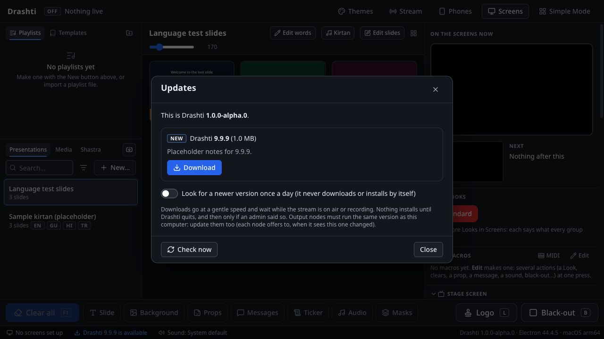

- **On Windows**, the update installs by itself as Drashti quits.
- **On the Mac**, until Drashti is signed with an Apple certificate, the update is downloaded and checked but cannot install itself: press **Show the file**, quit Drashti, open the file and drag Drashti into **Applications**.
- **Look for a newer version once a day** makes Drashti check by itself (it only tells you; it never downloads on its own). It is off to begin with.

**One version on both computers.** After updating Main, update the node too, the same evening. Until they match, the node refuses to follow Main and its screens keep their last picture; Main's **Screens** and the screens dashboard say which node needs updating. On the node, its window offers **Update to Drashti …**: press it, then **Download Drashti …**, then **Quit and install**, and start it again. A node with no internet: install the same version on it by hand.

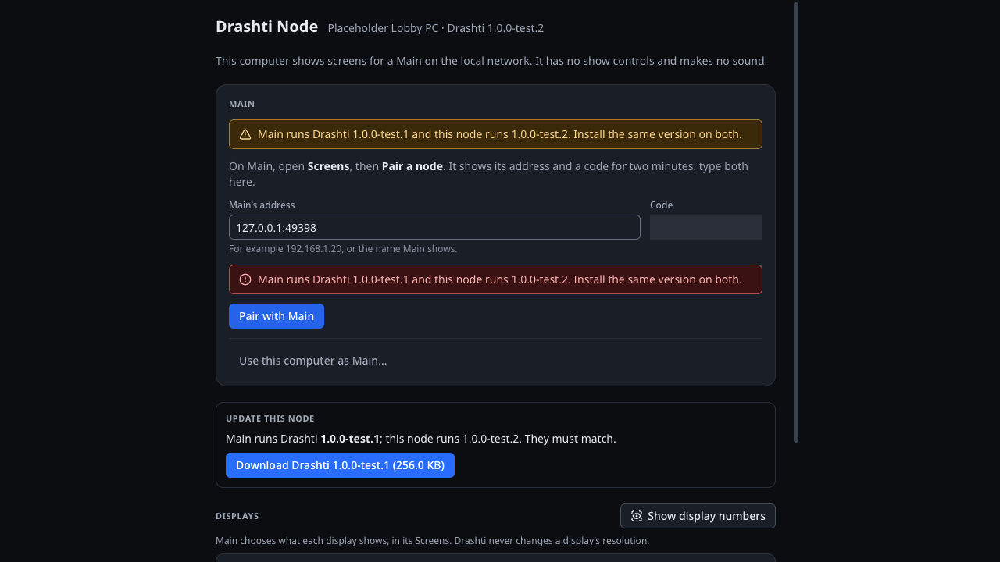

**Never update on the day of a sabha.** Update after a sabha, run the checks in section 12 on both computers, and keep the old installer until the next sabha has gone well.

---

## 3. Roles and PINs

Drashti has three roles:

- **Volunteers** run a sabha in **Simple Mode**: big buttons, nothing can be changed.
- **Operators** run the show in **Pro Mode**: playlists, words and slides, props, messages, timers, macros, Looks, masks, announcements, going live and recording.
- **Admins** also set Drashti up: importing and removing, themes and the logo, Shastra texts, calendars, the idle rotation and every schedule (the arti, backups, macros' times), macros and MIDI, the screens, Looks, stage layouts, masks and sound, the stream's settings and key, phones and nodes, backups, restores and updates, and the PINs.

**Without PINs**, Drashti starts in **Pro Mode** whenever it was quit on purpose, even if a volunteer was using Simple Mode: a volunteer who restarts Drashti sees Pro Mode. After an unexpected stop it comes back in the mode it was in, if it is started again within 3 hours; started later, it starts as after a quit on purpose. If volunteers should never find themselves in Pro Mode, set the PINs: then Drashti always starts in Simple Mode.

**Turning roles on.** Until two PINs are set, roles are off and anyone can leave Simple Mode by typing **pro**. To turn them on: **File**, then **Roles and PINs…**. Type an **admin PIN** and an **operator PIN** (4 to 12 digits each, different from each other), each twice, and press **Turn on roles**. Keep the admin PIN with the admins, and give the operator PIN only to the operators.

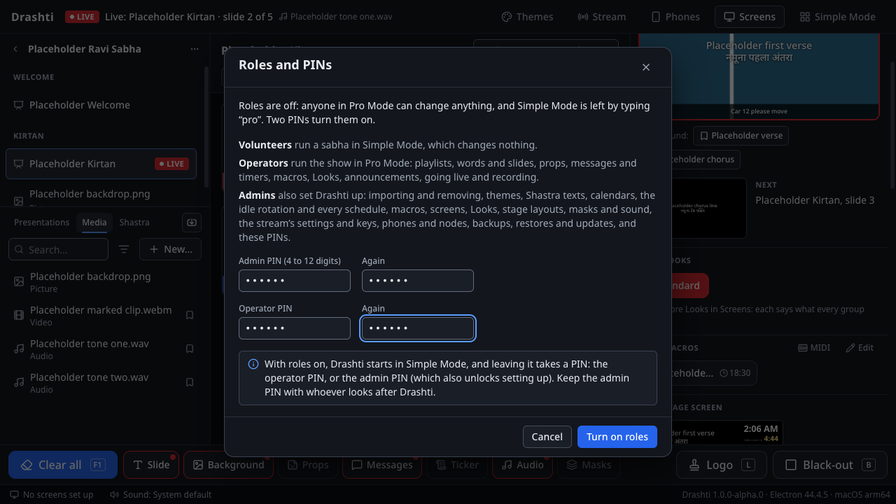

With roles on:

- Drashti starts in Simple Mode after a quit on purpose. **Switch to Pro Mode…** at the top right of Simple Mode (or **View**, then **Switch to Pro Mode…**) takes the operator PIN (or the admin PIN). After an unexpected stop, Drashti comes back in the mode it was in, with admin locked, if it is started again within 3 hours (later, in Simple Mode, as after a quit on purpose).
- In Pro Mode the header says **Operator**. Anything only an admin may do asks for the admin PIN first. Admin then stays unlocked for **10 minutes after the last admin action**; the header says **Admin** with the time left, and a press on it locks at once. Going into Simple Mode locks it too.
- After **five wrong PINs** in a row, Drashti waits a minute before it checks another, and longer after each further wrong one (up to 15 minutes), even over a restart. The log says a PIN was wrong, never the PIN.

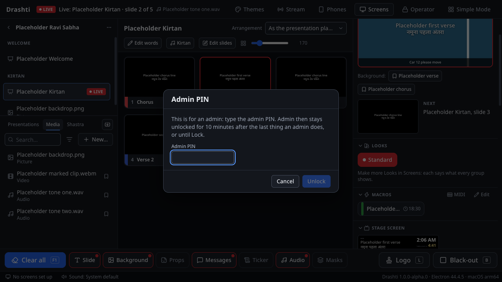

**Changing a PIN.** **File**, then **Roles and PINs…** (with the admin PIN).

**Resetting a forgotten admin PIN.** It cannot be read back, so it is reset at the computer, by someone who can use its user account:

1. Quit Drashti (on a Mac **Drashti**, then **Quit Drashti**; on Windows close its window).
2. Delete the file `roles.json` from Drashti's data folder:
   - **Mac:** in Finder choose **Go**, then **Go to Folder…**, paste `~/Library/Application Support/Drashti`, and drag `roles.json` to the Bin.
   - **Windows:** paste `%APPDATA%\Drashti` into File Explorer's address bar, press Enter, and delete `roles.json`.
3. Start Drashti. Roles are now off: Simple Mode is left by typing **pro**.
4. Set two new PINs in **File**, then **Roles and PINs…**.

Nothing else changes: the library, the playlists and the settings are as they were.

---

## 4. Screens, Looks and sound

The **setup wizard** sets the screens, their languages, the sound and the default theme in one go: it opens by itself the first time, and later from **View**, then **Set Up Screens…**. Section 4 of `docs/parallel-run.md` goes through it and through setting screens up by hand in **Screens**.

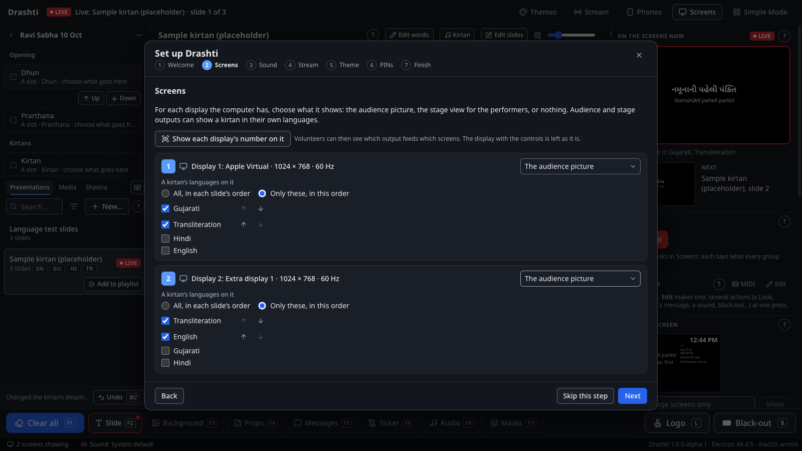

**Screen groups.** Each group is a set of screens that show the same: "Main Hall", "Stage", "Lobby". A group shows **the audience picture** or **the stage view (performers)**, or is **key and fill** for a video switcher. In **Screens**, each display has **Use this display**; each screen has its canvas size and scaling (for an LED wall that is not 1920 × 1080); **Identify screens** puts each screen's name on it.

**Looks.** A Look says what every group shows: which layers, a kirtan's languages and their order, and whether slides are drawn as designed or as a lower third. One Look is live at a time, and the operators switch it under the live picture. In **Screens**, under **Looks**: **New Look**, **Duplicate**, rename, **Earlier**/**Later**, **Remove**; choose a Look there to see and change each group's settings in it. Drashti starts with the **first** Look in the list after a clean quit, so keep the everyday Look first.

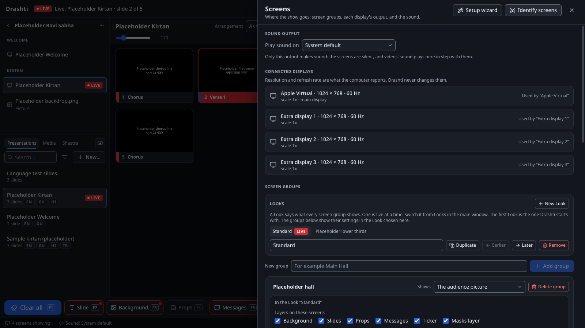

**Stage layouts.** Under a stage group, **Edit stage layouts…**: **Duplicate** Standard, then move and size its boxes (the slide, the next one, notes, the clock, timers, the stage message, what is next in the playlist, the time left on a video or sound, black-out and logo, fixed words), and **Save**. Then choose it under **Stage layout** for the group in the Looks that should use it. Ask the performers what they want to see.

**Masks.** A group's **Mask** in a Look is its screens' shape (an LED wall's outline, a projector spilling onto a pillar): **Edit masks…** under the group. It stays on: Clear all, F7 and Simple Mode never take it away. The **Masks** panel under the live picture is different: it puts a mask up for a moment, and F7 takes it down.

**Sound.** In **Screens**, under **Sound output**, choose the output that goes to the mixer. If it is not connected when Drashti starts, Drashti plays on the computer's default sound output, and a warning stays in the status bar until it is back.

**The logo.** In **Props** under the live picture, the stamp button beside a prop makes it the logo (**L**, and **Logo** in both modes).

---

## 5. Backups

**By hand.** **File**, then **Back Up Library…**: choose a folder on a USB drive or another disk, and keep **Include the media** ticked. Do it after any evening the library changed a lot (an import, a festival's slides).

**By themselves.** **File**, then **Scheduled Backups…**: **Choose…** the drive (never Drashti's own folder), tick the days, set the time (late evening, after the sabha), how many to keep (7 is a good start), keep **With the media** ticked, turn on **Back up by itself**, and **Save**. **Back up now** tries one at once.

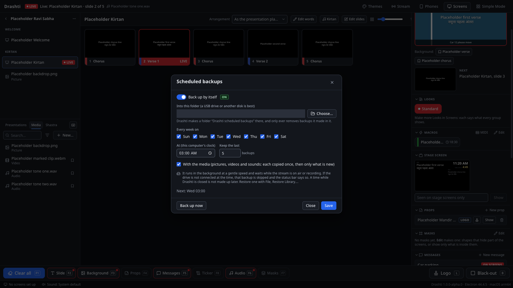

- The first backup copies every picture, video and sound; later ones copy only what is new, so they are quick.
- Drashti removes the oldest backups it made there when there are more than the number to keep, and nothing else on the drive.
- **Leave the drive plugged in.** A backup whose drive is missing is skipped, and a line at the bottom of the window says so until **OK**.
- A backup waits while the stream is on air or recording. One whose time passed while Drashti was closed is not made later.

**Restoring.** **File**, then **Restore Library…**, and choose a backup folder (for a scheduled one, a "Drashti backup …" folder inside "Drashti scheduled backups"). Drashti asks first, keeps the library it has as well (in `Backups/` in its data folder), and restarts: the screens go black for a moment, so **never restore during a sabha**. If the backup turns out to be damaged, Drashti says so after the restart and keeps the library it had.

**What a backup does not hold:** the PINs, the stream key (it is in the computer's own secure storage), and Main's certificate for the node. After restoring onto a new computer: set the PINs and the stream key again, pair the node again, and in **Screens** choose each screen's display again (the backup remembers the old computer's displays).

---

## 6. The node

Section 8 of `docs/parallel-run.md` has the steps: on the second computer choose **Node** on its first start; on Main, **Screens**, then **Pair a node**, which shows Main's address and a code for two minutes; on the node, type both and press **Pair with Main**. Then, in Main's **Screens**, give each of the node's displays a group with **Use this display**.

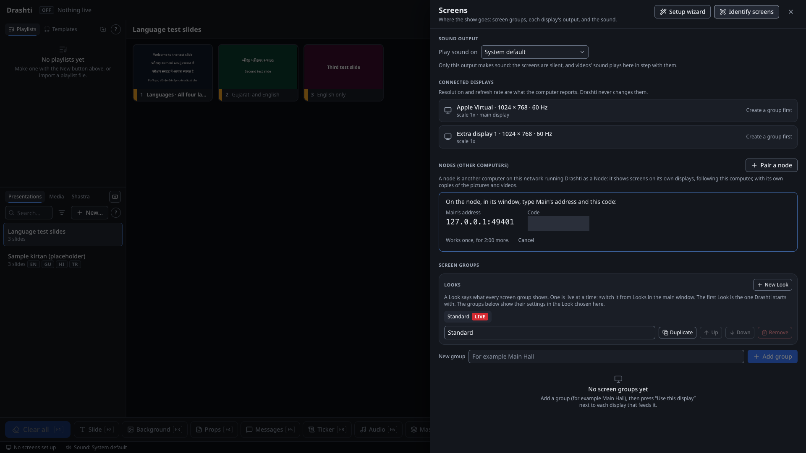

**Its pictures and videos.** The node keeps its own copies, made over the network ahead of time: what is on the screens and what Next brings, the playlist playing, every playlist made, changed or opened on Main in the last 7 days, the props, the logo and the idle rotation's pictures. Sound is never copied. For a festival with pictures from elsewhere in the library, tick **Get everything ready** for the node in the screens dashboard (it copies every picture and video in the library, not only this week's, until it is unticked). To reuse a playlist from an earlier week, open it on Main before the sabha (a click is enough).

**Before each sabha**, open the screens dashboard (the screens line at the bottom of Main's window): the node should say **Online**, and its pictures and videos ready ("14 of 14 ready").

**Fonts on the node.** The node draws the words itself. A font that is only installed on Main (a legacy Gujarati font, or an English font a theme names) must be installed on the node too (section 11).

**Removing a node.** **Remove** beside it in Main's Screens or the dashboard: it is cut off at once and its screens go black. On the node, **Use this computer as Main…** turns it back into a Main, with the library it had before, untouched.

**A screen that says Stopped.** If one output keeps failing (more than 5 times in a minute), Drashti stops trying for a moment: that screen is black, the status line at the bottom says "1 stopped", and Screens shows **Stopped**. Drashti tries it again by itself after 2 minutes, then every 10 minutes; **Try again** in Screens tries at once. The other screens are not affected. If it keeps happening, save diagnostics and fall back for that screen.

**When a file Drashti keeps cannot be read** (a damaged disk, a file cut short). Drashti never takes it for a missing file and never writes over it: it tries once more, then keeps the file aside in its data folder with the date in its name (for example `identity.unreadable-2026-10-10 05-36.json`), and says what it did:

- **Main's identity for its nodes** (`node-link/identity.json`): every paired node checks it, so Drashti does not make a new one by itself. A note says so when Drashti starts, nothing follows Main, and **Screens** says "The nodes cannot follow this computer". An admin presses **Make a new identity…** there; then pair each node again (on the node, **Unpair…**, then a new code from Main).
- **The role file** (Main or Node): Drashti starts as whichever it last ran as (judged from its other files; with no library at all, a node) without asking, and says what it chose.
- **A node's pairing** (`node.json`): the node starts unpaired and says so. Pair it again.

---

## 7. Phones and tablets

Section 7 of `docs/parallel-run.md` has the steps: **Phones** in the header, **Let paired phones and tablets connect**, then **Pair a Remote / Stage / Announcements device** for each phone or tablet, and **Make a poster link** for announcements from anyone on the Wi-Fi.

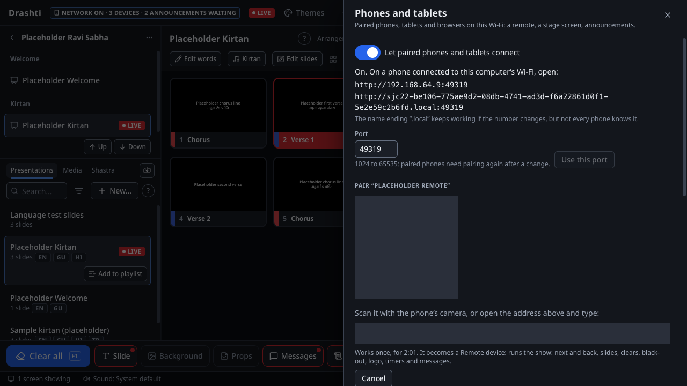

- Name each phone after its owner ("Remote: Priyansh's phone"), so the list says whose it is.
- **Remove** a phone that is lost, or whose owner leaves the seva: it is cut off at once.
- **Make a new one** stops an old poster's link (if a photo of it went somewhere it should not).
- Phones need **Safari 16.4 or later** on an iPhone or iPad, or **Chrome** on Android.
- **Presenters** (a speaker with a phone or an iPad) pair as a Remote, and use `docs/presenter-guide.md`: the library, their notes, and Next, from their own device, at no cost.
- A stage tablet should be set never to lock while it shows the stage.

---

## 8. The network: firewalls and a fixed address

**Firewalls.** Drashti listens for phones (port 8740, while the network is on) and, on Main, for the node (port 8741, while a node is paired). The first time each is turned on:

- **Mac:** "Do you want the application Drashti to accept incoming network connections?" Press **Allow**. If it was refused: **System Settings**, **Network**, **Firewall**, **Options**, and set Drashti to allow incoming connections.
- **Windows:** Windows Security asks about Drashti: tick **Private networks** only, then **Allow**. Check that Windows treats the mandir's network as private: **Settings**, **Network & internet**, the network's properties, **Private network**. If it was refused: Windows Security, **Firewall & network protection**, **Allow an app through firewall**, find Drashti and tick **Private**.

**A fixed address for Main.** Phones remember the address they were paired at, and the node looks for Main at the addresses it last knew. If the router gives Main a new number one day, phones paired at the old number cannot find it, and the node goes offline. So:

- Ask whoever looks after the mandir's network to **reserve Main's address in the router** (often called a DHCP reservation, or a fixed or static IP), for the cable or Wi-Fi that Main uses (each has its own).
- Pair phones at the address that ends in **`.local`** where the Phones panel shows one (it keeps working when the number changes).
- If the number did change: pair the node again (on the node **Unpair…**, then pair with the new address), and the phones at the new address.
- Use the mandir's own network, never a guest Wi-Fi, which keeps devices apart. A cable between Main and the node is better than Wi-Fi.

---

## 9. Shastra texts and calendars

Drashti comes with no scripture text and no calendar: an admin loads files prepared from a source BAPS or the mandir has authorised. The file formats are in `docs/shastra-format.md` and `docs/calendar-format.md`, with made-up examples in `docs/examples/`.

**Shastra texts.** Drag the file onto the library, or in the **Shastra** tab use **Texts…**, then **Load a text…**. Loading a text again (the same abbreviation) updates it, and its passages in playlists keep working. **Texts…** also removes one. Themes has a style for each language of a text, Sanskrit's two scripts included.

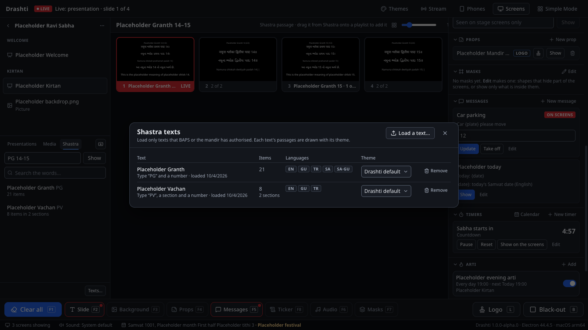

**Calendars.** Drag the file onto the library, or **Calendar** in the Timers panel, then **Load a calendar…**. Loading it again (the same name) updates it. Today's Samvat date and tithi then show along the bottom of the operator window, on stage layouts that have the box for it, and on the hall's screens only in a message that uses it. A date no calendar gives shows nothing.

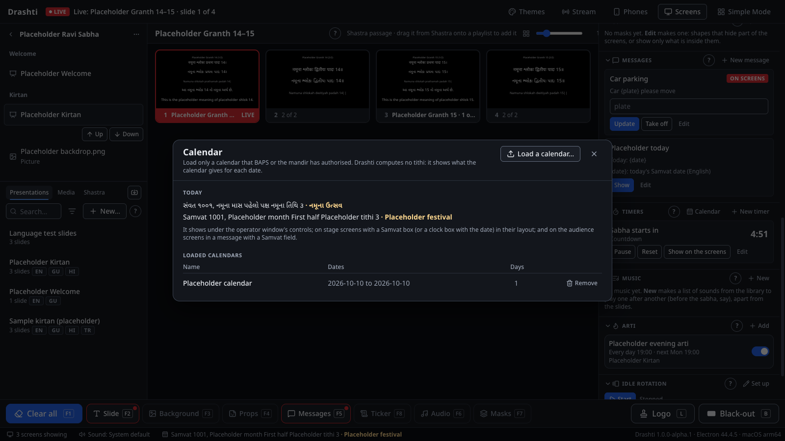

---

## 10. The arti, the idle rotation, music and markers

**The arti at its time.** The **Arti** panel at the bottom of the live column: **Add** sets its name, the presentation that is the arti, the days (or one date), the time, how many minutes before to prompt the operator, and whether it goes up by itself (then only after ten seconds counted down, with **Cancel**). The switch beside each turns it off without losing it. Without the "by itself" switch, it never goes up by itself: from its time, the operator's next Next puts it up.

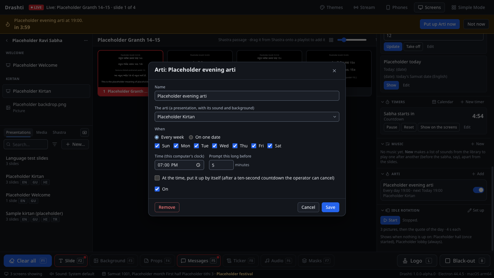

**The idle rotation.** Darshan pictures and quotes for before the sabha, or a lobby screen. **Set up** in the **Idle rotation** panel: tick pictures from the media library, put them in order, set how long each stays up, and type the quotes (from authorised sources) with who said or wrote them. Then, in **Screens**, each group's Look says what it shows **When nothing is up**: **The idle rotation, once started** (the operator presses **Start**; it stops by itself when the first slide goes up), **The idle rotation, always** (a lobby screen), or **Nothing**. A macro at a set time can start it (18:30, say).

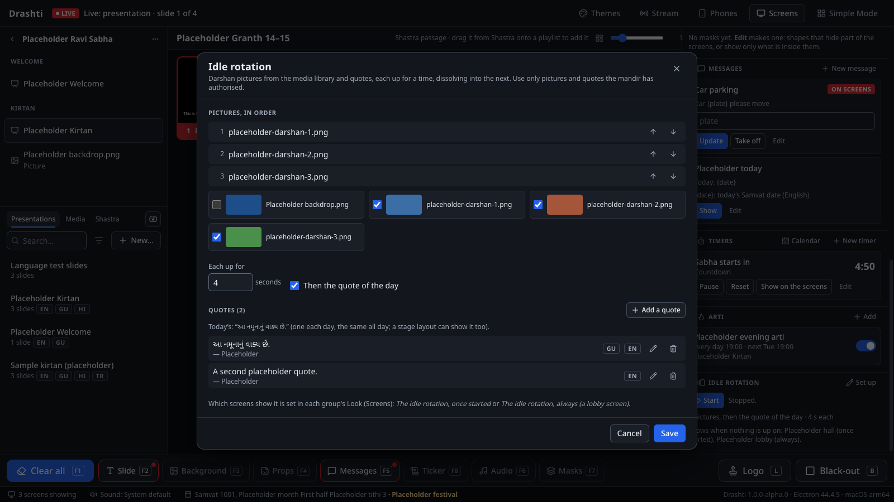

**Music before the sabha.** The **Music** panel: **New**, **Add sounds…** (tick sounds from the library), put them in order. The operators press **Play**; Simple Mode has **Play music** and **Pause music** too. A slide's own sound stops the music, with a fade.

**Markers.** In the library's **Media** tab, a video or a sound has a **Markers** button (a bookmark; its tooltip says "Start, end and markers of …"): set where it starts and ends (**Here** takes the time the preview shows), and named markers to jump to (**Add at the time shown**). Every slide and item that uses the file follows them, and while it plays the markers are buttons under the live picture. Played once, it stops within two frames of its end point on every screen.

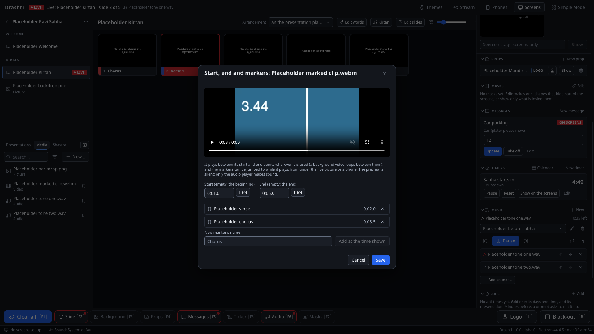

**Macros at set times.** In the macro editor, **Runs by itself**, **Add a time**. At the time, a strip counts down ten seconds with **Cancel**, in Simple Mode too. One whose time passed while Drashti was closed, or the computer slept, is not run later.

---

## 11. Fonts

Drashti brings its own fonts for Gujarati, Hindi, English and transliteration, so its own slides look the same on every computer and phone. Two kinds of font come from the computer instead:

- **Legacy Gujarati and Hindi fonts** (Gopika, Terafont, Kruti Dev and others), in which older slides were typed. The import report names them. Those slides only look right where the font is installed: install it on **Main and on the node**. Their words cannot be searched or edited as text yet.
- **A font a theme or a slide names** (an English display font, say): install it on both computers too, or set the theme back to Drashti's own font (leave the font empty).

After installing a font, quit Drashti and start it again. Then look at a few of those slides on every screen, the node's too.

---

## 12. Checks, diagnostics, and when things go wrong

**After installing or updating, on each computer:**

1. **The performance check** (section 11 of `docs/parallel-run.md`): run it twice and keep the second line. It should say `"passed":true`.
2. **The watchdog self-test**, on Main and on the node. Start Drashti from Terminal (Mac) or PowerShell (Windows) with diagnostics on, put a slide up, and choose **Diagnostics**, then **Run Watchdog Self-Test**. It takes about a minute (one output is black for about 20 seconds while it checks that a stuck screen is noticed). Every line should say PASS.
   - Mac: `DRASHTI_DIAGNOSTICS=1 /Applications/Drashti.app/Contents/MacOS/Drashti`
   - Windows: `$env:DRASHTI_DIAGNOSTICS=1; & "$env:LOCALAPPDATA\Programs\drashti\Drashti.exe"`

   On the node, start it the same way, with Main running, a slide of words up on Main (no video or timer, which change the picture) and one of the node's displays showing it; then **Diagnostics**, then **Run Watchdog Self-Test** (on Windows, press **Alt** for the menu). It crashes and reloads the node's own window and crashes the output, and checks the screen keeps its picture throughout and comes back showing Main's slide. Don't change slides on Main while it runs (about half a minute).

3. On the Windows PC, the checks in `docs/windows-checks.md`.

**Diagnostics.** After any problem, **Help**, then **Save Diagnostics…** writes one file to the Desktop: the versions, the screens and sound, counts from the library, the watchdog's events and the log. It holds no kirtan words, names or file paths, so it can be sent to whoever helps. The log itself is in Drashti's data folder, under `logs/`. On the node, **Help**, then **Save Diagnostics…** writes the node's own file to its Desktop (on Windows, press **Alt** for the menu): its link to Main and since when, its clock against Main's, the screens Main gave it, its copies of Main's pictures and videos (counts only), the watchdog's events and the log. It has no library part, and never the node's key to Main. Send both files after a problem that showed on the node's screens.

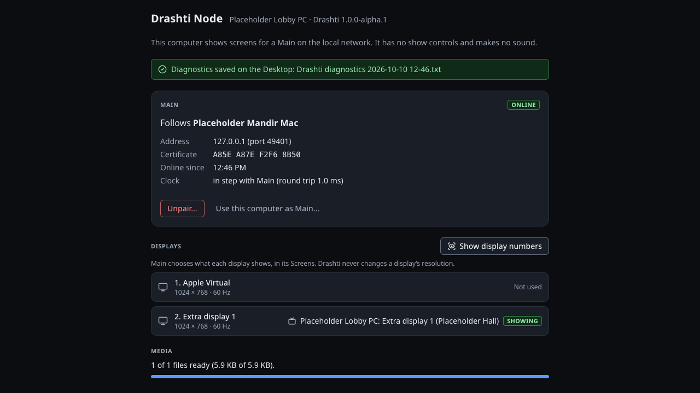

**The Stream panel says "The stream server's certificate could not be checked".** Drashti checks that it is really talking to YouTube before it sends anything, and that check failed. Look first at the computer's date, time and time zone: a wrong date is the usual cause. If they are right, the network may be one that inspects secure connections (a filter, or a hotel or office network): ask whoever runs it, or stream from the other computer. Drashti never turns the check off. (Drashti 1.0.0-alpha.0 on a Mac always failed it; Drashti since Session 23 does not.)

**When Drashti stops unexpectedly** (a crash, a power cut, a forced quit). Drashti saves what is on the screens as it changes, and every minute. Started again within **3 hours**, it puts it all back by itself (the slide, the background, black-out, the sound, timers, messages, props, the Look) and a note at the top says what it put back. Started 3 hours or more after the stop, it puts nothing on the screens, and the note says what was live and when. After a quit on purpose, nothing is put back, whatever happened in between, and the stream does not go on air or record again by itself.

**Falling back to ProPresenter.** ProPresenter stays installed, untouched, until Drashti has run four weeks of sabhas on that computer without falling back (PLAN.md, section 5.1). Every sabha has a named fallback operator who has practised it (under a minute):

1. Quit Drashti (**Cmd+Q**, or close its window on Windows). It asks first if screens are showing or the stream is on air or recording: confirm.
2. Open ProPresenter. Its screens come back as before.
3. After the sabha, save Drashti's diagnostics and write down what happened and when.

Fall back when Drashti cannot keep the screens right and the fix is not quick; not for a slide that a click puts right.

---

## 13. How much the computers need

Session 15 measured Drashti's heaviest cases on CI's computers, which have no real graphics chip (the Windows one decodes and draws video with its four cores; the Mac is a virtual machine with a virtual one), and again with a handicap (only two cores on Windows; busy programs competing on the Mac). In each, the slides changed every two seconds while a big import ran. The numbers are in the README ("Speed on modest hardware"). What they mean for the mandir:

- **Even the Windows computer with no graphics chip** kept every frame of a 1080p video background at 30 or 60 fps, of 4K, of a video under a mask, and of three screens with the stream, a recording and the music, and slides reached the screens within two frames. With only two cores it still kept 95 to 99% of the frames, except when a new video started every two seconds (then only half).
- **The Mac virtual machine** kept 86 to 100% of a 1080p30 background's frames, and fewer of 60 fps, 4K and dissolving videos. A real Mac decodes and draws video in its graphics chip.
- So each computer needs **a graphics chip that decodes video** (section 1), and the computer that streams, **a graphics encoder** (VideoToolbox on a Mac; NVENC, Quick Sync or AMF on a PC): the Stream panel's "Encoder" line names the one in use. Without one, on a modest PC, streaming takes all the processor there is.
- **Video backgrounds at 1080p and 30 fps.** 4K is four times the decoding for a 1080p screen, for nothing the hall can see.
- **Big imports before or after the sabha.** During one, the import gives way to the show: with the stream on, on a two-core PC, 400 files took more than 12 minutes.
- **After installing or updating, put a video up once before the first sabha:** the first one can hold slide changes up for a moment while the computer prepares its graphics.

The performance check (section 12) on each mandir computer says whether that computer keeps up, and its **video cases** say whether it shows a video background smoothly (`docs/parallel-run.md`, section 11; the setup-day checklist, section 8).

**Ahead of other programs (Windows).** On Windows, Drashti runs ahead of other programs (above normal priority), so the screens' video never keeps a slide change waiting. Session 15's tests seemed to show a price on a PC with no graphics chip when a new video dissolves in every few seconds, but they compared it with below normal, where CI's computer starts programs. Session 17 compared it with normal, where the mandir PC starts Drashti (two cores, no graphics chip, three runs each way): ahead of other programs, Drashti never stopped answering for more than about 30 ms with dissolves (at normal, up to 105 to 186 ms), kept a few more of the video's frames and finished the import sooner; at normal, 9 in 10 slide changes were a little quicker (20 to 29 ms against 34 to 50 ms). With three screens and the music the two were alike, and with the stream encoded on the processor as well both were overloaded (the stream held only 3 to 12 frames a second): the PC that streams needs a graphics encoder either way. Run the video cases on the PC both ways (the checklist says how) and decide: to set it back to normal on that computer, untick **File**, **Run Ahead of Other Programs** (press **Alt** for the menu; admin only; a node has it in its own **File** menu). It changes at once and stays for every start after, on that computer only (restoring a library elsewhere does not bring it). Tick it again to go back. The log says which it runs at (`Main process priority …`).
