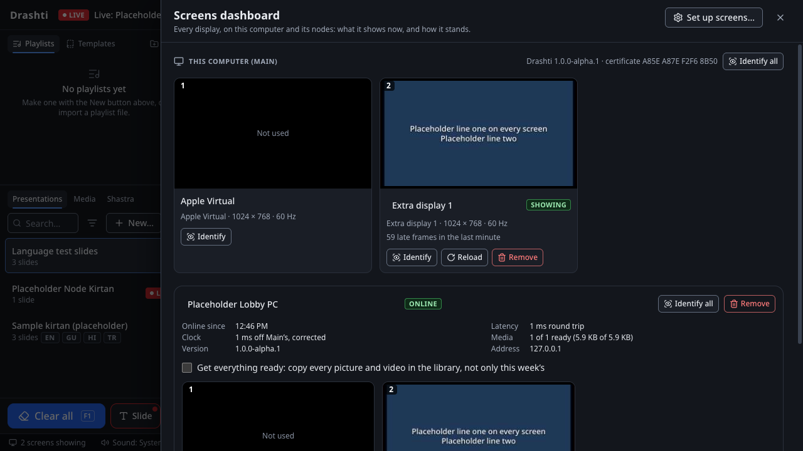
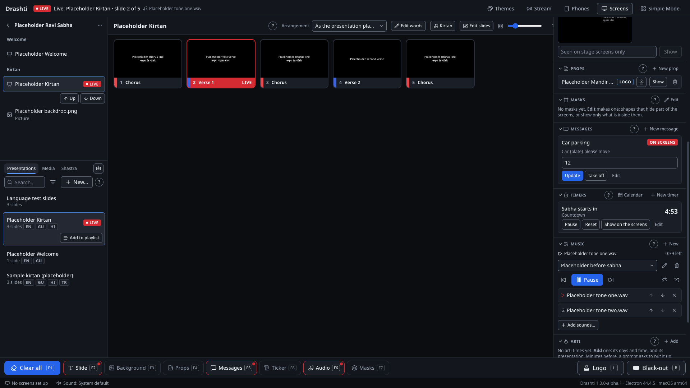
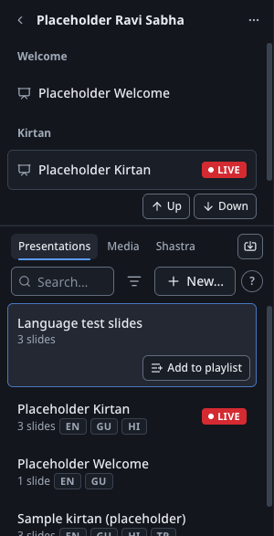
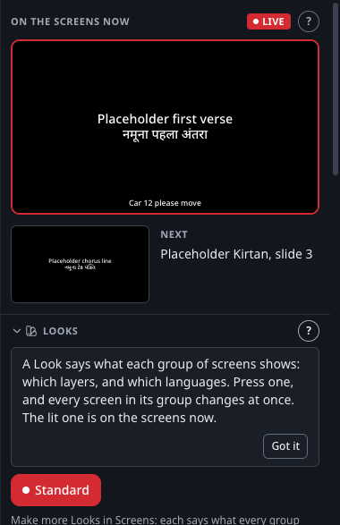
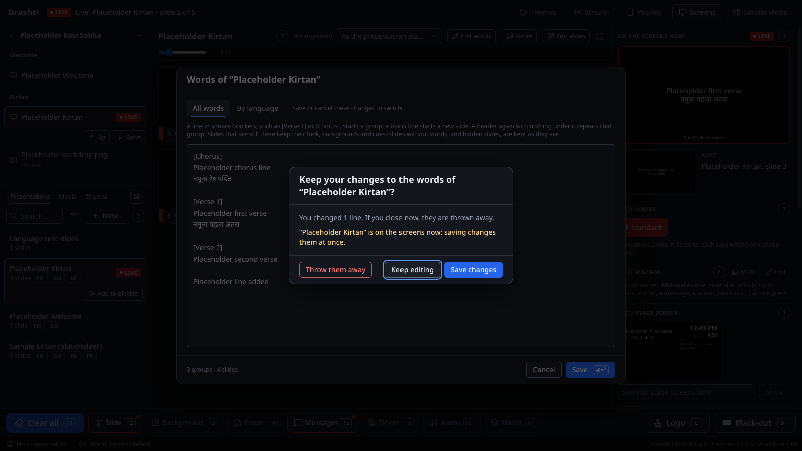
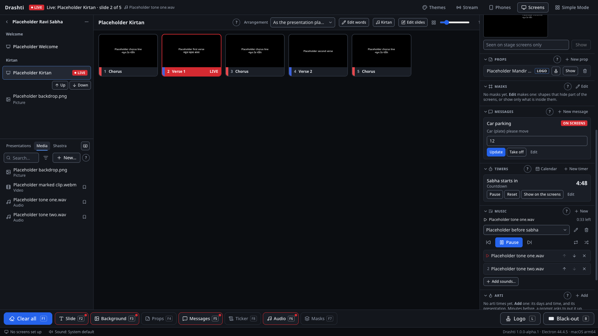
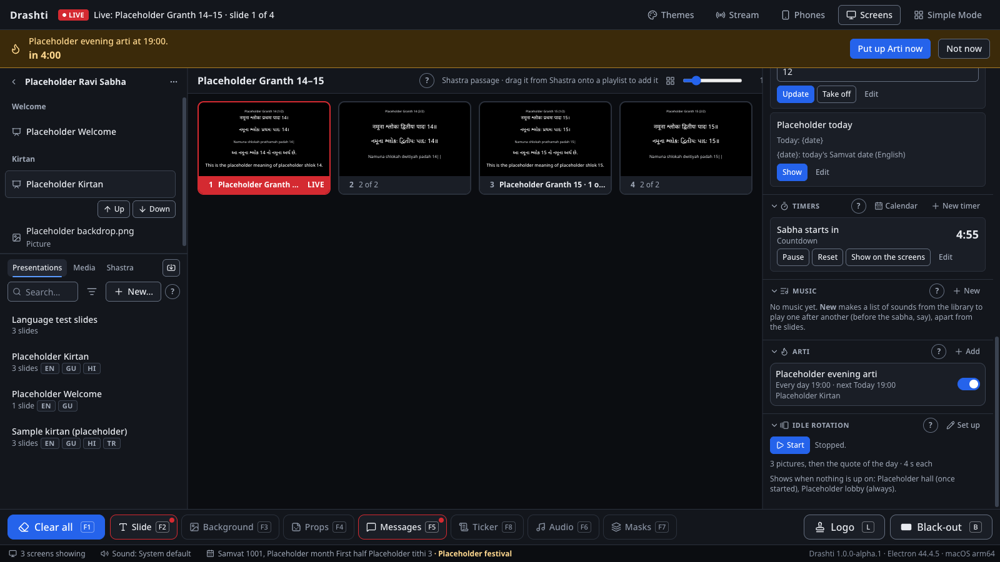
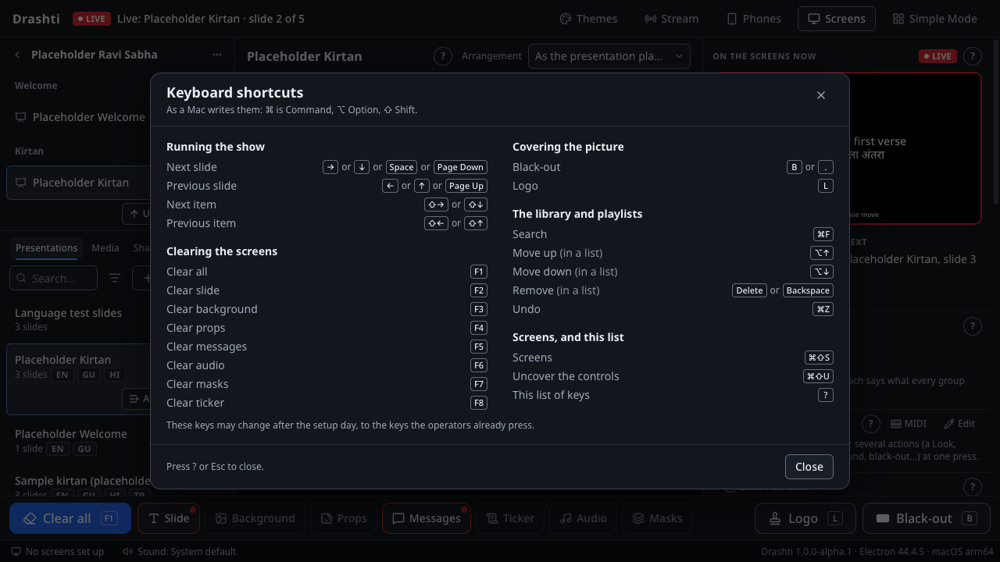

# The operator's guide: running a sabha in Pro Mode

This guide is for the **operators**: the people who run a sabha's screens in Drashti's Pro Mode, from switching on to switching off. It goes through a whole sabha in the order things happen. A volunteer who only presses Next uses Simple Mode instead (see "Simple Mode, for a volunteer" in `docs/parallel-run.md`), and setting Drashti up (screens, PINs, backups, the node, schedules) is the admin's job (`docs/admin-guide.md`).

On the Mac, **Cmd** is the ⌘ key; on Windows use **Ctrl** instead. On Windows the menu bar is hidden: press **Alt** to show it.

**The window, left to right:**

- **Left column:** at the top the **Playlists** (and **Templates**), and below them the **Library**: Presentations, Media and Shastra, with the search box.
- **Middle:** the **slides** of whatever you clicked, in the order they play.
- **Right column:** the **live picture** (what the hall sees now), **Next** (what Next will bring), and the panels: Looks, Macros, Stage screen, Props, Masks, Messages, Timers, Music, Arti and the Idle rotation.
- **Along the bottom:** the **clear buttons** for each layer, **Logo** and **Black-out**, then the **status bar** (the version, the screens, imports, warnings).

---

## 1. Before the sabha

Do these about 30 minutes before the sabha starts.

1. **Switch on and start Drashti.** Without PINs it opens in Pro Mode. If the screen shows Simple Mode (big buttons, as it does with PINs set), press **Switch to Pro Mode…** at the top right, and type the **operator PIN** (or the word **pro** if PINs are not set).
2. **Check the screens.** Click the screens line in the status bar (for example "3 screens showing"). The **screens dashboard** shows a small picture of what every screen really shows, the hall's, the stage's and the second computer's (the node). Every node should say **Online** and its pictures and videos **ready** (for example "14 of 14 ready"). **Identify** puts a screen's number on it if you are not sure which is which.

   

3. **Open tonight's playlist.** Under **Playlists** click it. If it is a playlist from an earlier week, open it now (a click is enough): the second computer then copies its pictures and videos in good time.
4. **Check the sound.** Play a sound from the playlist, or press **Play** in the **Music** panel, and check the mixer hears it. The status bar always says where the sound goes; a warning there means the chosen output is not connected.
5. **Music before the sabha.** In the **Music** panel, choose the list and press **Play**. It plays one sound after another with short fades, apart from the slides, until a slide's own sound takes over or you press **Pause**.

   

6. **Darshan pictures and quotes on the screens** (if the admin set up the idle rotation): press **Start** in the **Idle rotation** panel. It stops by itself when the first slide goes up.
7. **A countdown for the start** (if wanted): in **Timers**, press **Start** beside the countdown (for example one named "Sabha starts in"), and **Show on the screens** to put it on the hall's screens: they show "Sabha starts in 4:59".
8. **The stream** (only on the computer that streams, and only if tonight's sabha is streamed): press **Stream** in the header, choose **Camera and words** or **Slides**, press **Record** if it should be recorded, then **Go live…** and **Go live**. The header says **ON AIR** (and **REC**). Section 6 of `docs/parallel-run.md` has the details.
9. **Phones** (if a phone remote or a stage tablet is used): press **Phones**, check **Let paired phones and tablets connect** is on, and check each phone says **Connected**.

## 2. Running the sabha

**Starting.** In the open playlist, click the first item. Its slides appear in the middle. Press **Space** (or **→**) to put the first slide on the screens.

**Going through it:**

| Key                                      | What it does                                                                       |
| ---------------------------------------- | ---------------------------------------------------------------------------------- |
| **Space**, **→**, **↓** or **Page Down** | The next slide; at the end of an item, on into the next (headers are stepped over) |
| **←**, **↑** or **Page Up**              | The slide before                                                                   |
| **Shift+→** or **Shift+↓**               | The start of the next item                                                         |
| **Shift+←** or **Shift+↑**               | The start of the item before                                                       |
| A click on a slide                       | That slide, at once                                                                |
| A click on an item, then **Space**       | That item, from its first slide                                                    |

- **Next**, under the live picture, shows what the next press will bring, so nothing surprises you.
- Pictures and videos in the playlist go up as the **background**; the words of the next presentation go over them. A sound plays through the mixer and leaves the picture as it is.
- A presentation can play in its own **arrangement** (a chorus sung three times shows three times): choose it above the slides.
- A **Shastra passage**: in the **Shastra** tab, type its reference (for example `SD 14` or `Vach G.Pr. 1`) and press Enter; its slides appear in the middle like a presentation's.
- To find any kirtan quickly: **Cmd+F** (Ctrl+F), type a few letters of its title or its words, and press Enter.
- A playlist, folder or item has a menu (rename, remove, timers when it goes up, and more): right-click it, or press **Shift+F10** with the keyboard on it (on a Mac laptop, **Fn+Shift+F10**).
- **What is this?** The small **?** on a panel's heading says in two or three sentences what the panel is for and what to do first. **Got it** closes it.
- **Closing with changes asks first.** Edit words, the slide editor and the other editors ask "Keep your changes …?" before anything typed is lost: **Keep editing** (Enter or Esc), **Save changes**, or **Throw them away**. When the presentation is on the screens, it says so: saving then changes the screens at once.
- **Changing the playlist without dragging:** choose a presentation, a picture or video, or a Shastra passage in the library and press **Add to playlist** beside it; it goes after the playlist's chosen item. To move an item, choose it and press **Up** or **Down** beside it (or **Alt+↑** / **Alt+↓**). **Cmd+Z** (Ctrl+Z) takes back the last add or move. Dragging works too.

**Covering and clearing:**

| Key or button                   | What it does                                                                                                                     |
| ------------------------------- | -------------------------------------------------------------------------------------------------------------------------------- |
| **B** (or **.**), **Black-out** | Black on the hall's screens, and back exactly as it was. The stage screens keep the words.                                       |
| **L**, **Logo**                 | The mandir's logo instead of the picture, and back                                                                               |
| **F1**, **Clear all**           | Everything off the hall's screens. Straight after it, **Put it back** brings it all back.                                        |
| **F2** to **F8**                | One layer off: the slide's words (the background stays), the background, props, messages, the sound, the Masks layer, the ticker |

A clear button is lit, with a dot, while its layer is on the screens.

**Messages.** In **Messages**, fill in a message's fields (for example the car's number in "Car {plate} please move") and press **Show** (or Enter in the field). It goes across the bottom of the hall's screens. **Take off** removes it; **F5** removes them all.

**Timers.** In **Timers**: **Start**, **Pause**, **Reset**, and **Show on the screens**. The stage screens show every running timer by themselves.

**The stage message.** Under the live picture, **Stage screen**: type a short message for the performers ("Two minutes left") and send it. Only the stage screens show it, and Clear all leaves it; its own **Clear** takes it off.

**Props.** In **Props**, **Show** puts one up (the mandir's name, say) over whatever slide is live; **Hide** or **F4** takes it down.

**Looks.** If the admin made more than one Look ("Gujarati only", "Lower thirds"), switch between them in **Looks**: every screen changes at once.

**Macros.** A macro's button (in **Macros**) does several things at once, as the admin set it up ("Arti": Clear all, the arti prop, the sound, the stage message). Some run by themselves at a time: a strip near the top then counts down ten seconds; press **Cancel** to stop it that time.

**Announcements from phones.** While the network is on, **Announcements** in the header says how many are waiting. Open it, read each one, fix a typo with **Edit**, then **Approve** it into the ticker or as a message, or **Reject** it.

**Markers.** While a video or a sound with markers plays, its markers are buttons under the live picture: a press jumps every screen and the sound there together.

**The arti.** If the admin set the arti's time, a strip under the header names it and counts down to it, from some minutes before. At the time, the arti is what Next shows: press Next at the right moment. **Put up Arti now** puts it up at once; **Not now** leaves it.

**Music during the sabha.** A slide or item with a sound of its own stops the music (with a short fade). **Clear audio** (the **Audio** button along the bottom, or F6) stops it too, and **Put it back**, pressed at once, brings it back where it would be by now.

## 3. When something goes wrong

**The controls are covered by an output.** Press **Cmd+Shift+U** (Ctrl+Shift+U on Windows): every output over the controls turns off. It works even when Drashti is not the active app.

**A mistake on the screens.** Put the right slide up with a click, or press **←** (the slide before). After **Clear all** by mistake, press **Put it back** at once.

**A screen is black or frozen.** Open the screens dashboard: its picture shows what that screen really shows. Pro Mode can **Reload** it there. Drashti also restarts a screen that stops drawing by itself, within about 10 seconds. If the status line says **stopped**, that screen kept failing: Drashti tries it again every few minutes, and **Try again** in Screens tries at once. If a whole output computer stopped (a node offline), carry on: its screens keep their last picture, and it comes back by itself when the network does.

**No sound.** Check the status bar: it says where the sound goes and warns when the chosen output is missing (Drashti then plays on the computer's own speakers). Check the mixer's channel.

**The stream says Reconnecting.** Do nothing: Drashti tries again by itself and the recording carries on. The hall's screens are not affected. If it also says **the stream server's certificate could not be checked**, waiting will not help: tell whoever looks after Drashti (the admin guide, section 12).

**Drashti closed by itself.** Start it again: it puts back what was on the screens (the slide, background, sound, timers, messages and props) and says so at the top. If it was on air less than 5 minutes ago, it goes live again by itself. This happens only within 3 hours of the stop: started later than that (the next morning, say), Drashti puts nothing on the screens, and the note at the top says what was live and when. Within those 3 hours it also comes back in the mode it was in (Pro Mode or Simple Mode); started later, it starts as after a quit on purpose. After Drashti was quit on purpose, it always starts with nothing on the screens.

**When to fall back to ProPresenter.** If Drashti cannot keep the screens right, the named fallback operator quits Drashti (**Cmd+Q**, or close its window on Windows) and opens ProPresenter, as practised (`docs/parallel-run.md`, section 9). Then save diagnostics (below) for whoever looks after Drashti.

## 4. After the sabha

1. **The stream**: **End the stream…**, then **End the stream**, and **Stop recording**. End the broadcast in YouTube Studio too.
2. **F1** (Clear all), so nothing is left up.
3. If anything went wrong, **Help**, then **Save Diagnostics…**: a file appears on the Desktop. Send it to whoever looks after Drashti with the time and what you saw. It holds no kirtan words, names or file paths.
4. Quit Drashti, or switch to Simple Mode for the next volunteer (**View**, then **Switch to Simple Mode**). With PINs set, admin locks itself.

## 5. Keys at a glance

In Drashti, **Help**, then **Keyboard Shortcuts…** (or press **?** when no field is chosen) lists every key, as your computer writes it. The full key card, including the slide editor's keys, is at the end of `docs/parallel-run.md`. Going live, ending the stream and recording have no keys: always the buttons, and always a question first.

