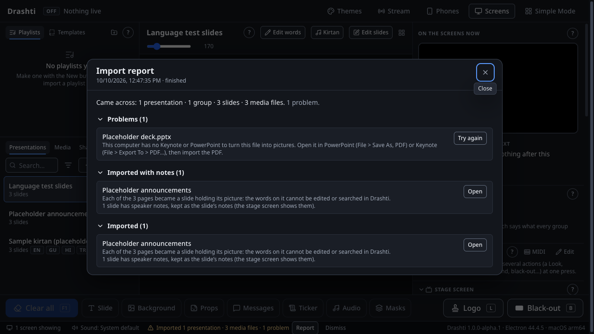

# Running Drashti alongside ProPresenter

This guide is for the volunteers who try Drashti on the mandir's two computers, the ProPresenter 6 Mac and the ProPresenter 7 Windows PC, before it is used for a real sabha. It follows the plan's "parallel run" (PLAN.md, section 5.1): Drashti runs on the real computers and screens on evenings **without** a sabha, and ProPresenter stays installed, untouched, the whole time.

You never need to change anything in ProPresenter. Drashti only reads its files.

Keep a notebook (or a shared document) open. For every evening, write down the date, which computer, who was there, and anything that looked different from ProPresenter or went wrong, with the time it happened.

---

## 1. First: check the Mac's macOS version

Drashti is built on Electron 44, which needs **macOS 13 (Ventura) or later**.

1. On the Mac, click the Apple menu in the top-left corner and choose **About This Mac**.
2. Read the version under the name, for example "macOS Sonoma 14.6".
3. If it says macOS 13, 14, 15 or later, carry on.
4. **If it says macOS 12 (Monterey) or anything older, stop here and tell us.** Do not try to update macOS yourself on the show computer. Drashti cannot run on it yet, and we will decide together what to do.

On the Windows PC, Drashti needs 64-bit Windows 10 or Windows 11. Press the Windows key, type `winver`, press Enter, and write down the version and build number.

---

## 2. Get Drashti and install it

Drashti is free, from one link for each computer. Each link always gives the newest version:

- **A Mac with Apple silicon:** https://github.com/Priyansh9121/drashti/releases/latest/download/Drashti-mac-apple-silicon.dmg
- **A Mac with an Intel processor:** https://github.com/Priyansh9121/drashti/releases/latest/download/Drashti-mac-intel.dmg
- **The Windows PC:** https://github.com/Priyansh9121/drashti/releases/latest/download/Drashti-windows-setup.exe

**Which Mac is it?** Apple menu, **About This Mac** (as in section 1). A line **Chip** that says Apple M1, M2, M3 or later means Apple silicon. A line **Processor** that mentions Intel means an Intel Mac. Take the right one: the Apple-silicon file does not open on an Intel Mac, and the Intel one runs more slowly on Apple silicon.

If a link says **Not Found**, no version has been published yet. Whoever looks after Drashti can then give you the installers from the newest CI run (**Actions**, **CI**, the newest green run for `main`, under **Artifacts**: **drashti-macOS** or **drashti-Windows**, zip files kept for 7 days; unzip the download).

**On the Mac:**

1. Open the downloaded `.dmg` (in **Downloads**) and drag **Drashti** into **Applications**.
2. Open Drashti from Applications. The first time, macOS says it could not verify Drashti, because it is not signed yet. Click **Done**, then open **System Settings**, then **Privacy & Security**, scroll down to **Security**, and click **Open Anyway** next to the message about Drashti. Confirm with your password (or Touch ID), and click **Open Anyway** once more. (On macOS 13 or 14 you can instead right-click Drashti in Applications and choose **Open**.)
3. This is only needed once. Eject the Drashti disk in Finder's sidebar; the `.dmg` can go in the Bin.
4. Drashti has its own logo: you see it in Applications, in the Dock while Drashti is open, and when you switch apps with Cmd+Tab. If the Dock or Finder still shows a different picture, restart the Mac.

**On the Windows PC:**

1. Open the downloaded `Drashti-windows-setup.exe`. If the browser says it is not commonly downloaded, keep it (in Edge: **…**, **Keep**, then **Show more**, **Keep anyway**).
2. Windows says "Windows protected your PC", because the build is not signed yet. Click **More info**, then **Run anyway**.
3. It installs for the current user, with no administrator password, and Drashti appears in the Start menu with its own logo, which the taskbar shows too while Drashti is open.
4. Section 6 of `docs/windows-checks.md` has checks for this install; do them now and write down what you see (the rest of that file comes in section 11 of this guide).

When Drashti starts the first time, its library holds two sample presentations. Your own library comes in the next step.

---

## 3. Bring in the ProPresenter library

Drashti copies presentations, playlists, props and media from ProPresenter's folders. It never changes or moves anything in them.

**On the Mac (ProPresenter 6):**

1. In Finder, open your home folder, then **Documents**. Drag the **ProPresenter6** folder onto Drashti's presentation list (the left-hand column, under Presentations). A dashed box says "Drop lyrics, presentations or media to import them".
2. Then the settings folder, which holds the playlists and props: in Finder, choose **Go**, then **Go to Folder…**, type `~/Library/Application Support/RenewedVision/ProPresenter6`, press Enter, and drag the **ProPresenter6** folder you see onto the presentation list too.
3. If the audit report named other folders with presentations or media (a second drive, a Media folder somewhere else), drag those in as well.

**On the Windows PC (ProPresenter 7):**

1. Open File Explorer, then **Documents**. Drag the **ProPresenter** folder onto Drashti's presentation list.
2. If the audit report named other folders (media on another drive, for example), drag those in as well.

You can also use **Import…**, above the list, then **A folder…**.

While it imports, a progress bar shows in the status bar along the bottom, and you can keep using Drashti. When it finishes, the **report** opens. Read it:

- It says what came across (presentations, slides, playlists, media).
- **Media that could not be found** (a notice at the top of the report): files ProPresenter pointed at that were not found. Press **Find missing media…** (or **Find…** beside one file) and choose the folder where those files are, and Drashti finds them by name.
- **Media Drashti cannot play** (a notice too; such files say **Can't play** in the media list): some video, picture and sound formats (ProRes, AVI, HEIC, AIFF and a few others) cannot play in Drashti as they are. Press **Convert all** (or **Convert** beside one file) and Drashti makes a copy of each that plays, one at a time in the background, and uses the copy everywhere the original was used. ProPresenter's files are never changed. It waits while the stream is on air or recording, and stops if the disk gets under 2 GB free. The **Media** tab beside Presentations shows the same, with progress and **Cancel**. If something looks wrong afterwards, **Undo** at the bottom of the left-hand column puts the original back.
- **Legacy fonts** (in the notes of the files that use them): older Gujarati and Hindi text is sometimes typed in fonts such as Gopika, Terafont or Kruti Dev. Those slides still show in that font when it is installed, but search cannot read them yet and their words cannot be edited as plain text. The report names the fonts.

**PowerPoint, Keynote and PDF.** A slide deck (an announcement deck, say) is dragged onto Drashti's window the same way (anywhere on it, in Pro Mode). Each page becomes a slide holding a picture of it, with its speaker notes kept for the stage screen. Its words cannot be changed in Drashti, and animations show as each slide's finished picture. Slides hidden in the deck are left out, as in its slide show; the report says how many. A PowerPoint file is first saved as PDF by PowerPoint where it is installed (otherwise Keynote, on a Mac), and a Keynote file by Keynote. They work out of sight: Drashti opens them in the background, and closes them again when it is done (if one was already open, it is left just as it was).

- **The first time**, the Mac asks whether **Drashti** may control **Keynote** (or **Microsoft PowerPoint**): choose **Allow**. If **Don't Allow** was chosen, the report says so: open **System Settings**, **Privacy & Security**, **Automation**, **Drashti**, switch **Keynote** (or **Microsoft PowerPoint**) on, and drag the deck in again.
- **If neither is on the computer**, or a deck will not open in them (it may be damaged), the report says so: open the deck in PowerPoint (**File**, **Save As**, PDF) or Keynote (**File**, **Export To**, **PDF…**), and drag in the PDF.
- **A problem with an import** shows in the status bar along the bottom, in yellow with a ⚠ sign: press **Report** there to read it.
- **To remove a presentation** from the list: click it, press **Delete** (on a Mac keyboard, **⌫**) and confirm **Remove**. **Edit**, **Undo** (Cmd-Z or Ctrl-Z) brings it back.



Importing a folder again later skips what did not change. For a presentation that changed in ProPresenter since, the report asks whether to **Replace** Drashti's copy or **Keep both**.

Write down the numbers the report shows (presentations, playlists, media, problems) in your notes.

Once the import is done, **back up the library** to a USB drive: choose **File**, then **Back Up Library…** (on Windows, press **Alt** first to show the menu bar), pick the drive, and keep **Include the media** ticked. Drashti says where the backup went. Do it again after any evening you change the library. If the library ever needs to go back to a backup, **File**, then **Restore Library…** asks first, keeps the current library as well, and restarts Drashti (the screens go black for a moment), so never do it during a sabha. If the backup turns out to be damaged, Drashti says so after the restart and keeps the library you had.

**Backups by themselves.** An admin can have Drashti back up on chosen days at a time: **File**, then **Scheduled Backups…**, **Choose…** the USB drive (or another disk; never Drashti's own folder), tick the days, set the time (late evening, after the sabha, is good), how many to keep (7 is a good start), and keep **With the media** ticked, then switch **Back up by itself** on and press **Save**. **Back up now** tries it at once. Drashti makes a folder "Drashti scheduled backups" on the drive and keeps everything there: the first backup copies all the pictures, videos and sounds, and later ones copy only what is new, so they are quick. When there are more than the number to keep, it removes the oldest it made there, and nothing else. It works quietly in the background and waits while the stream is on air or recording. **Leave the drive plugged in:** if it is not there at the time, that backup is skipped and a yellow line at the bottom of the window says so (press **OK** on it once you have seen it). If Drashti is closed at the time, that backup is not made later. To go back to one, use **File**, then **Restore Library…**, and choose a "Drashti backup" folder inside "Drashti scheduled backups".

---

## 4. Set up the screens and the sound

The first time Drashti starts, the **setup wizard** opens by itself (later, it is in **View > Set Up Screens…**; on Windows press Alt for the menu bar, or use **Setup wizard** in Screens). It takes a minute and changes nothing until **Finish**:

- **Screens**: **Show each display's number on it** puts a big number on every display for a few seconds (not on the one the controls are on), so you can see which output feeds which screens. For each display choose **The audience picture**, **The stage view (performers)** or **Not used**, and the languages a kirtan shows on it (for example Gujarati then transliteration in the hall, Gujarati only on the stage).
- **Sound**: choose the output that goes to the mixer, and **Play a test tone** to hear it.
- **Theme**: the look new presentations start with.
- **Finish**: everything is set at once, and every screen shows a test slide for a few seconds, in its own languages. If an output would cover the controls, Drashti asks first.

Each step has **Skip this step**, which keeps things as they are. To set up by hand instead, or to change a screen's size later:

1. Click **Screens** (top right).
2. Under **Screen groups**, type a name such as "Main Hall" and click **Add group**.
3. Under **Connected displays**, find each display that feeds the hall's screens and click **Use this display** next to it. If one of them is the display the Drashti controls are on, Drashti asks first, because the output would cover the controls.
4. Click **Identify screens**: each screen shows its name for a few seconds, so you can check they are the right ones.
5. If a screen needs a different size or shape (an LED wall, for example), set its canvas size and scaling there.
6. If there is a stage display for the performers, make a second group, for example "Stage", set it to show **The stage view (performers)**, and use its display.
7. **Sound**: in the same panel, under **Sound output**, choose the output that goes to the mixer (the one ProPresenter uses). Drashti remembers it.
8. Close the panel. The setup is kept for next time.

If an output ever covers the controls by mistake, press **Cmd+Shift+U** (Mac) or **Ctrl+Shift+U** (Windows) to uncover them. It works even when Drashti is not the active app.

**Looks.** A Look says what each screen group shows: which layers (the background, slides, props, messages, the ticker, the Masks layer), a kirtan's languages, and whether slides are drawn as designed or only their words, as a lower third (messages then show along the top). Drashti starts with one Look, **Standard**, which shows exactly what the screens showed before. In Screens, under **Looks**, **New Look** or **Duplicate** makes another, for example "Gujarati only" or "Lower thirds"; choose a Look there to see and change each group's settings in it. To switch the live Look in a sabha, use **Looks** under the live picture: every screen changes at once. The first Look in the list is the one Drashti starts with (**Up** and **Down** move a Look), and after an unexpected stop the Look that was live comes back. Simple Mode keeps whichever Look is live and cannot switch it.

**Stage layouts.** A stage screen shows the **Standard** stage view unless its group's Look gives it a layout of its own. In Screens, under a stage group, **Edit stage layouts…** opens the editor: **Duplicate** Standard, then drag the boxes where the performers want them (current and next slide, notes, clock, timers, the stage message, what's coming up in the playlist, the time left on a video or song, whether the hall is blacked out, or some fixed words), set each one's size and colour, and **Save**. Then choose it under **Stage layout** for the stage group. Ask the performers what they need to see.

**Macros.** A macro does several things at one press: for example "Arti": Clear all, the Arti prop, the arti sound, and the stage message "Arti now". Make one with **Edit** in the **Macros** panel (right column), then press its button, or make a slide run it when it goes up (**Edit slides**, the slide, **When it goes up, run**). A macro can't touch the stream, the library or any settings. Simple Mode doesn't run macros.

**A macro at a set time.** An admin can make a macro run by itself, for example "Start the idle rotation" at 18:30 before the sabha: in the macro editor, under **Runs by itself**, **Add a time** (every week on chosen days, or one date). At that time a strip near the top says the macro runs in ten seconds and counts down; press **Cancel** to stop it that time. It happens in Simple Mode too (a volunteer sees the strip and can cancel), but nobody in Simple Mode can set or change a time. If Drashti is closed at the time, or the computer was asleep, it does not run later.

**A MIDI controller.** If the operators like pads or a foot switch, plug it in, press **MIDI** in the Macros panel, choose the device, then for each action press **Learn** and the pad. Next, Back, Clear all, Black-out and Logo work in Simple Mode too.

**Key and fill.** If the mandir's video switcher (an ATEM, for example) lays words over the camera, it needs two feeds from the computer: in Screens, make a group, set it to **Key and fill (for a video switcher)**, and use two displays: the first is the **fill**, the second the **key** (swap them with **Sends** if they're the wrong way round). On the switcher, set the downstream key's source to those two inputs and turn on **Pre Multiplied Key**. The words show as a lower third; black-out and the logo don't affect them.

**Masks.** If a screen's picture spills somewhere it shouldn't (an LED wall that isn't a rectangle, a projector hitting a pillar), make a mask in Screens (**Edit masks…** under that group): add rectangles, rounded rectangles or ellipses over the parts to hide (or choose **Show only what is inside them**), **Save**, then choose it under **Mask** for that group. It stays on in that Look; Clear all and F7 never take it away. The **Masks** panel under the live picture is different: it puts a mask up on the audience screens for a moment, and F7 takes it down.

---

## 5. Run a sabha from a playlist

Replay last week's sabha from its imported playlist, from start to end, as the operator would.

1. At the top of the left column, under **Playlists**, click the playlist (inside its folder).
2. Click the first item. Its slides appear in the middle.
3. Press **Space** (or the right arrow) to put the first slide on the screens. Keep pressing it to go through the sabha. At the end of one item, it carries on into the next, stepping over headers.
4. **Shift+→** jumps to the start of the next item; **Shift+←** goes back to the start of the previous one.
5. Pictures and videos in the playlist go up as the background; songs and sounds play through the mixer.
6. Under the live picture, **Next** shows what comes next.
7. Try the other controls a sabha uses: **Black-out** (B), the clear buttons along the bottom (F1 to F8; each is lit while its layer is on the screens), a **timer** ("Sabha starts in 5:00"), a **message** (for example "Car {plate} please move"), a **prop** (the mandir's logo), a **stage message** if there is a stage display, and another **Look** if the mandir uses more than one.
8. Compare with ProPresenter as you go. Things to look at:
   - Do the words look the same: size, font, line breaks, Gujarati and Hindi letters?
   - Are the backgrounds and videos the same, and do they start and loop the same way?
   - Is the sound right, and in step with the picture?
   - Does anything appear late, flicker, or go black when it shouldn't?

Write down anything different, with the time.

**Shastra passages.** The texts (Satsang Diksha, the Vachanamrut, Swamini Vato…) are **not** part of Drashti. The mandir's admin loads each one from a file prepared from a source that BAPS or the mandir has authorised, and nobody else: never a text copied from a website or typed up from memory. To load one, drag its file onto the library, or choose **Shastra** (the tab beside Presentations and Media), then **Texts…**, then **Load a text…**. Loading a newer file of the same text updates it. To show a passage, type its reference in the Shastra box, for example `SD 14`, `SD 14-16` or `Vach G.Pr. 1`, and press Enter: its slides appear in the middle, ready to go up as a presentation's are. If Drashti says it cannot find that reference, check the text's abbreviation (listed in **Texts…**). You can also search the words, in any language, or click through a text's sections. Drag a passage onto a playlist to put it in the running order. Each screen shows the languages its Look chooses: Sanskrit can be shown in Gujarati script on one screen and Devanagari on another.

**Making next week's playlist from a template.** At the top of the left column, **Templates** lists running orders to make playlists from: two examples come with Drashti (**Example: Ravi Sabha** and **Example: Bal/Kishore Sabha**), to change into the mandir's own. **Use** beside one makes a new playlist from it; type its name and press Enter. Its slots (dashed rows, such as "Kirtan" or "Pravachan title") are places to fill: click one, and pick what goes there (the list starts with the slot's category, and typing searches titles, words, kavi and raag). To keep a playlist's running order as a template, open the playlist and choose **Save as template…** in its menu (**⋯**): each kirtan can stay the same every week or become a slot. A template never goes on the screens itself. To rename a slot or change what it searches, right-click it and choose **Edit slot…**. To make an item start a timer as it goes up (the pravachan's countdown for the stage, for example), right-click it and choose **Timers when it goes up…**; a template keeps this for every playlist made from it.

**The idle rotation (darshan pictures and quotes).** Before a sabha, the screens can show darshan pictures and quotes, one after another. An admin chooses them once, in the **Idle rotation** panel at the bottom of the live column: **Set up**, tick the pictures (they must be in the media library first: drag them onto the library's **Media** tab), choose how many seconds each stays up, and add quotes (type them from an authorised source, in Gujarati, Hindi or English, with who said them). Then, in **Screens**, set each group's **When nothing is up**: **The idle rotation, once started** for the hall, or **always** for a lobby screen that should show it whenever nothing else is up. Before the sabha press **Start**; the first slide that goes up stops it by itself, and Clear all does not bring it back to the hall. Check on a practice evening that every screen changes picture at the same moment.

**Samvat and tithi.** Like the texts, the calendar is **not** part of Drashti, and Drashti never works out a tithi itself. The mandir's admin loads a calendar file prepared from the calendar BAPS or the mandir publishes (and nobody else: never one copied from a website or worked out by hand), in the format in `docs/calendar-format.md`: drag it onto the library, or press **Calendar** in the Timers panel, then **Load a calendar…**. A new year's calendar is loaded the same way; loading a corrected file with the same name replaces the old one. Today's Samvat date, tithi and festival then show along the bottom of the operator window (and in Simple Mode). For the performers, add a **Samvat date and tithi** box to a stage layout (or tick **Today's Samvat date under the time** on its clock); for the audience, make a message such as "Today: {date}" with the field set to **Today's Samvat date**, and show it when wanted. On a date the calendar does not give, nothing shows: check the dates in **Calendar**.

**The arti at its time.** An admin sets each arti's time once, in the **Arti** panel at the bottom of the live column (Pro Mode): **Add**, then its name ("Evening arti"), the presentation that is the arti (with its sound and background on its slides), every week on chosen days or on one date, the time (this computer's clock), and how many minutes before to ask. Those minutes before, a yellow strip under the header says "Evening arti at 19:00" and counts down. At the time, the arti becomes what **Next** shows (the Next picture shows its first slide), so the next press of Next puts it up; or press **Put up Arti now** (any time in those minutes, too), or **Not now** to leave it. Drashti never puts the arti up by itself, unless its schedule says **At the time, put it up by itself**: then it counts ten seconds first, and **Cancel** stops it. If Drashti was closed (or the computer asleep) at the arti's time, it does not run it late. The prompt goes by itself ten minutes after the time. Try one on a practice evening: set a time two minutes ahead, and check the prompt, Next and Not now.

To fix words on a slide, use **Edit words** above the slides. To change how a slide looks (move or resize its words, give a word its own font or size, add a shadow or an outline, a shape, a picture or a video), use **Edit slides** beside it, or double-click a slide. In the slide editor, click something to select it and drag it to move it (it snaps to the middle and edges; hold Alt to place it freely); double-click words to type in them. Shift-click (or drag a box round them) selects several: drag the box round them by its handles to resize them together, or its round handle to turn them together. **Copy** and **Paste** (Cmd+C and Cmd+V, Ctrl on Windows) copy elements to another slide, or another presentation's editor, with their look; Cmd+Shift+V pastes exactly in place. **Save** puts the change on the screens if the slide is live; **Cancel** keeps nothing. Either save can be undone with **Undo** (Cmd+Z or Ctrl+Z).

**Music before the sabha.** In the **Music** panel (right column): **New**, then **Add sounds…** and tick the sounds (import them first, like any media). **Play** plays them one after another, with a short fade between them; **Pause** stops where it is, and **Play** goes on from there. The loop button (on to begin with) goes round again after the last; the shuffle button mixes the order from the next Play. The music is separate from the slides: Next and Back don't touch it. A slide or item with its own sound takes over (the music stops), and **Clear audio** (the **Audio** button along the bottom, or F6) or **Clear all** stops it too; **Put it back** brings it back. In Simple Mode there is a **Play music** / **Pause music** button, and a phone remote has them in its **More** tab.

**Start, end and markers.** To play only part of a video or a sound, or jump to a place in it: in the media list, press its **Markers** button (a bookmark; its tooltip says "Start, end and markers of …"). Play or drag the preview to the place, then press **Here** beside **Start** or **End**, or type a name and press **Add at the time shown** for a marker; **Save**. It plays only that part everywhere it is used (a looping background goes round between the two points). While it plays, its markers are buttons under the live picture (and in a phone remote's **More** tab): a press jumps every screen and the sound there together. After importing presentations, look over any start and end points and markers the report says were read.

### Simple Mode, for a volunteer

Simple Mode is one screen with big buttons, for running a sabha from its playlist without being able to change anything by mistake. Try it on one of these evenings, ideally with a volunteer who has not used Drashti before.

1. In Pro Mode, mark the mandir's logo once: under the live picture, in **Props**, press the stamp button beside the logo's prop (**Use … as the logo**). The **Logo** button shows that prop instead of the picture.
2. Press **Simple Mode** in the header (or **View**, then **Switch to Simple Mode**; on Windows press **Alt** first).
3. Pick the playlist at the top left if it is not already open. Its items are listed below, with headers.
4. **Next** (or →, Space, Page Down, or a presentation clicker) starts the playlist and goes through it. **Back** (←, Page Up) undoes the last Next exactly: after one Next too many, the screens are as they were.
5. **Black out** (B or .) and **Logo** (L) cover the picture, and pressing them again brings back exactly what was there. The stage screens keep showing the words.
6. **Clear all** (F1) takes everything down; straight after it, **Put it back** (or Cmd+Z, Ctrl+Z on Windows) brings it all back.
7. At the arti's time (if an admin set one), a big **Put up Arti now** button appears above the others, with **Not now** beside it. **Next** puts the arti up too, once its time has come.
8. Nothing in Simple Mode can import, edit, remove, or change themes, screens, the sound, the arti times, or backups, or switch the Look. If Drashti stops unexpectedly and is started again within 3 hours, it comes back in Simple Mode. After Drashti is quit on purpose (or started 3 hours or more after a stop) it starts in Pro Mode, unless PINs are set (see below): then it starts in Simple Mode.
9. To leave it: **Switch to Pro Mode…** at the top right (or **View**, then **Switch to Pro Mode…**), type **pro** (or, once PINs are set, a PIN: see below), and press **Switch to Pro Mode**. Volunteers should not need to.

Write down anything the volunteer found hard, with what they were trying to do.

### Updates (for whoever looks after Drashti)

Drashti never updates itself. To see if there is a newer version: **Help**, then **Check for Updates…** (Pro Mode; on Windows press **Alt** first). If there is one, an admin presses **Download** (it comes slowly in the background, and waits while the stream is on air or recording), then turns on **Install it when Drashti quits**. It installs the next time Drashti is quit, after the sabha, and Drashti does not start again by itself: start it as usual. On a Mac, until Drashti is signed, the update is downloaded but has to be installed by hand: **Show the file**, quit Drashti, open the file and drag Drashti into Applications. **Update the second computer too:** a node must run the same version as Main. Its window then says so and offers **Update to Drashti …**; press it, then **Download Drashti …**, then **Quit and install**, and start it again.

### Roles and PINs

Drashti has three roles. **Volunteers** run a sabha in Simple Mode, which changes nothing. **Operators** run the show in Pro Mode: playlists, words and slides, props, messages and timers, macros, Looks, announcements, going live and recording. **Admins** also set Drashti up: importing and removing, themes, Shastra texts, calendars, the idle rotation and every schedule, macros, the screens, Looks, stage layouts, masks and sound, the stream's settings and keys, phones and nodes, backups, restores and updates.

Until someone sets PINs, roles are off and everything works as above. To turn them on, an admin chooses **File**, then **Roles and PINs…** (on Windows press **Alt** first), types an **admin PIN** and an **operator PIN** (4 to 12 digits each, different from each other), each twice, and presses **Turn on roles**. The setup wizard offers the same at its **PINs** step. Keep the admin PIN with whoever looks after Drashti, and give the operator PIN only to the operators.

With roles on:

- Drashti starts in **Simple Mode**. To leave it, press **Switch to Pro Mode…** at the top right (or **View**, then **Switch to Pro Mode…**), and type the **operator PIN** (or the admin PIN). After an unexpected stop, Drashti comes back in the mode it was in, so the operator carries on (within 3 hours of the stop, as for the show itself).
- In Pro Mode the header says **Operator**. Something only an admin may do (opening Screens to change a display, importing, a backup, a schedule…) asks for the **admin PIN** first. Admin then stays unlocked for **10 minutes** after the last thing an admin did, and the header shows **Admin** with the time left; press it to lock at once. Going into Simple Mode locks it too.
- After **five wrong PINs** in a row, Drashti waits a minute before it checks another one, and longer after each further wrong PIN (up to 15 minutes), even if Drashti is restarted.
- If nobody remembers the admin PIN, ask whoever looks after Drashti: they can reset it at the computer.
- Phones and nodes keep their kinds: a Remote phone runs the show as an operator does, and pairing a phone or a node is for an admin.

---

## 6. Going live on YouTube, and recording

Only on the computer that streams, and only once the screens and sound work. **Try it first on a private or unlisted YouTube stream**, never the mandir's public one, until it has worked twice.

**Once, to set it up:**

1. Plug in the camera (or the capture card) and the cable from the mixer's line out into the computer.
2. In Drashti press **Stream** (top right), then **Stream settings**.
3. In **YouTube Studio** choose **Go live**, then **Stream**. Copy the **Stream key** and paste it in Drashti's **Stream key** box, then **Save key**. Drashti keeps it locked away and never shows it again ("A key is saved"). Check the **Address** says `rtmps://a.rtmps.youtube.com/live2`.
4. Choose the **Camera** and the **Sound input** (the mixer's line in). On a Mac, the first time, macOS asks whether Drashti may use the camera and the microphone: press **Allow**. If Drashti says Windows or macOS is blocking them, follow what it says, then open the Stream panel again.
5. **Internet**: **Good internet** (1080p) needs an upload of 8 Mbps or more; otherwise choose **Weak internet** (720p). Ask whoever looks after the mandir's internet, or run a speed test on this computer.
6. **Save profile**. Back in the Stream panel, the preview shows what the stream will look like, and the bar under it moves with the sound. Talk into a microphone on the mixer: if the lips move after the words are heard, raise **Sound delay** in Stream settings a little at a time.
7. **Recording**: press **Choose a folder…** and pick a folder on a disk with plenty of space (an hour at Good internet is about 3 GB).

**Each time:**

1. Open the **Stream** panel. Choose **Camera and words** (the camera, with the kirtan's words along the bottom) or **Slides** (what the hall sees). You can switch at any time, even on air.
2. Press **Record** if the sabha should be recorded too.
3. Press **Go live…**, read what it says, then **Go live**. The top of the window says **ON AIR**. In YouTube Studio the stream appears after a few seconds.
4. Run the sabha as usual. On the hall's screens, black-out and the logo do not black out the stream in **Camera and words**: the camera carries on and the words go.
5. At the end, press **End the stream…**, then **End the stream**, and **Stop recording**. End the broadcast in YouTube Studio too.
6. The recording is in the folder you chose, named `Drashti <date> <time>.mkv`. It opens in **VLC** (free, for Mac and Windows) or IINA on a Mac; QuickTime Player does not open this kind of file. If Drashti stopped in the middle, the file still plays up to that moment.

There is no key for going live or ending: always the buttons, and always a question first.

**When the internet drops:** do nothing at first. Drashti says **Reconnecting** and tries again by itself (after 1, 2, 4, 8, 15 and then every 30 seconds), and the recording carries on all the while. The hall's screens are not affected. If it has not come back within a few minutes, check the internet (a browser on this computer), and if the connection is slow all evening, end the stream, choose **Weak internet** in Stream settings and go live again. If YouTube's broadcast has ended by then, start a new one in YouTube Studio.

**If Drashti closes by itself while on air**, start it again: within 5 minutes it goes live again by itself (and records into a new file; the first one still plays) and says so. After 5 minutes it asks first, in the Stream panel.

**If the disk fills up**, Drashti stops recording before less than 2 GB is free and says so; the stream goes on. The Stream panel always shows the free space and about how long the recording can go on.

---

## 7. Phones and tablets on the Wi-Fi

Drashti can take a phone as a remote, a tablet as a stage screen, and announcements sent from phones. It is off until you turn it on, and only phones you pair (or the printed poster's link) get in. Try it on one of these evenings with two or three phones.

**Turning it on (once on each computer):**

1. Press **Phones** in the header, then turn on **Let paired phones and tablets connect**.
2. The first time, the computer asks about the network:
   - **Mac:** "Do you want the application Drashti to accept incoming network connections?" Press **Allow**.
   - **Windows:** Windows Security asks about Drashti. Tick **Private networks** only, then **Allow**. Check that Windows treats the mandir's Wi-Fi as private: Settings, **Network & internet**, the Wi-Fi's properties, **Private network**.
3. The panel shows the address phones open, such as `http://192.168.1.20:8740`. While the network is on, the top of the window always says **Network on**, with how many devices are connected.

**A phone as a remote:**

1. The phone joins the **same Wi-Fi** as this computer.
2. In **Phones**, type a name (for example "Remote: Priyansh's phone") and press **Pair a Remote device**. A QR code and a six-digit code appear for two minutes.
3. On the phone, scan the QR code with the camera and open the link, or open the address in the browser and type the code.
4. The remote opens: **Next** and **Back** at the bottom, the slides to tap, Clear, Black-out, Logo, timers and messages. The top says **Connected**. A tap does what the same button does in Drashti, and Simple Mode's limits apply to it too.

**A presenter's phone or iPad** is a Remote too: it also has the whole **Library** (search, open a presentation, tap a slide to put it up), the slide's **Notes** under the live picture, and, on an iPad held sideways, the notes and Next beside the slides. Give the presenter `docs/presenter-guide.md`: one page, from pairing and Add to Home Screen to using it.

**A tablet as a stage screen:** the same, with **Pair a Stage device**. The tablet shows what the stage screens show. Press **Full screen** on it, and set the tablet never to lock while it is on the stage.

**The announcements poster:**

1. In **Phones**, press **Make a poster link**, then **Print the poster**, and put it up where people can see it. The link is shown only then, so print it before closing Drashti.
2. Anyone on the Wi-Fi can scan it and send an announcement: the words, who it is from, and how long to show it.
3. **Announcements** at the top of Drashti says how many are waiting. Open it, and for each one:
   - **Approve** puts it **In the ticker**, scrolling along the bottom of the hall's screens (not on the stream), or **As a message**. It comes off by itself when its time is up, or press **Take off**.
   - **Edit** fixes a typo first.
   - **Reject** keeps it off the screens.
4. Only Pro Mode approves announcements. In Simple Mode the top says how many are waiting: ask the coordinator.
5. **Make a new one** stops the old poster's link, for example if a photo of the poster was shared somewhere it should not be.

**When a phone cannot connect:**

- Is the phone on the **same Wi-Fi** as this computer, not a guest network? Turn its mobile data off and try again.
- Does the top of Drashti say **Network on**? If the Phones panel says the port is in use by another program, quit that program, or choose another port (every phone then needs the new address).
- **Windows:** if Private networks was not ticked, open Windows Security, **Firewall & network protection**, **Allow an app through firewall**, find Drashti and tick **Private**.
- **Mac:** if Allow was not pressed, open System Settings, **Network**, **Firewall**, **Options**, and set Drashti to allow incoming connections.
- Try the number address instead of the name ending `.local`, or the other way round.
- If the Wi-Fi drops for a moment, do nothing: the remote says **Connecting…** and comes back by itself.

**When a phone is lost** (or someone leaves the seva): in **Phones**, press **Remove** beside it. It is cut off at once, even in the middle of a sabha. To use it again, pair it with a new code.

---

## 8. The second computer as a node

With Drashti, the mandir's second computer can follow the first instead of running a show of its own: the first is **Main** (the library, the playlists, the controls), and the second is a **node** that shows Main's screens on its own displays, in step. A node has no controls and makes no sound. Try it on one of these evenings, after section 7.

**Setting up the node (once):**

1. Install **the same version** of Drashti on both computers (the node says so if they differ, and refuses to follow until they match).
2. On the second computer, start Drashti. On its very first start it asks how the computer will be used: choose **Node: show screens for another computer**. (A computer that already runs Drashti as Main: **File**, then **Use This Computer as a Node…**; on Windows press **Alt** for the menu bar. Its library stays on the computer, untouched, for switching back.)
3. The node's window opens: **Drashti Node**, with **Pair with Main**.
4. On Main, open **Screens** (in the header), then press **Pair a node**. It shows Main's **address** (for example `192.168.1.20`) and a **code**, for two minutes.
5. On the node, type the address and the code, then press **Pair with Main**. The node's window now says **Online** and **Follows** Main's name.
6. The first time, Main's computer may ask about the network:
   - **Mac:** "accept incoming network connections?" Press **Allow**.
   - **Windows:** tick **Private networks** only, then **Allow**.

**Giving the node's displays a screen:** in Main's **Screens**, under **Nodes**, each of the node's displays is listed with **Use this display**: choose the group (for example "Main Hall" or "Lobby") and press it. The node opens an output on that display and shows what that group shows, the same as Main's own screens. **Show display numbers** in the node's window puts each display's number on it, so you know which is which.

**Pictures and videos:** the node keeps its own copies, made over the network before they are needed: what is on the screens, the playlist that is playing, and every playlist made, changed or opened on Main this week. For a festival with pictures from elsewhere in the library, tick **Get everything ready** for the node in the screens dashboard (below). If something goes up before its copy has arrived, the words show at once and the picture or video appears as soon as it has copied.

**Reusing a playlist from an earlier week:** open it on Main before the sabha (a click on it is enough). It then counts as this week's, and the node copies its pictures and videos straight away. Check the dashboard says they are all ready (for example "14 of 14 ready"). **Get everything ready** also covers it.

**Before the sabha: the screens dashboard.** Click the screens line at the bottom left of Main's window (for example "3 screens showing"). The dashboard shows every display, Main's and the node's, with a small picture of what each really shows, and for the node: **Online**, its latency, its clock, and how many pictures and videos are ready (for example "14 of 14 ready"). **Identify** puts a display's number and screen name on it. Simple Mode can open the dashboard too, but cannot change anything there.

**When a node goes offline** (the bottom of Main's window shows a warning, such as "“Lobby PC” offline since 19:42"):

- **Do not stop the sabha.** Main's own screens carry on. The node's screens keep their last picture (a video plays on), so nothing goes black.
- Check the node computer is on, Drashti is open on it, and its network cable or Wi-Fi is connected. When the network is back, the node connects again **by itself** and catches up with the show; nothing needs pressing.
- If the node computer restarted, Drashti shows the last picture again until Main answers.
- If the warning says the node is **still copying** files on its screens, they appear as soon as they arrive. If it says there is not enough room on the node's disk, free some space on that computer.
- If the node's window says **Refused**: "not the Main this node paired with", Main's computer or its Drashti data was replaced; unpair the node and pair it again. If nothing was replaced, tell whoever looks after Drashti, and leave the node unpaired. "Main runs Drashti … and this node runs …": install the same version on both.

**Removing a node:** in Main's **Screens** (or the dashboard), press **Remove** beside it. It is cut off at once and its screens go black. To use it again, pair it with a new code. On the node, **Unpair…** does the same from its side, and **Use this computer as Main…** turns it back into a Main.

---

## 9. Falling back to ProPresenter

A real sabha always has a named fallback operator who knows how to switch back. Practise it on these evenings until it takes **under a minute**:

1. Quit Drashti: **Cmd+Q** on the Mac; on Windows, close the Drashti window. If screens are showing, Drashti asks first, because they will go black. Confirm.
2. Open ProPresenter. Its screens come back as before.
3. Time it and write the time down.

The plan's order for real use (PLAN.md, section 5.1) is: a smaller weekday or Bal/Kishore sabha first, then Ravi Sabha, then a festival, one computer at a time. ProPresenter is only retired on a computer after four weeks of sabhas without falling back.

---

## 10. After a problem: save diagnostics

If anything goes wrong (a screen went black, something froze, Drashti closed by itself), as soon as you can:

1. In Drashti, choose **Help**, then **Save Diagnostics…** (on Windows, press **Alt** first to show the menu bar).
2. A file called "Drashti diagnostics" with the date and time appears on the **Desktop**. The live controls say where it went.
3. Send that file to whoever looks after Drashti, with the time it happened and what you saw.

The file holds the versions, the screen and sound setup, and Drashti's log. It never holds kirtan words, presentation names or where your files are.

If the problem showed on the node's screens, do the same on the node: **Help**, then **Save Diagnostics…** there too (on Windows, press **Alt** first). The node's window says where its file went, and both files go to whoever looks after Drashti.

If Drashti closed by itself, start it again: it puts back what was on the screens (the slide, background, sound, timers, messages and props) and says so at the top. Save diagnostics after that.

---

## 11. The checks to run on each computer

Once per computer, during these evenings:

1. **The performance check.** Close Drashti first. It covers the first display for about half a minute, imports a few hundred sample files into a throwaway library (never the real one) while changing slides quickly, and prints one line.
   - Mac, in Terminal:

     ```bash
     DRASHTI_SELFTEST=performance /Applications/Drashti.app/Contents/MacOS/Drashti | grep DRASHTI_PERFTEST_RESULT
     ```

   - Windows, in PowerShell:

     ```powershell
     $env:DRASHTI_SELFTEST = 'performance'
     Start-Process -Wait -NoNewWindow "$env:LOCALAPPDATA\Programs\drashti\Drashti.exe" -RedirectStandardOutput "$env:TEMP\drashti-perf.txt"
     Select-String DRASHTI_PERFTEST_RESULT "$env:TEMP\drashti-perf.txt"
     ```

   Run it twice and copy the **second** line into your notes (the first run after installing can be slow while the computer checks the new app). It should say `"passed":true`.

   **The video cases** (on each computer that shows video: Main, and the node). The same check, with a video background on the screen while the slides change every two seconds, as in a sabha. Run each case once (twice if it did not pass), with the installed Drashti closed:
   - `video-1080p30`: a 1080p video at 30 frames a second, the everyday background;
   - `dissolves-video`: a new video dissolving in every two seconds, the hardest case;
   - `masks-video`: the 1080p video under a mask (only if a screen has a mask).

   Mac, in Terminal (one line per case):

   ```bash
   DRASHTI_SELFTEST=performance DRASHTI_PERF_SCENARIO=video-1080p30 /Applications/Drashti.app/Contents/MacOS/Drashti | grep DRASHTI_PERFTEST_RESULT
   ```

   Windows, in PowerShell (change the case on the second line for each run):

   ```powershell
   $env:DRASHTI_SELFTEST = 'performance'
   $env:DRASHTI_PERF_SCENARIO = 'video-1080p30'
   Start-Process -Wait -NoNewWindow "$env:LOCALAPPDATA\Programs\drashti\Drashti.exe" -RedirectStandardOutput "$env:TEMP\drashti-perf.txt"
   Select-String DRASHTI_PERFTEST_RESULT "$env:TEMP\drashti-perf.txt"
   ```

   Copy each line into your notes. What matters in it (`"name"` is the check, `"ok"` whether it passed, `"detail"` its figure):
   - **"every screen showed 9 in 10 of the background video's frames"** must be `"ok":true`. Its detail is the share it showed (for example `97%`). Below 90% means this computer cannot decode and draw the video in time: it needs a graphics chip that decodes video (`docs/admin-guide.md`, sections 1 and 13).
   - **"half the slide changes during the import reached the screen within a frame"** and **"9 in 10 within two frames"** should be `"ok":true`.
   - **"the main process never went more than 150 ms without a turn"** should be `"ok":true`; a figure a little over (say 150 to 200 ms) once is not a worry, several hundred is.
   - **"the import overlapped at least 2 slide changes (if it lasted 4.0 s or more)"** should be `"ok":true`. On a quick computer the import is over before the slides can change twice: the line still passes, and its detail says so (for example `1 in 1.1 s, quicker than 2 changes take: nothing to judge`). The slides then go on changing after the import until five changes have been made since it began, and the slide-change lines judge those five; their details say how many came after it (for example `median 9 ms, 5 changes from the import's start, 4 after it`). If this line fails, the slides stopped changing while the import ran: note the detail.
   - The `summary` names the priority Drashti ran at (`main process priority above normal` on Windows).

   **On the Windows PC only**, run `video-1080p30` and `dissolves-video` again with `$env:DRASHTI_PRIORITY = 'normal'` added (normal priority, level with other programs, instead of ahead of them), and keep those lines too: the admin decides from them whether Drashti runs ahead of other programs on this PC (`docs/admin-guide.md`, section 13). Afterwards close PowerShell (or `Remove-Item Env:DRASHTI_*`), so nothing is left set.

2. **On the Windows PC**, go through `docs/windows-checks.md`: the taskbar, focus, scaling, sleep, notifications, installing, performance and the fallback drill. Write down Pass, Fail (with what you saw) or N/A for each.

---

## Keys at a glance

On the Mac, **Cmd** is the ⌘ key; on Windows, use **Ctrl** instead. These keys are provisional: they will be changed to the ones the operators use in ProPresenter once the setup checklist comes back.

| Key                                            | What it does                                                                                                          |
| ---------------------------------------------- | --------------------------------------------------------------------------------------------------------------------- |
| **Space**, **→**, **↓** or **Page Down**       | Next slide (on into the next playlist item at the end; from the arti's time, the arti)                                |
| **←**, **↑** or **Page Up**                    | Previous slide (in Simple Mode, Back: undoes the last Next exactly)                                                   |
| **Shift+→** or **Shift+↓**                     | Next playlist item                                                                                                    |
| **Shift+←** or **Shift+↑**                     | Previous playlist item                                                                                                |
| **B** or **.**                                 | Black-out on or off                                                                                                   |
| **L**                                          | The logo instead of the picture, and back                                                                             |
| **F1**                                         | Clear all                                                                                                             |
| **F2**                                         | Clear the slide (the background stays)                                                                                |
| **F3**                                         | Clear the background                                                                                                  |
| **F4**                                         | Clear props                                                                                                           |
| **F5**                                         | Clear messages                                                                                                        |
| **F6**                                         | Clear the sound                                                                                                       |
| **F7**                                         | Clear the Masks layer (a screen's own mask, set in its Look, stays)                                                   |
| **F8**                                         | Clear the ticker (announcements scrolling along the bottom)                                                           |
| **Cmd+F** / **Ctrl+F**                         | Search the library                                                                                                    |
| **Shift+F10** or the Menu key (in a list)      | The menu of a playlist, folder or item, as a right-click (on a Mac laptop: **Fn+Shift+F10**)                          |
| **Tab** / **Shift+Tab**                        | Move through the window, region by region; **Enter** presses what has the focus (Space is Next)                       |
| **Delete** or **Backspace** (in a list)        | Remove the marked presentations, playlists or items (asks first for presentations and playlists)                      |
| **Alt+↑** / **Alt+↓** (a playlist's item)      | Move the item up or down a place (on a Mac, **Alt** is the ⌥ Option key)                                              |
| **Cmd+Z** / **Ctrl+Z**                         | Undo the last removal, words edit, theme, or playlist add or move (in Simple Mode: put back what Clear all took down) |
| **Cmd+Enter** / **Ctrl+Enter** (editing words) | Save the words                                                                                                        |
| **Cmd+Shift+S** / **Ctrl+Shift+S**             | Open Screens                                                                                                          |
| **Cmd+Shift+U** / **Ctrl+Shift+U**             | Uncover the controls (works from anywhere)                                                                            |
| **Esc**                                        | Close a dialog or a question, or empty the search box. With typed changes it asks first: **Enter** keeps editing      |

The screens dashboard has no key: click the screens line at the bottom left of the window (it opens in Simple Mode too). Going live, ending the stream and recording have no keys: use the buttons in the **Stream** panel (each going live or ending asks first). Switching the Look and running a macro have no keys either: use their buttons under the live picture, or a MIDI pad mapped to a macro. The arti prompt has no keys of its own: from its time, Next puts the arti up.

In the slide editor:

| Key                                                    | What it does                                                                                                 |
| ------------------------------------------------------ | ------------------------------------------------------------------------------------------------------------ |
| **Tab** / **Shift+Tab**                                | Select the next (or previous) thing on the slide                                                             |
| **← → ↑ ↓**                                            | Move what is selected one pixel (with **Shift**, ten)                                                        |
| **Enter**                                              | Type in the selected words (double-click them, too)                                                          |
| **Esc**                                                | Stop typing; then let go of the selection; then close (asking first if changed)                              |
| **Delete** or **Backspace**                            | Delete what is selected                                                                                      |
| **Cmd+D** / **Ctrl+D**                                 | Duplicate what is selected                                                                                   |
| **Cmd+A** / **Ctrl+A**                                 | Select everything on the slide                                                                               |
| **Cmd+C**, **Cmd+X**, **Cmd+V** (Ctrl on Windows)      | Copy, cut and paste what is selected (to another slide, or another presentation's slides)                    |
| **Cmd+Shift+V** / **Ctrl+Shift+V**                     | Paste exactly in place                                                                                       |
| **Cmd+Z** / **Ctrl+Z**, **Cmd+Shift+Z** / **Ctrl+Y**   | Undo and redo in the editor (while typing: the typing)                                                       |
| **Cmd+S** / **Ctrl+S**                                 | Save the slides                                                                                              |
| **Alt** (while dragging)                               | Place freely, without snapping                                                                               |
| **Shift** (while dragging a corner or the turn handle) | Keep the proportions (a picture or video keeps them anyway: Shift lets them go); turn in steps of 15 degrees |
