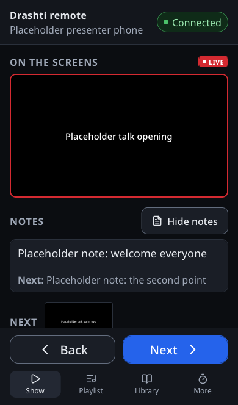
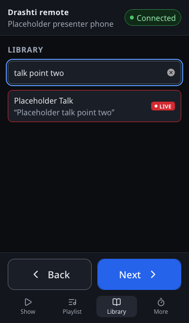
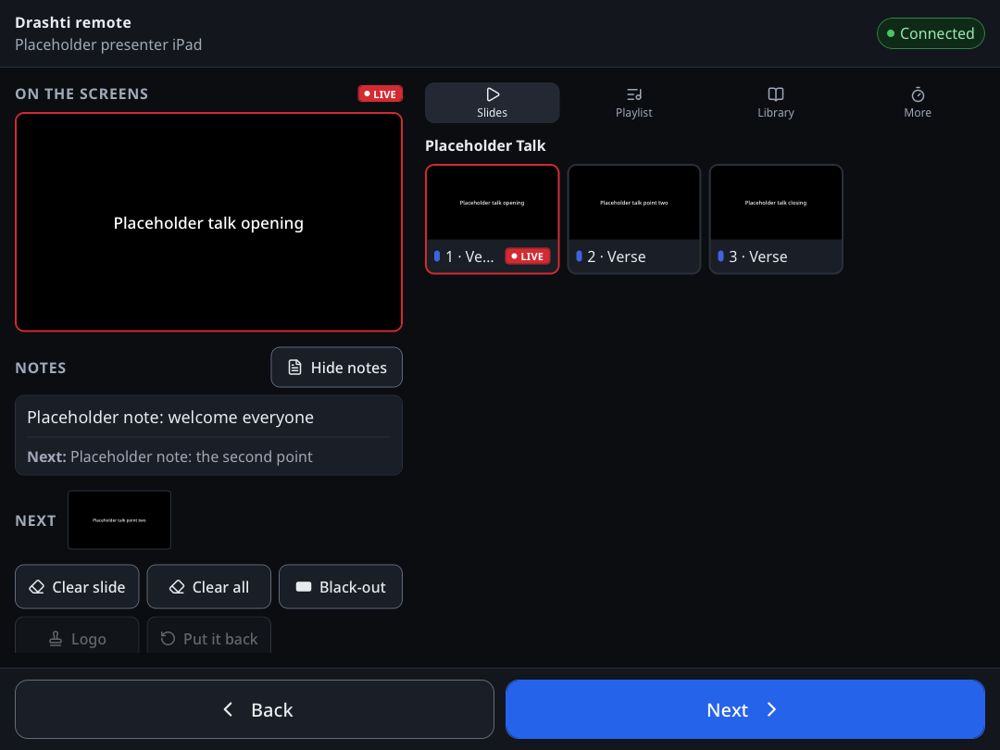

# Drashti on your phone or iPad: a guide for presenters

For anyone who speaks or leads from the front: you see what is on the screens, your notes, and the next slide, and you move through any presentation in Drashti's library from your phone, your iPad or a laptop. The screens follow. It costs nothing and needs no app: it is a page that Drashti itself shows on the mandir's Wi-Fi.

## Once: pair your phone or iPad

1. Join the **mandir's Wi-Fi** (the same network as the Drashti computer, not a guest network).
2. Ask the operator to pair it. On the Drashti computer they press **Phones** in the header, type a name for your phone (for example "Remote: speaker's iPad"), and press **Pair a Remote device**. A QR code and a six-digit code appear for two minutes.
3. On your phone or iPad, point the **camera** at the QR code and open the link. (Or open the address the operator reads out, for example `http://192.168.1.20:8740`, and type the code.)
4. The page says **Connected** at the top. That's it: it stays paired. Next time, just open it again.

## Once: put it on your Home Screen

So it opens like an app, from one tap:

- **iPhone or iPad** (in Safari): tap the **Share** button (the square with an arrow), then **Add to Home Screen**, then **Add**.
- **Android phone or tablet** (in Chrome): tap the **⋮** menu, then **Add to Home screen** (or **Install app**).
- **A laptop** (Windows or Mac, in Edge or Chrome): open the **⋯** or **⋮** menu, then **Apps** (or **Cast, save and share**), then **Install this site as an app** (or **Create shortcut**). Or simply bookmark the page.

## Using it

- **At the top: what is on the screens now**, with a red LIVE badge.
- **Under it: Notes.** Your notes for this slide, and below them the next slide's notes. **Hide notes** and **Show notes** switch them off and on; your phone remembers which. The notes are the slides' own notes in Drashti, the ones the stage screens show: at the Drashti computer, open the presentation in the editor, pick a slide, and type them under **Notes** in the Inspector on the right.
- **Next** and **Back** are always at the bottom of the page. Tapping fast is safe: two quick taps on **Next** go on two slides and never zoom the page, and pulling down at the top does not reload it.
- **Library**: every presentation in Drashti, by name. Type in the search box to find a talk, a kirtan, or words on a slide. Tap a presentation to see its slides. **Nothing changes on the screens until you tap a slide.** Then that slide goes up, and Next carries on from it.
- **On the screens** takes you back to the slides that are showing now, after you have looked at another presentation.
- **Playlist**: the sabha's running order. Tap an item to see its slides.

**On an iPad held sideways** (or a laptop): the live picture, your notes, what comes next, and Back and Next are on the left, and the slides are on the right, with the Playlist, the Library and More a tab away above them. Held upright, the iPad shows the playlist or the library beside the show.

The operator can always change the screens from the computer too; your page follows whatever is up.

## If something is not right

- **"Not connected"** at the top: the page tries again by itself. Check that you are on the mandir's Wi-Fi, and ask the operator whether the network is on in **Phones**.
- **"This device was removed"**: ask the operator to pair it again (a new code).
- **The screen goes dark during the talk**: on an iPhone or iPad, **Settings**, **Display & Brightness**, **Auto-Lock**, and choose a longer time for the evening. Put it back afterwards.
- **A button says it cannot be done**: some things only the operator does (for example, switching the Look while Simple Mode is on).

What the page never does: it never changes the library (the words, playlists or themes), and it never downloads the pictures or videos themselves, only small previews.
